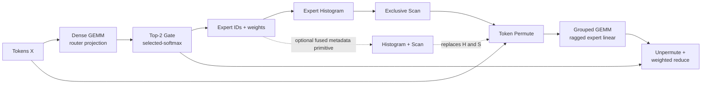

# RaggedRoute

English | [简体中文](README.zh-CN.md)

[](https://github.com/shunwendongan/RaggedRoute/actions/workflows/ci.yml)
[](LICENSE)

An evidence-driven CUDA project for single-GPU Top-2 Mixture-of-Experts (MoE) routing and ragged expert computation.

RaggedRoute is built as one explainable seven-stage pipeline—not seven unrelated kernel demos. It combines a source-breaking v0.2 C++ API, strict-FP32 CUDA implementations, independent CPU oracles, benchmark-only library references, and an auditable L1/L2/L3 measurement pipeline. The project is designed to demonstrate CUDA performance-engineering judgment: define the semantic contract, build a correct baseline, profile the real bottleneck, test one hypothesis at a time, and reject candidates that do not survive counterexamples.

> [!IMPORTANT]
> This is a reproducible AI Infra/CUDA portfolio project, not a production MoE runtime. The executable path is validated only for RTX 3080 / SM86 with FP32 row-major tensors. FP16/BF16 Tensor Core kernels, H100/Blackwell validation, multi-GPU expert parallelism, and a complete MoE FFN are not implemented.

## Pipeline at a glance



The two L3 entry points make the timing boundary explicit:

- `chain_from_tokens`: all seven semantic stages, including router projection;
- `chain_from_logits`: the six post-logit stages when router logits already exist.

The benchmark registry exposes eight adapters: the seven semantic operators plus the optional `histogram_exclusive_scan` composite primitive.

## Latest seven-operator matrix

The seven-operator portfolio is frozen at clean SHA `9732a0343c60f869fc4166a0cc3cabba2fd67bbb`: RTX 3080/SM86, strict FP32, five independent processes, 20 warmups, and 30 samples per process. A newer Grouped-GEMM-only follow-up is frozen at clean SHA `c2205ed1ba1063fccce3cd417fd671798dbfb66f`; it evaluates v5/v6 on the same hardware and numerical contract without rewriting the other six matrices. Speedups come from unprofiled CUDA Event measurements; NSYS/NCU durations are diagnostic only. See the [portfolio evidence](docs/reports/compact/20260829-9732a03-interview-portfolio/REPORT.md), [Grouped v5/v6 evidence](docs/reports/compact/20260830-c2205ed-grouped-v6/REPORT.md), and the detailed [Chinese interview guide](docs/interview/README.md).

| Operator | SM86 `Auto` | Strongest in-tree candidate | Strongest comparable baseline | Full declared matrix | Best local shape | Auto decision |
|---|---|---|---|---:|---:|---|
| Dense GEMM | `cuda_naive` | v3 64x32 `cp.async` | fastest cuBLASLt/cuBLAS per shape | `0.8716x`, 1/3 wins | 256³ `1.0095x` | no; libraries win overall |
| Top-2 Gate | `cuda_naive` | v4 two-reduction | exact-contract naive | `1.0972x`, 21/30 wins | E64/T4096 `1.6934x` | no; 10.88% max regression |
| Histogram | shape-dispatched v1 | `cuda_candidate_v2` | fastest v1/CUB/naive per shape | `1.1016x`, 9/15 wins | R1M/E1 `4.3026x` | unchanged; research winner |
| Exclusive Scan | `cuda_naive` | no retained custom candidate | CUB Warp/Block/Device | Block `1.0249x`; Warp subset `1.0290x` | E33 Block `1.0765x` | no; tiny launch-bound work |
| Token Permute | `cuda_naive` | v2 full-from-ids | adapted vLLM | `1.5671x`, 5/5 wins | `1.8501x` | unchanged; full-boundary winner |
| Grouped GEMM | `cuda_naive` | v6 hybrid 32x128 / v5-v2 fallback | fastest CUTLASS/cuBLAS per shape | `0.9946x`, 5/10 wins | fallback portfolio: uniform T512 `1.2257x`; single-hot `1.7762x` | no; active wide path T2048 `0.7534x` |
| Unpermute | `cuda_naive` | `cuda_warp_token_vec4` | fastest vLLM/naive per shape | `1.0154x`, 12/32 wins | Zipf T4096/N128 `1.2892x` | no; narrow-N local benefit |

The portfolio evidence ceiling is now `CV<=0.50`: values above 0.10 remain disclosed WDDM stability risks but no longer cause an automatic `insufficient_evidence` label. Matrix claims still require complete five-process evidence, ratio-of-sums, shape geomean, coverage, maximum regression, workspace, and cross-process direction checks. This policy is not a production SLA.

cuBLAS/cuBLASLt comparisons keep the strict-FP32 contract; CUTLASS Grouped and cuBLAS per-expert form the Grouped GEMM reference envelope; CUB includes its workspace and launch boundary; adapted vLLM results state their mapping and input-domain limits. Top-K external CUB/vLLM numbers are comparable only on a limited random-input subdomain, not the full tie/NaN/selected-softmax contract.

> [!CAUTION]
> `histogram_exclusive_scan` is a separate cross-operator primitive and is not ranked as an eighth semantic operator. Fixed-shape CUDA Graph results (`1.6205x` postlogit and `1.2336x` postroute) are setup-complete host time-to-solution replay results—not kernel speedups—and do not change `KernelFamily::kAuto`.

## Engineering highlights

### A public operator contract, not benchmark-only kernels

The v0.2 API separates two intentional layers:

- `raggedroute::ops::launch_*_naive` is the low-level kernel entry used for L1 kernel-body studies. Reset and workspace preconditions remain explicit.
- `raggedroute::{dense_gemm, topk_gate, histogram, exclusive_scan, histogram_exclusive_scan, token_permute, grouped_gemm, unpermute}` is the checked public wrapper used by L2/L3. It uses the caller's CUDA stream, performs no hot-path allocation or unconditional synchronization, and includes mandatory resets in the operator boundary.

Floating payloads use `ConstTensorView`/`MutableTensorView`; `TensorSpec` records dtype, layout, and element strides. Routing metadata remains strongly typed `int32`. `KernelSelection` separates stable families (`Auto`, `CudaNaive`, `CudaOptimized`) from operator-local research ids. FP16/BF16 and lower-precision enum values describe the API vocabulary only; no such runtime kernels are claimed.

### Correctness before performance

Each adapter owns its typed parameters, CPU oracle, tolerance or exact-integer checks, reset semantics, workspace contract, and operator-specific work estimates. The test surface covers edge/randomized cases, redzones, failure-artifact round trips, stream behavior, dtype/layout rejection, public API dispatch, and Compute Sanitizer evidence captured on the RTX 3080 environment.

### Promotion is allowed to fail

Suite v2 groups variants under one logical case and one declared promotion baseline. `raggedroute.aggregate.v2` preserves the pairing fields; `raggedroute.comparison.v1` refuses to compute speedup when GPU, build, semantics, seed, measurement level, cache policy, repeats, samples, or excluded work differ. Failed experiments remain documented instead of being hidden behind a best-case number.

## Evidence snapshot

The formal Release run contains 3,725 validated records and 745 aggregate groups, with five independent processes per group. The tracked compact bundle contains matrix summaries, per-shape CSV, normalized NSYS/NCU metrics, an environment/command manifest, and SHA-256 checksums. Raw JSONL, full aggregates, `.ncu-rep`, `.nsys-rep`, and SQLite stay in ignored output or immutable release assets.

NSYS identifies Grouped v2 as the dominant L3 kernel: 71.6% of uniform GPU kernel time (23.744 us median) and 86.0% of Zipf time (22.111 us median). The Zipf trace includes one 752.849 us system outlier, so profiler duration is not used as Release evidence. NCU classifies Permute v3 as bandwidth-bound at 86.85% DRAM throughput, while Scan and fused Histogram→Scan are one-CTA underfill cases.

The follow-up keeps the v2 `16x32` mainloop in v5 but replaces balanced-workload prefix/binary-search persistent traversal with a direct grid. V6 changes only that balanced path to a `32x128x16` tile, 256 threads, per-thread `4x4` outer products, aligned `float4` stores, and two-stage Ampere `cp.async`, with v5 fallback elsewhere. Against v5, NCU shows 43.4%/75.5% fewer global load/store requests and 82.7% fewer DRAM writes. At uniform T2048, however, v6 has only 0.941 waves/SM and 31.28% issue activity, with the least-active SM 54.17% below the mean. The remaining bottleneck is underfill/work imbalance and issue efficiency, not spills; local load/store instructions are zero.

The `1.2257x` uniform-T512 and `1.7762x` single-hot results belong to the deployable v6 *hybrid portfolio*, but both fail the wide-path selector and execute its v5/v2 fallback chain; they are not wins produced by the `32x128` kernel itself. The retained wide kernel is directly selected for uniform T512/E16/N256 (`1.0120x` versus CUTLASS) and uniform T2048/E64/N128 (`0.7534x`). A later benchmark-only v8 screen halved tile-M to 16 while holding the 128-column pipeline fixed. It improved over v5 but reached only about `0.93x` versus v6 and `0.81x` versus CUTLASS across four declared balanced shapes, so it is rejection evidence rather than a new headline.

## Quick start

### CPU-only validation (including macOS)

CPU-only presets do not enable the CUDA language. They validate host-side schemas, evidence tooling, and repository checks; they do not validate CUDA operator capability or performance.

Requirements: CMake 3.24+, Ninja, Python 3, and a C++17 compiler.

```bash
cmake --preset cpu-release
cmake --build --preset build-cpu-release --parallel
ctest --preset test-cpu-release
python scripts/repository_checks.py
```

### RTX 3080 / SM86 CUDA validation

The measured environment is Windows with CUDA Toolkit, Visual Studio 2022 Build Tools, CMake, Ninja, and Python. Run this only on a supported NVIDIA CUDA system:

```powershell
$env:RAGGEDROUTE_FETCH_REFERENCES = "ON"
cmd /c scripts\configure_windows.bat rtx3080-sm86-release
cmd /c scripts\build_windows.bat rtx3080-sm86-release
ctest --preset test-rtx3080-sm86-release

python scripts\run_benchmarks.py `
  --binary out\build\rtx3080-sm86-release\raggedroute_benchmark.exe `
  --config configs\project\benchmark\smoke.json `
  --output out\runs\smoke.jsonl
```

List every adapter and variant:

```powershell
out\build\rtx3080-sm86-release\raggedroute_benchmark.exe --list
```

### Install as a CMake package

CUDA-enabled builds export `RaggedRoute::runtime`, `RaggedRoute::baseline_ops`, and the separate test-support target `RaggedRoute::correctness_framework`.

```powershell
cmake --install out\build\rtx3080-sm86-release
```

```cmake
find_package(RaggedRoute 0.2 CONFIG REQUIRED)
target_link_libraries(my_target PRIVATE RaggedRoute::runtime)
```

The package requires C++17 and deliberately rejects consumers requesting the removed v0.1 pointer-based API.

## Dependencies

- CPU-only builds require CMake 3.24+, Ninja, Python 3, and a C++17 compiler; they do not discover a CUDA toolkit.
- CUDA builds additionally require the NVIDIA CUDA Toolkit. The measured Windows path uses Visual Studio 2022 Build Tools.
- cuBLAS/cuBLASLt come from the toolkit. CCCL/CUB and CUTLASS are optional benchmark dependencies selected with `AUTO`, `SYSTEM`, `FETCH`, or `OFF`; fetched sources are pinned to CCCL `v3.4.0` and CUTLASS `v4.6.1`.
- Adapted vLLM sources and all benchmark-only references retain provenance and license records under `src/*/library_baseline/` and [`THIRD_PARTY_NOTICES.md`](THIRD_PARTY_NOTICES.md).

## Measurement boundaries

| Level | Question answered | Typical boundary |
|---|---|---|
| L1 — Kernel Body | Did the CUDA kernel mechanism improve? | low-level launcher; required reset/workspace may be explicit preconditions |
| L2 — Operator | Is the complete public call better? | validation/dispatch contract, required reset, mapping preparation, and kernel work |
| L3 — Chain | Did the composed MoE path improve? | all per-invocation operator work with workspace preallocated |

CUDA Events provide unprofiled release latency. NSYS explains launch gaps and stage contribution; NCU explains a selected kernel's resource use and bottleneck mechanism. Profiler duration is never substituted for release latency.

## Current limitations and next work

- Treat the v5/v2 fallback wins as the current Grouped portfolio highlight. V8 has ruled out halving tile-M at fixed N=128; the next isolated geometry experiment should test a 32x64 tile, which adds CTAs without duplicating the much larger weight tile across extra M tiles, before any selector or `Auto` change.
- Predeclare a Top-K v4 E64/T>=512 interval and test full-from-ids Permute v2 at L3 before considering any `Auto` change.
- Rerun fused Histogram + Scan F2 in an exclusive RTX 3080 window and review its primitive-specific `Auto` if fallback or L3 gates still fail.
- Replace the tracked synthetic route fixture with an anonymized captured/production working set before making any real-trace claim.
- Keep raw profiler binaries and full aggregates in immutable release assets; tighten repository checks against evidence-policy drift.
- Implement and measure FP16/BF16 Tensor Core paths only in a future CUDA environment. H100/Blackwell support requires real-hardware correctness and performance validation.

## Documentation

- [CUDA / AI Infra interview entry (Chinese)](docs/interview/README.md)
- [Seven operator performance cards](docs/interview/operator-performance.md)
- [Bottleneck analysis](docs/interview/bottleneck-analysis.md)
- [Interview question bank](docs/interview/question-bank.md)
- [Branch governance and cleanup review](docs/cleanup-review.md)
- [Implementation status and claim boundary](docs/implementation-status.md)
- [Development roadmap](docs/development-roadmap.md)
- [Benchmark architecture](docs/benchmark-architecture.md)
- [Route trace and three-state promotion](docs/route-trace-and-promotion.md)
- [Correctness framework](docs/correctness-framework.md)
- [Operator optimization index](docs/operator-optimization-index.md)
- [CI quality gates](docs/ci-quality-gates.md)
- [Full technical design and historical plan (review-held legacy document)](docs/RaggedRoute-最终产品技术文档.md)
- [Third-party provenance](THIRD_PARTY_NOTICES.md)

## License

RaggedRoute is licensed under the [Apache License 2.0](LICENSE). Adapted and benchmark-only third-party sources retain their original notices; see [THIRD_PARTY_NOTICES.md](THIRD_PARTY_NOTICES.md) and [`third_party/licenses/`](third_party/licenses/).
