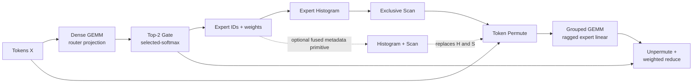

# RaggedRoute

English | [简体中文](README.zh-CN.md)

[](https://github.com/shunwendongan/RaggedRoute/actions/workflows/ci.yml)
[](LICENSE)

An evidence-driven CUDA project for single-GPU Top-2 Mixture-of-Experts (MoE) routing and ragged expert computation.

RaggedRoute is built as one explainable seven-stage pipeline—not seven unrelated kernel demos. It combines a source-breaking v0.2 C++ API, strict-FP32 CUDA implementations, independent CPU oracles, benchmark-only library references, and an auditable L1/L2/L3 measurement pipeline. The project is designed to demonstrate CUDA performance-engineering judgment: define the semantic contract, build a correct baseline, profile the real bottleneck, test one hypothesis at a time, and reject candidates that do not survive counterexamples.

> [!IMPORTANT]
> This is a reproducible AI Infra/CUDA portfolio project, not a production MoE runtime. The executable path is validated only for RTX 3080 / SM86 with FP32 row-major tensors. FP16/BF16 Tensor Core kernels, H100/Blackwell validation, multi-GPU expert parallelism, and a complete MoE FFN are not implemented.

## Pipeline at a glance



The two L3 entry points make the timing boundary explicit:

- `chain_from_tokens`: all seven semantic stages, including router projection;
- `chain_from_logits`: the six post-logit stages when router logits already exist.

The benchmark registry exposes eight adapters: the seven semantic operators plus the optional `histogram_exclusive_scan` composite primitive.

## What is implemented

| Operator / primitive | SM86 `Auto` | Research or library paths | Current decision |
|---|---|---|---|
| Dense GEMM | `cuda_naive` | optimized ids 1–7; cuBLASLt/cuBLAS references | v3 is the strongest in-tree large-shape path, but no default promotion |
| Top-2 Gate | `cuda_naive` | optimized ids 1–4; benchmark-only CUB/vLLM references | exact-shape and continuous-bucket gates produced no promoted interval |
| Expert Histogram | shape-dispatched `cuda_candidate` | small/sparse/block-private paths; CUB reference | promoted on SM86 after a 12-case five-process gate |
| Exclusive Scan | `cuda_naive` | CUB Device/Block/Warp Scan references | standalone experimental candidates were removed |
| Histogram + Scan | fused F2 for `R <= 4096`, `E <= 64`; otherwise separate fallback | CUB composite references | code path exists, but release-quality revalidation is still required |
| Token Permute | `cuda_naive` | explicit shape-dispatched v2/v3; adapted vLLM paths | v3 adds a two-token CTA research path; clean Release decision pending |
| Grouped GEMM | `cuda_naive` | explicit SM86 v1/v2/v3; CUTLASS/cuBLAS references | v3 changes only tile/live-range geometry; no default promotion |
| Unpermute | `cuda_naive` | benchmark-only warp/CTA candidate; adapted vLLM reference | rejected because tail and stability gates failed |

> [!CAUTION]
> `histogram_exclusive_scan` currently resolves `Auto` to the fused F2 implementation on SM86. The archived run was affected by competing GPU workloads: fused-region center results were promising, but CV, fallback, and L3 gates failed. Treat this path as experimental until it is rerun in an exclusive CUDA environment or demoted. No new CUDA capability or performance check is performed on macOS.

The active portfolio round is deliberately narrow. `cuda_grouped_sm86_fp32_v3` tests a `16x64x16`, 256-thread, two-stage `cp.async` tile against CUTLASS; `cuda_candidate_v3` tests two tokens per CTA for the Permute shapes where v2 tile4 regressed. Both are explicit research IDs, preserve v2/v1 fallbacks, and leave `Auto` unchanged. Versioned route traces and a three-state evaluator are implemented; the tracked trace is a synthetic parser fixture, so real-trace promotion remains `insufficient_evidence` until captured input is supplied.

## Engineering highlights

### A public operator contract, not benchmark-only kernels

The v0.2 API separates two intentional layers:

- `raggedroute::ops::launch_*_naive` is the low-level kernel entry used for L1 kernel-body studies. Reset and workspace preconditions remain explicit.
- `raggedroute::{dense_gemm, topk_gate, histogram, exclusive_scan, histogram_exclusive_scan, token_permute, grouped_gemm, unpermute}` is the checked public wrapper used by L2/L3. It uses the caller's CUDA stream, performs no hot-path allocation or unconditional synchronization, and includes mandatory resets in the operator boundary.

Floating payloads use `ConstTensorView`/`MutableTensorView`; `TensorSpec` records dtype, layout, and element strides. Routing metadata remains strongly typed `int32`. `KernelSelection` separates stable families (`Auto`, `CudaNaive`, `CudaOptimized`) from operator-local research ids. FP16/BF16 and lower-precision enum values describe the API vocabulary only; no such runtime kernels are claimed.

### Correctness before performance

Each adapter owns its typed parameters, CPU oracle, tolerance or exact-integer checks, reset semantics, workspace contract, and operator-specific work estimates. The test surface covers edge/randomized cases, redzones, failure-artifact round trips, stream behavior, dtype/layout rejection, public API dispatch, and Compute Sanitizer evidence captured on the RTX 3080 environment.

### Promotion is allowed to fail

Suite v2 groups variants under one logical case and one declared promotion baseline. `raggedroute.aggregate.v2` preserves the pairing fields; `raggedroute.comparison.v1` refuses to compute speedup when GPU, build, semantics, seed, measurement level, cache policy, repeats, samples, or excluded work differ. Failed experiments remain documented instead of being hidden behind a best-case number.

## Evidence snapshot

The latest report merged into `main` is the [RTX 3080 seven-stage L3 three-way analysis](docs/reports/l3_three_way_20260805/RaggedRoute_L3_3way_comparison.md). It evaluates one strict-FP32 workload (`T=512`, `E=64`, `top_k=2`, `K=N=128`) with three independent release processes per path:

| Research chain | Aggregate p50 | p95 | Cross-process CV | Interpretation |
|---|---:|---:|---:|---|
| Selected CUDA candidates | 69.734 us | 76.820 us | 0.0605 | diagnostic research chain; not public `Auto` dispatch |
| Repository library chain | 94.413 us | 117.412 us | 0.1018 | not strictly comparable because of Top-K and host-offset boundaries |
| Triton reference | 245.760 us | 256.020 us | 0.0236 | cross-toolchain reference, not a promotion denominator |

The observed CUDA/Triton ratio is `3.524x`, but it is deliberately reported as a cross-backend diagnostic rather than a production speedup. In the CUDA research chain, Grouped GEMM accounts for `64.4%` of NSYS kernel time. NCU reports 106 registers/thread, one wave/SM, 26.62% achieved occupancy, and SM/L2 work imbalance—making Grouped GEMM the highest-value next optimization target.

The strongest counterexample is also preserved: the clean three-process Grouped GEMM candidate reached only `0.805x` ratio-of-sums versus CUTLASS across ten shapes and fell to `0.467x` at `T=2048,E=64,K=N=128,uniform`. That failure is part of the project result: local wins did not justify a default path.

## Quick start

### CPU-only validation (including macOS)

CPU-only presets do not enable the CUDA language. They validate host-side schemas, evidence tooling, and repository checks; they do not validate CUDA operator capability or performance.

Requirements: CMake 3.24+, Ninja, Python 3, and a C++17 compiler.

```bash
cmake --preset cpu-release
cmake --build --preset build-cpu-release --parallel
ctest --preset test-cpu-release
python scripts/repository_checks.py
```

### RTX 3080 / SM86 CUDA validation

The measured environment is Windows with CUDA Toolkit, Visual Studio 2022 Build Tools, CMake, Ninja, and Python. Run this only on a supported NVIDIA CUDA system:

```powershell
$env:RAGGEDROUTE_FETCH_REFERENCES = "ON"
cmd /c scripts\configure_windows.bat rtx3080-sm86-release
cmd /c scripts\build_windows.bat rtx3080-sm86-release
ctest --preset test-rtx3080-sm86-release

python scripts\run_benchmarks.py `
  --binary out\build\rtx3080-sm86-release\raggedroute_benchmark.exe `
  --config configs\project\benchmark\smoke.json `
  --output out\runs\smoke.jsonl
```

List every adapter and variant:

```powershell
out\build\rtx3080-sm86-release\raggedroute_benchmark.exe --list
```

### Install as a CMake package

CUDA-enabled builds export `RaggedRoute::runtime`, `RaggedRoute::baseline_ops`, and the separate test-support target `RaggedRoute::correctness_framework`.

```powershell
cmake --install out\build\rtx3080-sm86-release
```

```cmake
find_package(RaggedRoute 0.2 CONFIG REQUIRED)
target_link_libraries(my_target PRIVATE RaggedRoute::runtime)
```

The package requires C++17 and deliberately rejects consumers requesting the removed v0.1 pointer-based API.

## Dependencies

- CPU-only builds require CMake 3.24+, Ninja, Python 3, and a C++17 compiler; they do not discover a CUDA toolkit.
- CUDA builds additionally require the NVIDIA CUDA Toolkit. The measured Windows path uses Visual Studio 2022 Build Tools.
- cuBLAS/cuBLASLt come from the toolkit. CCCL/CUB and CUTLASS are optional benchmark dependencies selected with `AUTO`, `SYSTEM`, `FETCH`, or `OFF`; fetched sources are pinned to CCCL `v3.4.0` and CUTLASS `v4.6.1`.
- Adapted vLLM sources and all benchmark-only references retain provenance and license records under `src/*/library_baseline/` and [`THIRD_PARTY_NOTICES.md`](THIRD_PARTY_NOTICES.md).

## Measurement boundaries

| Level | Question answered | Typical boundary |
|---|---|---|
| L1 — Kernel Body | Did the CUDA kernel mechanism improve? | low-level launcher; required reset/workspace may be explicit preconditions |
| L2 — Operator | Is the complete public call better? | validation/dispatch contract, required reset, mapping preparation, and kernel work |
| L3 — Chain | Did the composed MoE path improve? | all per-invocation operator work with workspace preallocated |

CUDA Events provide unprofiled release latency. NSYS explains launch gaps and stage contribution; NCU explains a selected kernel's resource use and bottleneck mechanism. Profiler duration is never substituted for release latency.

## Current limitations and next work

- Rerun fused Histogram + Scan F2 in an exclusive RTX 3080 window; demote `Auto` if it still fails stability, fallback, or L3 gates.
- Complete the clean five-process Grouped GEMM v3, Permute v3, and six-stage L3 decisions; preserve a rejected candidate if stability or speedup gates fail.
- Replace the tracked synthetic route fixture with an anonymized captured/production working set before making any real-trace claim.
- Reconcile the realistic/vLLM-semantic stacked evidence branches before treating them as `main` capabilities.
- Keep raw profiler binaries and full aggregates in immutable release assets; tighten repository checks against evidence-policy drift.
- Implement and measure FP16/BF16 Tensor Core paths only in a future CUDA environment. H100/Blackwell support requires real-hardware correctness and performance validation.

## Documentation

- [Implementation status and claim boundary](docs/implementation-status.md)
- [Development roadmap](docs/development-roadmap.md)
- [Benchmark architecture](docs/benchmark-architecture.md)
- [Route trace and three-state promotion](docs/route-trace-and-promotion.md)
- [Correctness framework](docs/correctness-framework.md)
- [Operator optimization index](docs/operator-optimization-index.md)
- [CI quality gates](docs/ci-quality-gates.md)
- [Full technical design and historical plan](docs/RaggedRoute-最终产品技术文档.md)
- [Third-party provenance](THIRD_PARTY_NOTICES.md)

## License

RaggedRoute is licensed under the [Apache License 2.0](LICENSE). Adapted and benchmark-only third-party sources retain their original notices; see [THIRD_PARTY_NOTICES.md](THIRD_PARTY_NOTICES.md) and [`third_party/licenses/`](third_party/licenses/).
