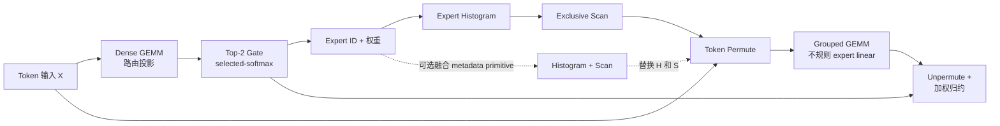

# RaggedRoute

[English](README.md) | 简体中文

[](https://github.com/shunwendongan/RaggedRoute/actions/workflows/ci.yml)
[](LICENSE)

一个面向单 GPU Top-2 混合专家（MoE）路由与不规则专家计算、以证据驱动的 CUDA 项目。

RaggedRoute 是一条可解释的七阶段流水线，而不是七个彼此孤立的 CUDA Demo。项目包含一次破坏源码兼容性的 v0.2 C++ API 升级、strict-FP32 CUDA 实现、独立 CPU oracle、仅用于 benchmark 的外部库参考路径，以及可审计的 L1/L2/L3 测量体系。它重点展示 CUDA 性能工程判断：先固定语义合同和正确基线，再定位真实瓶颈，每轮只验证一个优化假设，并拒绝无法通过反例门禁的候选实现。

> [!IMPORTANT]
> 这是一个可复现的 AI Infra/CUDA 简历项目，不是生产级 MoE runtime。当前可执行路径仅在 RTX 3080 / SM86、FP32、row-major tensor 上验证。FP16/BF16 Tensor Core kernel、H100/Blackwell 实卡验证、多 GPU Expert Parallel 和完整 MoE FFN 均未实现。

## 流水线概览



两个 L3 入口明确区分测量边界：

- `chain_from_tokens`：包含路由投影在内的全部七个语义阶段；
- `chain_from_logits`：输入已有 router logits，只执行之后六个阶段。

Benchmark registry 一共暴露八个 adapter：七个语义算子，以及可选的 `histogram_exclusive_scan` 组合 primitive。

## 最新七算子性能总览

七算子统一证据固定在 `9732a0343c60f869fc4166a0cc3cabba2fd67bbb`：RTX 3080 / SM86、strict FP32、clean Release、5 个独立进程、20 warmup、30 samples/process、seed `20260828`。Grouped GEMM 又在 clean `c2205ed1ba1063fccce3cd417fd671798dbfb66f` 完成 v5/v6 follow-up，并在 clean `dea7c066a83a5df700aa60c03fd51446c6b4c5e5` 完成 V9/V10 15-shape、5-process 复测；两轮都不改写其他六算子结论。倍率均来自未插桩 CUDA Event；NSYS/NCU 只解释原因。证据见 [统一 compact report](docs/reports/compact/20260829-9732a03-interview-portfolio/REPORT.md)、[Grouped v5/v6 report](docs/reports/compact/20260830-c2205ed-grouped-v6/REPORT.md)、[Grouped V9/V10 report](docs/reports/compact/20260830-dea7c06-grouped-v9-v10/REPORT.md) 和 [面试入口](docs/interview/README.md)。

| 算子 | 当前 `Auto` | 最强树内 `cuda_candidate` | 最强可比基线 | 完整预声明矩阵 | 最大局部收益 | 是否进入 Auto |
|---|---|---|---|---:|---:|---|
| Dense GEMM | `cuda_naive` | v3 `64x32 cp.async` | 每 shape 最快 cuBLASLt/cuBLAS | `0.8716x` ratio-of-sums，1/3 获益 | 256³ `1.0095x` | 否；库整体胜出 |
| Top-2 Gate | `cuda_naive` | v4 two-reduction | exact-contract naive | `1.0972x`，21/30 获益 | E64/T4096 `1.6934x` | 否；最大回退 10.88% |
| Histogram | shape-dispatched v1 | `cuda_candidate_v2` | 每 shape 最快 v1/CUB/naive | `1.1016x`，9/15 获益 | R1M/E1 `4.3026x` | 本轮不改；显式 research winner |
| Exclusive Scan | `cuda_naive` | 无 retained candidate | CUB Warp/Block/Device | Block `1.0249x`；Warp 子域 `1.0290x` | E33 Block `1.0765x` | 否；tiny launch-bound |
| Token Permute | `cuda_naive` | v2 full-from-ids | adapted vLLM | `1.5671x`，5/5 获益 | `1.8501x` | 本轮不改；full boundary winner |
| Grouped GEMM | `cuda_naive` | V9 `32x64x16 cp.async` / V6-V5-V2 fallback | 每 shape 最快 CUTLASS/cuBLAS | `1.0916x` research trend，11/15 获益；1 个 CUTLASS tail group 越过 CV ceiling | V9 kernel：T512/E32/N64 `1.8819x`；T4096/E64/N64 `1.3661x` | 否；K256/N128/non-aligned 回退，V10 selector rejected |
| Unpermute | `cuda_naive` | `cuda_warp_token_vec4` | 每 shape 最快 vLLM/naive | `1.0154x`，12/32 获益 | Zipf T4096/N128 `1.2892x` | 否；仅窄 N 局部优势 |

### 每个最强 candidate 的设计与结论

- Dense v3 使用 64x32 register tile 和 Ampere `cp.async` 双缓冲。1024³ NCU 显示 1.506 waves/SM、85 registers/thread、34.63% achieved occupancy、SM/memory 73.26%/74.50%，但 512³/1024³ 仍输给成熟的 cuBLASLt/cuBLAS 调度和数据复用；只能写“256³ 局部持平”，不能写“超过 cuBLAS”。
- Top-K v4 把 Top-2 pair 保存在寄存器中，用 vector row load 和两次 subgroup reduction 减少比较/归约成本。收益集中在 E64 和较大 T；完整 tie/NaN/selected-softmax 合同对 naive 的矩阵趋势很强，但 E32/T32 是反例。CUB/vLLM 只在有限 random-input 子域作为参考，不能冒充完整合同等价 baseline。
- Histogram v2 利用 `E=1` 的语义退化，直接写 `counts[0]=R`，避免读取 route IDs 和 atomic；E>1 继续复用 single-CTA shared / block-private dispatcher。其完整矩阵对最强 envelope 仍为正收益，但最大 CV 0.4503，属于 Windows/WDDM 作品集 research 证据，不外推生产 SLA。
- Scan 的 E 只有 1–64。naive profile 是单 block/单 thread、0.000919 waves/SM，主要受 launch/underfill 限制；CUB Warp/Block 仅小幅领先，DeviceScan 只有 `0.3310x`。因此“不造复杂 standalone candidate”本身是性能工程决策。
- Permute 必须区分 pure copy 和 full-from-ids。pure v2/v3 对 retained token-owned 只有 `0.9841x/0.9892x`，而 v2 把 counts/scan/cursor preparation 融入完整 L2 后对 adapted vLLM 达 `1.5671x`。该收益来自减少中间准备和 launch，不能写成 copy kernel 普遍更快。
- Grouped 从 v5 direct grid、v6 `32x128`、失败的 v7/v8 tile-M 消融推进到 V9。V9 固定 tile-M=32、K16、256 threads、strict FP32、zero workspace 和双缓冲 `cp.async`，只把 tile-N 128→64、每线程 `4x4`→`4x2`。clean 15-shape 对 CUTLASS/cuBLAS envelope 的 ratio-of-sums/geomean 为 `1.0916x/1.1397x`、11/15 p50 获益；其中真正执行 V9 kernel 的 T512/E32/N64 与 T4096/E64/N64 对 CUTLASS 为 `1.8819x/1.3661x`，均 5/5 process pairs 同向。NCU 显示代表点相对 V5 fallback 的 CTA 1280→320、global load/store requests 减少 37.9%/50.5%，occupancy 反而下降仍更快，收益来自减少 over-partitioning 与重复请求。K256/N128/non-aligned 只有 `0.9072x/0.7736x/0.7508x`；V10 68-SM CTA-window selector 对 V9 aggregate 仅 `0.9775x`，因此两者不进入 Auto。
- Unpermute vec4 让一个 warp 负责 token 并使用对齐向量访问，在中大型 T、窄 N 有局部优势；完整 32-case coverage 只有 12/32，所以不做全局 Auto dispatch。

### CV 与晋级口径

本作品集政策将 evidence ceiling 放宽为 `CV<=0.50`：`CV>0.10` 继续公开为稳定性风险，但不再单独自动降级为 `insufficient_evidence`。矩阵结论仍同时检查五进程完整性、ratio-of-sums、shape geomean、获益覆盖率、最大回退、workspace 和跨进程方向；不挑选“安静进程”、不手工删离群值，也不把单 shape winner 包装成整体领先。这一口径只服务 Windows/WDDM 简历证据，不外推为生产 SLA。

### 外部基线边界

- cuBLAS/cuBLASLt：仅比较 strict FP32；TF32/Tensor Core 不是等价分母。
- CUTLASS：Grouped 使用 v4.6.1 strict-FP32 Grouped；cuBLAS per-expert 同时进入强 baseline envelope。
- CUB：Histogram/Scan 的库 primitive；workspace、reset 和额外 launch 均保留在同一 L2 边界。
- vLLM：使用仓库内固定来源的 adapted benchmark 路径；Top-K 只在有限随机输入子域可比，Permute/Unpermute 必须写明 mapping 和 preparation 边界。
- Triton：历史 L3 只作为跨 backend 诊断，不进入本轮七算子强基线排名。

> [!CAUTION]
> `histogram_exclusive_scan` 是第八个跨算子 primitive，不混入七算子排名。其 SM86 `Auto` 当前选择融合 F2，但历史 fallback/L3 门禁仍需独占环境复核。固定 shape CUDA Graph replay 的 `1.6205x/1.2336x` 是 setup 完成后的 host time-to-solution，不是 kernel speedup，也不修改 `KernelFamily::kAuto`。

## 工程亮点

### 公共算子合同，而不只是 benchmark kernel

v0.2 API 有意保留两个层级：

- `raggedroute::ops::launch_*_naive` 是用于 L1 Kernel Body 研究的低层 kernel 入口；reset 与 workspace 前置条件保持显式；
- `raggedroute::{dense_gemm, topk_gate, histogram, exclusive_scan, histogram_exclusive_scan, token_permute, grouped_gemm, unpermute}` 是 L2/L3 使用的完整公共 wrapper。它使用调用方 CUDA stream，不在 hot path 分配显存或执行无条件同步，并将必要 reset 纳入算子边界。

浮点 payload 使用 `ConstTensorView`/`MutableTensorView`；`TensorSpec` 记录 dtype、layout 和 element stride。路由 metadata 保持强类型 `int32`。`KernelSelection` 将稳定 family（`Auto`、`CudaNaive`、`CudaOptimized`）与算子局部 research id 分离。FP16/BF16 及更低精度枚举只描述 API 可表达的类型，不代表已有对应 runtime kernel。

### 正确性优先于性能

每个 adapter 都管理自己的类型参数、CPU oracle、浮点容差或精确整数检查、reset 语义、workspace 合同和算子专属工作量估计。测试覆盖边界与随机 case、redzone、failure artifact round-trip、stream 行为、dtype/layout 拒绝、公共 API dispatch，以及在 RTX 3080 环境归档的 Compute Sanitizer 证据。

### 允许候选优化失败

Suite v2 将不同 variant 组织在同一个 logical case 下，并声明唯一 promotion baseline。`raggedroute.aggregate.v2` 保留全部配对字段；当 GPU、build、语义、seed、测量层级、cache policy、repeats、samples 或 excluded work 不一致时，`raggedroute.comparison.v1` 会拒绝计算 speedup。失败实验会保留在项目记录中，而不会被最好看的单点数字掩盖。

## 证据快照

正式 Release 共有 3725 条记录、745 个聚合组，每组 5 个独立进程，全部 validation 通过。compact bundle 提交 `summary.json`、逐 shape CSV、NSYS/NCU 归一化指标、环境/命令 manifest 与 `SHA256SUMS`；raw JSONL、完整 aggregate、`.ncu-rep`、`.nsys-rep` 和 SQLite 留在 ignored 输出或不可覆盖资产，不继续膨胀 Git 历史。

两条 L3 NSYS trace 都把 Grouped v2 判为绝对热点：uniform 占 71.6%（median 23.744 us），Zipf 占 86.0%（median 22.111 us）。Zipf 包含一次 752.849 us 系统长尾，因此 profiler duration 不进入 speedup。Permute v3 的 NCU DRAM throughput 达 86.85%，属于 bandwidth-bound；Scan 和 fused Histogram→Scan 的 grid 都只有一个 CTA，属于 launch/underfill。

最新 Grouped V9 detailed 在 uniform T4096/N64 中为 1.569 waves/SM、78 registers/thread、14,336 B shared、41.54% achieved occupancy；V5 fallback 为 2.689 waves/SM、68 registers/thread、48.44% occupancy。V9 occupancy 更低仍在 Release 中更快，且两者 local load/store 都为 0；结合 CTA 与 request 数下降，主机制是减少过细分块、重复 request 和 tail/scheduling cost，不是 spill 或追求最大 occupancy。CUTLASS 只有 68 CTA、约 16.66% occupancy，暴露通用 128x128 tile 在窄 N ragged shape 的 underfill。

V9/V10 Release 共 375/375 validation 通过；62/75 groups 超过 0.10 风险线，仅 CUTLASS tail 的一个 process `CV=0.5041` 超过 0.50 ceiling，原样保留。全矩阵数字因此标为 research trend；简历 headline 只使用未越过 ceiling、5/5 process pairs 同向的 V9 local shapes。V10 selector 失败也被保留为 dispatch 反例。

历史 v3/v4/Graph 与三线路 L3 证据仍保留在 [报告目录](docs/reports/)，但不覆盖本轮统一矩阵。完整面试导向瓶颈分析见 [bottleneck-analysis](docs/interview/bottleneck-analysis.md)。

## 快速开始

### CPU-only 验证（包括 macOS）

CPU-only preset 不启用 CUDA language。它用于验证 host-side schema、证据工具和仓库规则，不能验证 CUDA 算子能力或性能。

要求：CMake 3.24+、Ninja、Python 3 和 C++17 编译器。

```bash
cmake --preset cpu-release
cmake --build --preset build-cpu-release --parallel
ctest --preset test-cpu-release
python scripts/repository_checks.py
```

### RTX 3080 / SM86 CUDA 验证

现有实测环境为 Windows，安装 CUDA Toolkit、Visual Studio 2022 Build Tools、CMake、Ninja 和 Python。以下命令只能在受支持的 NVIDIA CUDA 系统运行：

```powershell
$env:RAGGEDROUTE_FETCH_REFERENCES = "ON"
cmd /c scripts\configure_windows.bat rtx3080-sm86-release
cmd /c scripts\build_windows.bat rtx3080-sm86-release
ctest --preset test-rtx3080-sm86-release

python scripts\run_benchmarks.py `
  --binary out\build\rtx3080-sm86-release\raggedroute_benchmark.exe `
  --config configs\project\benchmark\smoke.json `
  --output out\runs\smoke.jsonl
```

列出全部 adapter 和 variant：

```powershell
out\build\rtx3080-sm86-release\raggedroute_benchmark.exe --list
```

### 作为 CMake package 安装

启用 CUDA 的构建会导出 `RaggedRoute::runtime`、`RaggedRoute::baseline_ops`，以及独立测试支持 target `RaggedRoute::correctness_framework`。

```powershell
cmake --install out\build\rtx3080-sm86-release
```

```cmake
find_package(RaggedRoute 0.2 CONFIG REQUIRED)
target_link_libraries(my_target PRIVATE RaggedRoute::runtime)
```

Package 要求 C++17，并有意拒绝仍请求已删除 v0.1 pointer-based API 的 consumer。

## 依赖

- CPU-only 构建要求 CMake 3.24+、Ninja、Python 3 和 C++17 编译器，不会发现 CUDA Toolkit；
- CUDA 构建额外要求 NVIDIA CUDA Toolkit；实测 Windows 路径使用 Visual Studio 2022 Build Tools；
- cuBLAS/cuBLASLt 来自 Toolkit。CCCL/CUB 与 CUTLASS 是可选 benchmark 依赖，通过 `AUTO`、`SYSTEM`、`FETCH` 或 `OFF` 选择；Fetch 固定为 CCCL `v3.4.0` 和 CUTLASS `v4.6.1`；
- Adapted vLLM 源码和全部 benchmark-only reference 的来源与许可证记录在 `src/*/library_baseline/` 和 [`THIRD_PARTY_NOTICES.md`](THIRD_PARTY_NOTICES.md)。

## 测量边界

| 层级 | 回答的问题 | 典型边界 |
|---|---|---|
| L1 — Kernel Body | CUDA kernel 机制本身是否改善？ | 低层 launcher；必要 reset/workspace 可以作为显式前置条件 |
| L2 — Operator | 完整公共调用是否更好？ | validation/dispatch 合同、必要 reset、mapping preparation 和 kernel 工作 |
| L3 — Chain | 组合后的 MoE 路径是否更好？ | workspace 预分配，包含每次调用必需的全部算子工作 |

CUDA Event 提供未被 profiler 干扰的 Release latency。NSYS 用于解释 launch gap 和阶段占比；NCU 用于解释代表 kernel 的资源使用和瓶颈机制。Profiler duration 不会替代正式 Release latency。

## 当前限制与后续工作

- 将 V9 `32x64` 的 narrow-N、moderate-K 区间作为当前 Grouped kernel 亮点；下一轮只在新 held-out shapes 上验证 V9 与 library-favorable K256/N128/non-aligned 区域的显式 dispatch，禁止用现有矩阵事后调 V10 阈值，形成证据前不改 Auto；
- 对 Top-K v4 预声明 E64/T>=512 区间，并把 full-from-ids Permute v2 放入 L3 做收益归因；这些实验形成证据前不修改 `Auto`；
- 在独占 RTX 3080 窗口复测融合 Histogram + Scan F2；若 fallback 或 L3 门禁仍失败，则 review 是否撤回该 primitive 的 `Auto`；
- 在提出任何真实 trace 性能结论前，用匿名 captured/production working set 替换仓库内 synthetic fixture；
- 将原始 profiler binary 和完整 aggregate 放入不可覆盖的 Release asset，并加强仓库规则以防 evidence policy 漂移；
- 只在未来 CUDA 环境真正实现并测量 FP16/BF16 Tensor Core 路径。H100/Blackwell 支持必须经过实卡 correctness 与性能验证。

## 文档

- [CUDA / AI Infra 面试入口](docs/interview/README.md)
- [七算子性能卡片](docs/interview/operator-performance.md)
- [瓶颈分析](docs/interview/bottleneck-analysis.md)
- [面试追问题库](docs/interview/question-bank.md)
- [分支治理与冗余清理 review](docs/cleanup-review.md)
- [实现状态与声明边界](docs/implementation-status.md)
- [开发路线图](docs/development-roadmap.md)
- [Benchmark 架构](docs/benchmark-architecture.md)
- [Route trace 与三态 promotion](docs/route-trace-and-promotion.md)
- [正确性框架](docs/correctness-framework.md)
- [算子优化索引](docs/operator-optimization-index.md)
- [CI 质量门禁](docs/ci-quality-gates.md)
- [完整技术设计与历史规划（待 review 的历史长文）](docs/RaggedRoute-最终产品技术文档.md)
- [第三方来源与许可证](THIRD_PARTY_NOTICES.md)

## 许可证

RaggedRoute 使用 [Apache License 2.0](LICENSE)。Adapted 与 benchmark-only 第三方源码保留各自原始声明；详见 [`THIRD_PARTY_NOTICES.md`](THIRD_PARTY_NOTICES.md) 和 [`third_party/licenses/`](third_party/licenses/)。
