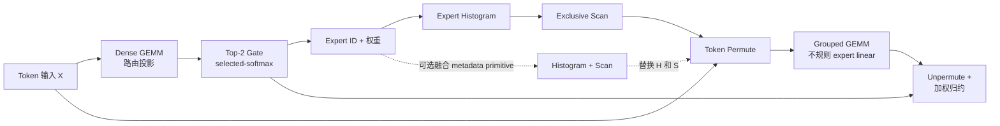

# RaggedRoute

[English](README.md) | 简体中文

[](https://github.com/shunwendongan/RaggedRoute/actions/workflows/ci.yml)
[](LICENSE)

一个面向单 GPU Top-2 混合专家（MoE）路由与不规则专家计算、以证据驱动的 CUDA 项目。

RaggedRoute 是一条可解释的七阶段流水线，而不是七个彼此孤立的 CUDA Demo。项目包含一次破坏源码兼容性的 v0.2 C++ API 升级、strict-FP32 CUDA 实现、独立 CPU oracle、仅用于 benchmark 的外部库参考路径，以及可审计的 L1/L2/L3 测量体系。它重点展示 CUDA 性能工程判断：先固定语义合同和正确基线，再定位真实瓶颈，每轮只验证一个优化假设，并拒绝无法通过反例门禁的候选实现。

> [!IMPORTANT]
> 这是一个可复现的 AI Infra/CUDA 简历项目，不是生产级 MoE runtime。当前可执行路径仅在 RTX 3080 / SM86、FP32、row-major tensor 上验证。FP16/BF16 Tensor Core kernel、H100/Blackwell 实卡验证、多 GPU Expert Parallel 和完整 MoE FFN 均未实现。

## 流水线概览



两个 L3 入口明确区分测量边界：

- `chain_from_tokens`：包含路由投影在内的全部七个语义阶段；
- `chain_from_logits`：输入已有 router logits，只执行之后六个阶段。

Benchmark registry 一共暴露八个 adapter：七个语义算子，以及可选的 `histogram_exclusive_scan` 组合 primitive。

## 当前实现

| 算子 / primitive | SM86 `Auto` | 研究或外部库路径 | 当前结论 |
|---|---|---|---|
| Dense GEMM | `cuda_naive` | optimized id 1–7；cuBLASLt/cuBLAS 参考 | v3 是树内大 shape 最强路径，但未默认晋级 |
| Top-2 Gate | `cuda_naive` | optimized id 1–4；benchmark-only CUB/vLLM 参考 | exact-shape 与连续 bucket 门禁均未形成晋级区间 |
| Expert Histogram | shape-dispatched `cuda_candidate` | small/sparse/block-private 路径；CUB 参考 | 通过 12-case、五进程门禁后在 SM86 晋级 |
| Exclusive Scan | `cuda_naive` | CUB Device/Block/Warp Scan 参考 | standalone 实验候选已删除 |
| Histogram + Scan | `R <= 4096`、`E <= 64` 时使用融合 F2，否则回退两阶段路径 | CUB 组合参考 | 代码路径存在，但仍需 release 级复测 |
| Token Permute | `cuda_naive` | 显式 v2 shape dispatcher；adapted vLLM 路径 | 保留作研究；pure-permute 稳定性阻止默认晋级 |
| Grouped GEMM | `cuda_naive` | benchmark-only SM86 candidate；CUTLASS/cuBLAS 参考 | 未通过声明的 CUTLASS shape 门禁 |
| Unpermute | `cuda_naive` | benchmark-only warp/CTA candidate；adapted vLLM 参考 | 因 tail 与稳定性门禁失败而拒绝晋级 |

> [!CAUTION]
> `histogram_exclusive_scan` 在 SM86 上当前会由 `Auto` 选择融合 F2。归档运行受到其他 GPU workload 干扰：融合区域中心结果有潜力，但 CV、fallback 与 L3 门禁均失败。在独占 CUDA 环境复测通过或撤回默认选择之前，应将其视为实验路径。macOS 上没有进行任何新的 CUDA 能力或性能检查。

## 工程亮点

### 公共算子合同，而不只是 benchmark kernel

v0.2 API 有意保留两个层级：

- `raggedroute::ops::launch_*_naive` 是用于 L1 Kernel Body 研究的低层 kernel 入口；reset 与 workspace 前置条件保持显式；
- `raggedroute::{dense_gemm, topk_gate, histogram, exclusive_scan, histogram_exclusive_scan, token_permute, grouped_gemm, unpermute}` 是 L2/L3 使用的完整公共 wrapper。它使用调用方 CUDA stream，不在 hot path 分配显存或执行无条件同步，并将必要 reset 纳入算子边界。

浮点 payload 使用 `ConstTensorView`/`MutableTensorView`；`TensorSpec` 记录 dtype、layout 和 element stride。路由 metadata 保持强类型 `int32`。`KernelSelection` 将稳定 family（`Auto`、`CudaNaive`、`CudaOptimized`）与算子局部 research id 分离。FP16/BF16 及更低精度枚举只描述 API 可表达的类型，不代表已有对应 runtime kernel。

### 正确性优先于性能

每个 adapter 都管理自己的类型参数、CPU oracle、浮点容差或精确整数检查、reset 语义、workspace 合同和算子专属工作量估计。测试覆盖边界与随机 case、redzone、failure artifact round-trip、stream 行为、dtype/layout 拒绝、公共 API dispatch，以及在 RTX 3080 环境归档的 Compute Sanitizer 证据。

### 允许候选优化失败

Suite v2 将不同 variant 组织在同一个 logical case 下，并声明唯一 promotion baseline。`raggedroute.aggregate.v2` 保留全部配对字段；当 GPU、build、语义、seed、测量层级、cache policy、repeats、samples 或 excluded work 不一致时，`raggedroute.comparison.v1` 会拒绝计算 speedup。失败实验会保留在项目记录中，而不会被最好看的单点数字掩盖。

## 证据快照

当前 `main` 中最新报告是 [RTX 3080 七阶段 L3 三线路分析](docs/reports/l3_three_way_20260805/RaggedRoute_L3_3way_comparison.md)。报告使用一个固定 strict-FP32 workload（`T=512`、`E=64`、`top_k=2`、`K=N=128`），每条路径运行三个独立 Release 进程：

| Research chain | 聚合 p50 | p95 | 跨进程 CV | 解释 |
|---|---:|---:|---:|---|
| Selected CUDA candidates | 69.734 us | 76.820 us | 0.0605 | 诊断性 research chain，不是公共 `Auto` dispatch |
| Repository library chain | 94.413 us | 117.412 us | 0.1018 | Top-K 与 host-offset 边界不同，不能严格比较 |
| Triton reference | 245.760 us | 256.020 us | 0.0236 | 跨工具链参考，不是 promotion 分母 |

观察到的 CUDA/Triton 比值为 `3.524x`，但这里只把它作为跨 backend 诊断，不作为生产 speedup。在 CUDA research chain 中，Grouped GEMM 占 NSYS kernel time 的 `64.4%`。NCU 报告 106 registers/thread、one wave/SM、26.62% achieved occupancy，以及 SM/L2 工作不均，因此 Grouped GEMM 是下一阶段价值最高的优化对象。

项目也保留了最强反例：在干净的三进程、十 shape 对比中，Grouped GEMM candidate 相对 CUTLASS 的 ratio-of-sums 只有 `0.805x`，并在 `T=2048,E=64,K=N=128,uniform` 降至 `0.467x`。这项失败本身也是项目结论：局部胜点不足以支持默认发布。

## 快速开始

### CPU-only 验证（包括 macOS）

CPU-only preset 不启用 CUDA language。它用于验证 host-side schema、证据工具和仓库规则，不能验证 CUDA 算子能力或性能。

要求：CMake 3.24+、Ninja、Python 3 和 C++17 编译器。

```bash
cmake --preset cpu-release
cmake --build --preset build-cpu-release --parallel
ctest --preset test-cpu-release
python scripts/repository_checks.py
```

### RTX 3080 / SM86 CUDA 验证

现有实测环境为 Windows，安装 CUDA Toolkit、Visual Studio 2022 Build Tools、CMake、Ninja 和 Python。以下命令只能在受支持的 NVIDIA CUDA 系统运行：

```powershell
$env:RAGGEDROUTE_FETCH_REFERENCES = "ON"
cmd /c scripts\configure_windows.bat rtx3080-sm86-release
cmd /c scripts\build_windows.bat rtx3080-sm86-release
ctest --preset test-rtx3080-sm86-release

python scripts\run_benchmarks.py `
  --binary out\build\rtx3080-sm86-release\raggedroute_benchmark.exe `
  --config configs\project\benchmark\smoke.json `
  --output out\runs\smoke.jsonl
```

列出全部 adapter 和 variant：

```powershell
out\build\rtx3080-sm86-release\raggedroute_benchmark.exe --list
```

### 作为 CMake package 安装

启用 CUDA 的构建会导出 `RaggedRoute::runtime`、`RaggedRoute::baseline_ops`，以及独立测试支持 target `RaggedRoute::correctness_framework`。

```powershell
cmake --install out\build\rtx3080-sm86-release
```

```cmake
find_package(RaggedRoute 0.2 CONFIG REQUIRED)
target_link_libraries(my_target PRIVATE RaggedRoute::runtime)
```

Package 要求 C++17，并有意拒绝仍请求已删除 v0.1 pointer-based API 的 consumer。

## 依赖

- CPU-only 构建要求 CMake 3.24+、Ninja、Python 3 和 C++17 编译器，不会发现 CUDA Toolkit；
- CUDA 构建额外要求 NVIDIA CUDA Toolkit；实测 Windows 路径使用 Visual Studio 2022 Build Tools；
- cuBLAS/cuBLASLt 来自 Toolkit。CCCL/CUB 与 CUTLASS 是可选 benchmark 依赖，通过 `AUTO`、`SYSTEM`、`FETCH` 或 `OFF` 选择；Fetch 固定为 CCCL `v3.4.0` 和 CUTLASS `v4.6.1`；
- Adapted vLLM 源码和全部 benchmark-only reference 的来源与许可证记录在 `src/*/library_baseline/` 和 [`THIRD_PARTY_NOTICES.md`](THIRD_PARTY_NOTICES.md)。

## 测量边界

| 层级 | 回答的问题 | 典型边界 |
|---|---|---|
| L1 — Kernel Body | CUDA kernel 机制本身是否改善？ | 低层 launcher；必要 reset/workspace 可以作为显式前置条件 |
| L2 — Operator | 完整公共调用是否更好？ | validation/dispatch 合同、必要 reset、mapping preparation 和 kernel 工作 |
| L3 — Chain | 组合后的 MoE 路径是否更好？ | workspace 预分配，包含每次调用必需的全部算子工作 |

CUDA Event 提供未被 profiler 干扰的 Release latency。NSYS 用于解释 launch gap 和阶段占比；NCU 用于解释代表 kernel 的资源使用和瓶颈机制。Profiler duration 不会替代正式 Release latency。

## 当前限制与后续工作

- 在独占 RTX 3080 窗口复测融合 Histogram + Scan F2；若稳定性、fallback 或 L3 门禁仍失败，则撤回其 `Auto`；
- Grouped GEMM 每轮只验证一个假设：先研究 task-map balance 和 expert skew，再研究 register live range/tile shape，并保持 CUTLASS 为 strict-FP32 参考；
- 在实现三态 promotion evaluator 前，增加带版本的真实 route trace 以及 working-set/cache 语义；
- 在作为 `main` 能力前，整理 realistic/vLLM-semantic stacked evidence 分支；
- 将原始 profiler binary 和完整 aggregate 放入不可覆盖的 Release asset，并加强仓库规则以防 evidence policy 漂移；
- 只在未来 CUDA 环境真正实现并测量 FP16/BF16 Tensor Core 路径。H100/Blackwell 支持必须经过实卡 correctness 与性能验证。

## 文档

- [实现状态与声明边界](docs/implementation-status.md)
- [开发路线图](docs/development-roadmap.md)
- [Benchmark 架构](docs/benchmark-architecture.md)
- [正确性框架](docs/correctness-framework.md)
- [算子优化索引](docs/operator-optimization-index.md)
- [CI 质量门禁](docs/ci-quality-gates.md)
- [完整技术设计与历史规划](docs/RaggedRoute-最终产品技术文档.md)
- [第三方来源与许可证](THIRD_PARTY_NOTICES.md)

## 许可证

RaggedRoute 使用 [Apache License 2.0](LICENSE)。Adapted 与 benchmark-only 第三方源码保留各自原始声明；详见 [`THIRD_PARTY_NOTICES.md`](THIRD_PARTY_NOTICES.md) 和 [`third_party/licenses/`](third_party/licenses/)。
