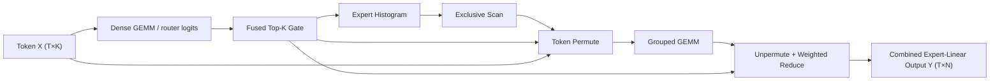

# RaggedRoute 最终产品技术文档

> 项目定位：单 GPU MoE 路由与专家计算 CUDA 核心算子库  
> 使用目标：第一段 AI Infra / CUDA 实习的可复现简历项目  
> 主开发平台：NVIDIA RTX 3080（Ampere，SM 8.6）  
> 可选迁移平台：NVIDIA H100（Hopper，SM 9.0 / SM90a）；实测前仅为 roadmap  
> Blackwell：仅保留接口与调研预案；未在实卡验证前不宣称支持或性能  
> 文档版本：v2.1，2026-07-29
> Benchmark 可执行契约：[benchmark-architecture.md](benchmark-architecture.md)

## 0. 先给结论

这个项目定位为“小而完整的单卡 MoE 核心算子库”，而不是完整模型框架，也不是七个互不相关的 CUDA Demo。采用“3 个主算子深入优化 + 4 个配套算子形成可组合微流水线”的结构：

- 主算子：Dense GEMM、Fused Top-K Gate、Grouped GEMM。
- 配套算子：Expert Histogram、Exclusive Scan、Token Permute、Unpermute + Weighted Reduce。
- 本地 RTX 3080 完成正确性、Ampere 优化和正式性能报告；有条件时在 H100 重新测基线和调参，再决定是否研究 TMA/WGMMA 等 Hopper 专属版本。
- 简历只写自己实测的数据。本文中的性能数字位置统一用 `[待实测]`，第三方论文或仓库的结果只能作为背景，不能写成自己的结果。

项目的一句话描述可以是：

> 独立实现面向单 GPU Top-2 MoE 路由与专家线性计算的 7 算子 CUDA 库，在 RTX 3080 上围绕访存合并、共享内存、warp primitive、Tensor Core 与持久化调度迭代；以自写朴素 CUDA kernel 和 NVIDIA CUDA/CUTLASS/CUB 库为基线，提供严格的正确性、Kernel Body、Operator 与算子链测评。

项目只承诺路由、数据重排、一次 Expert Linear Projection 和加权合并等核心 primitive，不承诺复现完整 Expert FFN、训练系统或端到端模型。这个边界既保留 GEMM 深度，也使项目更可信、可答辩。

---

## 1. 项目范围、证据边界与成功标准

### 1.1 v2 明确包含什么

设：

- token 数为 $T$；
- expert 数为 $E$，v2 重点覆盖 $E\le 64$；
- 每个 token 选择 $k=2$ 个 expert；
- hidden size 为 $K$；
- expert 输出宽度为 $N$；
- route pair 总数为 $R=T\cdot k$；
- 激活和权重默认 FP16，router logits、gate weight 和累加默认 FP32；
- Dense GEMM 另保留一个教育用途的 FP32 CUDA Core 路径。

v2 实现以下可组合算子微流水线，用于验证七个算子的接口与协同工作：



Dense GEMM 在项目里同时承担“独立通用算子”和“可选 router projection”两个角色；Top-K 也允许直接接收外部 logits，以便单独测量。Grouped GEMM 首版只实现一次 $X_eW_e$，用于研究动态 $M_e$ 下的专家线性映射；这条微流水线不等同于完整 MoE FFN。

### 1.2 v2 刻意不做什么

- 不做多 GPU Expert Parallel 和 All-to-All。
- 不做训练反向传播。
- 不实现完整两层 SwiGLU Expert FFN；Grouped GEMM 首版只实现单层 $X_eW_e$。上层以后可复用同一 Grouped GEMM 算子并组合激活，但不属于 v2 完成条件。
- 不把 FlashAttention、Conv、LayerNorm 等无关算子加入首版凑数量。
- FP8 不是首版必选项；RTX 3080 主线不依赖 FP8。H100 上完成 FP16/BF16 后才考虑 FP8 扩展。
- 不把 Blackwell 文档阅读或编译通过写成“B200 支持”。

### 1.3 三类陈述必须分开

| 类别 | 可以怎么写 | 不能怎么写 |
|---|---|---|
| 已实现事实 | “实现 FP16/FP32 accumulation 的 SM86 kernel” | 未运行就写“支持 H100/B200” |
| 自己的实测 | “在指定 shape、指定软件版本下，相对基线加速 `[待实测]`” | 把最佳单点当作全 shape 结论 |
| 外部资料 | “CUTLASS/论文采用了持久化调度，本文据此设计实验” | 把论文的加速比写成自己的结果 |

### 1.4 项目完成的最低标准

每个算子都必须同时有：

1. 清晰的数学与 API 语义；
2. CPU 或 PyTorch reference；
3. 至少一个朴素 CUDA 版本；
4. 至少一个基于 profile 证据的优化版本；
5. 边界 shape、非对齐 shape、空 expert、极端倾斜等测试；
6. 与合理基线的公平 benchmark；
7. Nsight Compute 指标、瓶颈结论和“失败优化”记录。

主算子额外要求至少三轮版本迭代，并能解释为什么快、在哪些 shape 不快。配套算子不必追求业内最优，但必须在 L2/L3 中显式呈现必要 metadata 和 launch 成本。

### 1.5 与原有 FP32 GEMM 项目的继承关系

这个方案是对原项目的上层扩展，不是推倒重写。原 GEMM 项目中的有效工作按以下方式保留：

| 原有内容 | 在新项目中的位置 | 是否保留 |
|---|---|---|
| FP32 `C=αAB+βC` 语义与 CPU/cuBLAS 对拍 | `dense_gemm/fp32` 教学与 correctness 路径 | 完整保留 |
| CTA Tile→Warp Tile→Thread Tile | Dense GEMM 的核心优化链，也是理解 Grouped GEMM 的基础 | 完整保留 |
| Shared Memory Tiling、Register Blocking、外积累加 | Dense GEMM V2/V3 | 完整保留并补 profile 证据 |
| `cp.async`、双缓冲、下一 K-tile 预取 | SM86 Dense GEMM V4；再迁移思路到 FP16/Grouped GEMM | 保留，但重新 sweep stage/资源 |
| 16B 搬运、`float4` 写回、Fast/Edge path | Dense GEMM 的 vector/tail 与 shape dispatch | 保留并增加对齐合同 |
| CUDA Event、GFLOP/s、cuBLAS 基线与 shape sweep | 全算子共享 benchmark harness | 升级为统一、可复现的测量框架 |
| 已有实测数字 | Ampere 历史结果 | 只有能由当前代码、环境和原始结果复现时才继续使用 |

在七算子微流水线尚未跑通前，简历可以暂时保留独立 GEMM 项目；完成集成后再把它升级为 RaggedRoute 的第一主算子，避免两个项目重复描述同一份工作。新项目不能让 GEMM 深度变浅：Dense GEMM 仍要保留版本链、shape-aware dispatch 和单独性能报告。

---

## 2. 建议 API、数据布局与仓库结构

### 2.1 稳定的算子契约

| 算子 | 建议接口与输出 | 关键约定 |
|---|---|---|
| Dense GEMM | `dense_gemm(args, workspace, stream)` | row-major；FP32 路径支持 $C=\alpha AB+\beta C$；FP16 路径 FP32 accumulate |
| Fused Top-K Gate | `(ids[T,k], weights[T,k]) = topk_gate(logits[T,E])` | v2 为 Top-2；相同值取较小 expert id；NaN 策略固定 |
| Expert Histogram | `counts[E] = histogram(ids[T,k])` | `sum(counts)=R`；32-bit count 足够时使用 `int32` |
| Exclusive Scan | `offsets[E+1] = scan(counts[E])` | `offsets[0]=0`，`offsets[E]=R` |
| Token Permute | `(X_p[R,K], route_pos[T,k], sorted_route[R]) = permute(X, ids, offsets)` | `route_pos[t,i]` 指向 permuted 行；`sorted_route[pos]` 为可选反向映射 |
| Grouped GEMM | `Y_p[offset[e]:offset[e+1],:] = X_p[...] @ W[e]` | $W$ 为 `[E,K,N]`；跳过空 expert |
| Unpermute + Reduce | `Y[t,:] = sum_i weights[t,i] * Y_p[pos(t,i),:]` | 每个输出元素由唯一线程/warp 负责，避免全局 atomic |

建议同时明确两个方向：`route_pos[t,i]=pos(t,i)` 供 token-owned unpermute 直接 gather；可选 `sorted_route[pos]=t*k+i` 供调试、按 permuted 行遍历或其他后端使用。不要用一个含糊的 `route_map` 名称掩盖方向，也不要在不同版本中悄悄改变 tie-break、权重归一化或 permute 顺序。

### 2.2 两层 API 与计时边界

算子库同时提供低层 kernel entry 和完整 operator wrapper。低层接口用于研究 Kernel Body，允许明确的调用前置条件；完整 operator 用于工程集成和 L2/L3 测评。

```cpp
// 低层接口示意：允许要求 counts 已清零、workspace 已准备。
Status histogram_kernel(const int32_t* ids,
                        int32_t* counts_zeroed,
                        const HistogramKernelConfig& config,
                        cudaStream_t stream);

// 完整算子示意：负责满足公开算子合同，但 hot path 不分配显存。
Status histogram(const HistogramArgs& args,
                 void* workspace,
                 size_t workspace_bytes,
                 cudaStream_t stream);

size_t get_histogram_workspace_size(const HistogramArgs& args);
```

统一合同：

- 使用 caller 提供的 CUDA stream，算子内部不做无条件设备同步；
- hot path 不调用 `cudaMalloc/cudaFree`，workspace 大小可查询并由调用方预分配；
- shape、dtype、layout、stride、alignment、确定性和非法输入策略写入 API；
- 低层 kernel benchmark 可以排除清零/动态 metadata，但结果必须标为 `Kernel Body`；
- 完整 operator benchmark 包含该公开 API 每次调用必需的内部 kernel、重置与动态 metadata；
- 静态 descriptor、handle、算法搜索和 workspace allocation 在 steady-state 测量前完成。

### 2.3 推荐仓库结构

```text
RaggedRoute/
├── CMakeLists.txt
├── cmake/
├── include/raggedroute/
│   ├── common.cuh
│   ├── dispatch.h
│   └── operators.h
├── src/
│   ├── dense_gemm/
│   ├── topk_gate/
│   ├── histogram/
│   ├── scan/
│   ├── permute/
│   ├── grouped_gemm/
│   └── unpermute/
├── tests/                 # correctness、边界和 sanitizer 测试
├── benchmarks/            # 独立算子与 L3 operator-chain
├── scripts/               # shape sweep、日志聚合、画图
├── configs/               # SM86/SM90a 与 benchmark YAML
├── reports/
│   ├── ampere_rtx3080.md
│   └── hopper_h100.md
└── third_party/            # 尽量用 CMake FetchContent 或 submodule 固定版本
```

### 2.4 编译目标分离

- RTX 3080：单独构建 `sm_86` 二进制。
- H100 通用路径：构建 `sm_90`；使用 Hopper 架构专属指令的路径单独构建 `sm_90a`。
- 运行时按 compute capability 分派；不让一个未经测试的 fallback 悄悄代表“架构支持”。
- 所有依赖固定 tag 或 commit，报告中记录 CUDA、驱动、编译器、PyTorch、CUTLASS/CUB 版本。

---

## 3. 项目级性能调优审计框架（吸收 CuEmbed 中适用的方法）

本节只吸收知乎《聊聊 CuEmbed（一）》及续篇中对本项目确有价值的分析方式，并将其适配到 MoE routing、permute 和小矩阵计算。文章提供的是“怎么提出和验证性能假设”的方法，不改变本项目的算子集合、数学语义和硬件主线；硬件结论还必须由 NVIDIA 官方文档、Nsight 指标和本项目实测确认。

### 3.0 保留、适配与拒绝边界

| 处理 | 内容 | 原因 |
|---|---|---|
| 原样保留 | 7 算子流水线、3 主 4 辅、Top-2/$E\le64$、FP16+FP32 accumulate、RTX 3080→H100、Blackwell 仅预案 | 这是项目定位和可答辩范围，不因一篇外部文章改变 |
| 直接吸收 | 真实/长尾数据、working-set sweep、cache hit 与 DRAM 的联合解释、Little’s Law、实测带宽 | 是通用 GPU 性能分析方法，能提高 benchmark 可信度 |
| 适配后吸收 | embedding hotness→expert 路由倾斜；索引 gather→permute/unpermute；metadata cache→offset/route/problem descriptor | 访问模式相似，但语义和瓶颈不能直接等同 |
| 仅作实验候选 | 16-byte load、循环展开、SMEM 缓存、fusion | 是否有效依赖对齐、复用、register、occupancy 和 shape，必须由 profile 决定 |
| 明确拒绝 | 把项目改成 embedding 库、照抄文章 kernel、沿用文章硬件数字/加速比、增加无关算子 | 会偏离原项目，且第三方结果不能成为自己的证据 |

任何新增优化若不能回答“它作用于哪个现有算子、减少什么成本、用什么指标验证”，就不进入主开发计划。文章内容只增加审计维度，不增加 v2 的必做算子数量。

工程上保留每个已验证版本和结果，不用新想法直接覆盖旧实现。新方向先作为独立 variant/feature flag，通过语义对拍、sanitizer、代表 shape 与反例 shape 的回归后才升级为默认路径；若只在单点获益，就保留为 shape-dispatch 分支或记录为失败实验。这样每次迭代都可比较、可回退，也不会因吸收外部思路而破坏原项目。

### 3.1 先问工作负载是否真实

只用均匀随机数据会掩盖真实问题。MoE 路由常出现 expert 热点、长尾与时间相关性，因此至少测试：

| 维度 | 建议取值 | 目的 |
|---|---|---|
| $T$ | 1、8、32、128、512、2048，并加入真实模型采样值 | 分离 decode、小 batch、prefill/吞吐场景 |
| $E$ | 8、16、32、64 | 观察 reduction 深度、直方图冲突和小 expert 数特化 |
| $K,N$ | 256、512、1024、2048；增加非 8/16/64 对齐值 | 覆盖 Tensor Core 友好与 tail path |
| 路由分布 | uniform、Zipf、单热点、双热点、周期性热点迁移 | 暴露 atomic contention、load imbalance 和缓存效应 |
| 缓存状态 | warm、cold、工作集小于/接近/大于有效缓存容量 | 区分 L1/L2 命中与真实 DRAM 压力 |
| expert 负载 | 均衡、轻度倾斜、重度倾斜、空 expert | 验证 Grouped GEMM 调度 |

Zipf 合成分布可写为

$$
p(e)=\frac{(e+1)^{-s}}{\sum_{j=0}^{E-1}(j+1)^{-s}},
$$

其中 $s=0$ 退化为均匀分布。建议 sweep $s\in\{0,0.6,1.0,1.4\}$，这些值只是压力测试轴，不宣称等同于某个真实模型。最终再从公开 MoE 模型或小规模 PyTorch router 中导出 `topk_ids` trace，报告合成与 trace-driven 两组结果。

### 3.2 缓存命中率不能脱离 L2/L3 解释

粗略地，若 L2 hit rate 是“在 L1 miss 条件下”的命中率，则到达 DRAM 的请求比例可近似写为

$$
f_{DRAM}\approx(1-h_{L1})(1-h_{L2\mid L1\ miss}).
$$

这只是思考模型，实际计数口径以所用 Nsight Compute 版本为准。更高缓存命中会让 DRAM bandwidth utilization 下降，但延迟可能同时变好；所以“DRAM 利用率更高”不是独立优化目标。必须同时看：

- kernel latency / throughput；
- logical bytes 与 physical DRAM bytes；
- L1/L2 hit rate；
- long scoreboard stall；
- active warps 与 issue efficiency；
- L2 完整算子与 L3 微流水线是否真正减少了中间读写。

### 3.3 用 Little’s Law 检查内存级并行是否够

为了以目标带宽 $B_{target}$ 隐藏平均内存延迟 $L$，所需在途字节数近似为

$$
Bytes_{in\ flight}\approx B_{target}\cdot L.
$$

若每个独立 load 为 $q$ 字节，则所需独立 load 数近似为

$$
N_{load}\approx\frac{B_{target}\cdot L}{q}.
$$

使用 16-byte vectorized load、循环展开、每线程处理多个连续元素，可以增加 ILP；但展开也增加 live register，可能降低 occupancy。正确做法不是盲目 `#pragma unroll`，而是编译多个 `UNROLL/ITEMS_PER_THREAD` 版本，记录：

- registers/thread；
- active warps/SM；
- local-memory spill；
- long-scoreboard stall；
- achieved bandwidth 与 latency。

这能回答“到底是缺少独立请求，还是请求已经足够但受别的资源限制”。

### 3.4 用实测 Roofline，而不是只抄峰值

对每个算子计算逻辑算术强度

$$
AI=\frac{FLOPs}{Logical\ Bytes},
$$

再用同一块 GPU 上的 microbenchmark 测出：

- 连续 copy/read/write 的可持续带宽；
- 间接 gather/scatter 的有效带宽；
- 对应 dtype 和 shape 的 cuBLAS/CUTLASS 计算上界。

预测上界为

$$
P_{roof}=\min(P_{compute,measured},\ AI\cdot BW_{measured}).
$$

Top-K、atomic histogram、scan 这类操作不能只用 FLOP Roofline解释，还要补充 reduction depth、atomic serialization、launch/scheduler 开销。报告应同时给出“逻辑有效带宽”和 profiler 看到的物理层流量。

### 3.5 每次优化前必须回答的 12 个问题

1. 当前 shape 和分布是否代表目标场景，还是只对均匀随机数据有效？
2. 工作集在 warm/cold cache 下分别怎样？L1/L2 命中是否改变瓶颈？
3. 数学最小流量是多少，profile 的物理流量为何更大？
4. 是 compute、bandwidth、latency、atomic、launch，还是 scheduler bound？
5. global load/store 是否合并，平均每 sector 的有效字节是否合理？
6. 16-byte vector load 的地址、stride 和 tail 是否满足对齐？
7. shared memory 是复用数据还是只做了一次昂贵搬运？是否有 bank conflict？
8. 展开或 thread tile 增加了多少 ILP，又增加了多少 register？有 spill 吗？
9. occupancy 低是问题本身，还是每个 warp 已有足够 ILP？
10. metadata、atomic cursor、指针数组和 shape dispatch 占总时间多少？
11. 小 shape 是否由 kernel launch 主导，批量重复测量、shape dispatch 或安全 fusion 是否更有效？
12. 优化是否只改善单个 kernel，却增加了前后算子的转换、padding 或同步？

### 3.6 共享内存审计

- 明确每个 SMEM 数组的生产者、消费者、复用次数和生命周期。
- 对二维 tile 画出 lane 到 bank 的映射；必要时 padding 或 swizzle。
- `cp.async`/TMA 只解决搬运与重叠问题，不自动解决错误布局、bank conflict 或寄存器压力。
- 比较 1/2/3/4-stage pipeline；stage 越多，SMEM 占用越大，可能减少 resident CTA。
- 对 broadcast、warp shuffle 和 SMEM 交换分别做小实验；小 $E$ reduction 通常优先 shuffle。

### 3.7 文章方法论在七个算子中的落点

| 方法 | 最相关算子 | 需要验证的假设 |
|---|---|---|
| Zipf/热点与真实 trace | Histogram、Permute、Grouped GEMM、Unpermute | 倾斜是否带来 atomic 冲突、缓存收益或尾部拖延 |
| Cache hit 与工作集 sweep | GEMM 权重、Permute/Unpermute 间接访问 | DRAM 利用率下降是否其实来自更高命中 |
| Little’s Law / ILP | Permute、Unpermute、GEMM mainloop | active warp × 独立 load 是否足以覆盖延迟 |
| 16-byte load 与展开 | GEMM、Permute、Unpermute | 对齐、tail、register 与 occupancy 的平衡 |
| 缓存 metadata/indices 到 SMEM | Histogram、Permute、Grouped scheduler | 重用是否足以抵消搬运和同步 |
| 实测硬件带宽 | 全部 memory-bound 算子 | 理论峰值是否高估可达 roof |

---

## 4. 统一 benchmark、profile 与正确性规范

### 4.1 核心原则：记录边界，不等于把所有成本塞进一个数字

Kernel Body 是本算子库的主要性能指标，也是展示 CUDA 优化能力的第一证据。工业规范并不要求把所有 reshape、metadata 和 workspace allocation 强行合并进同一个时间；要求的是：测试名称、调用前置条件、排除项与基线必须一致且可复现。

本项目固定四层测评口径：

| 层级 | 测量对象 | 包含 | 典型用途 |
|---|---|---|---|
| L1 Kernel Body | 一个具体 CUDA kernel | kernel 本体；输入、输出、workspace 和必要前置状态已准备 | 每个算子的主要优化数字与版本消融 |
| L2 Device Operator Steady-State | 一个 device-side 公开算子调用 | 每次调用必需的清零、cursor reset、device dynamic metadata 及内部多个 kernel；workspace 已预分配 | 验证没有通过隐藏准备成本制造虚高结果；输入相关 host prepare 进入 L4 |
| L3 `chain_from_tokens` | 完整七算子微流水线 | Dense Router Projection、Top-K、统计/scan、permute、一次 Expert Linear、unpermute | 固定从 token 开始的完整 7 算子口径 |
| L3 `chain_from_logits` | 预计算 logits 后的六算子微流水线 | Top-K、统计/scan、permute、一次 Expert Linear、unpermute | 单独 suite/基线；不得冒充七算子链 |
| L4 Host End-to-End | C++/PyTorch 扩展真实调用 | host dispatch、kernel launch 和最终同步 | 可选工程指标，不作为单 kernel 优化主结果 |

简历优先选择一个主算子的 L1 结果和一个 L3 结果；README 保存四层完整数据。

### 4.2 哪些成本计入哪一层

| 成本 | L1 Kernel Body | L2/L3 处理方式 |
|---|---|---|
| 纯 view reshape | 不计，无设备搬运 | 不计，但记录 shape/stride 前置条件 |
| 物化 reshape/transpose/contiguous copy | 若不属于 kernel 合同可排除 | 若公开算子每次必须执行，则计入 |
| Permute/Concat | 如果它本身是目标 kernel，单独测 | 若属于微流水线，L3 计入；未使用的 Concat 不人为加入 |
| Histogram counts 清零 | atomic kernel body 可排除并标 `counts_zeroed` | 若完整 histogram 每次需要，L2/L3 计入 |
| Permute cursor reset | placement/copy kernel body可排除 | 若完整 permute 每次需要，L2/L3 计入 |
| 静态 metadata/descriptor | steady-state 排除 | 初始化一次；另记 cold-start 或 setup |
| 输入相关动态 metadata | 可在对应 kernel body 外 | 完整 operator/chain 计入 |
| Workspace allocation | 排除，循环外预分配 | steady-state 排除并报告 bytes；首次调用单独测 |
| Workspace 内部读写 | 自然包含 | 自然包含 |

任何被排除的步骤都必须写入结果 manifest。不能用 L1 数字冒充 L2，也不能把包含布局转换的库基线与已经预排布的自写 kernel 直接计算 speedup。

### 4.3 Kernel Body 正式计时规则

- Release 编译，允许 `-lineinfo`，禁止在性能结果中混入 `-G`。
- 所有输入、输出、handle、descriptor 和 workspace 在 warmup 前分配并初始化。
- warmup 与 measured loop 分离；次数、随机种子和采样策略写入 config。
- CUDA Event 记录在被测 kernel 所用的同一 stream；计时前清空该 stream 的前序工作，停止 event 后再同步。
- 超短 kernel 可在一个 event pair 中连续普通 launch $N$ 次，使用 `elapsed/N`，不引入其他执行模式。该值必须命名为 `batch_mean_us`；它的 p95 是“批次均值的 p95”，不是单次调用尾延迟。单调用 p95 必须使用 `N=1` 的独立采样协议。
- adapter 必须声明 repeat policy。Histogram L1 可以在不溢出时累加；Token Permute L1 会推进 cursor，当前实现强制 `N=1`，L2 则把每轮 cursor reset 计入时间。
- 至少进行 3 次独立进程运行；保存全部 raw batch means，主报告使用 process median 的 median，并补充 p95、MAD/IQR 或 CV，min 只作补充。
- 正式 benchmark 循环内不进行日志、随机数生成、分配、H2D/D2H 或无关 kernel。
- 测试结束抽样校验输出，避免某个优化版本改变数学语义。

### 4.4 Cache、时钟与环境

每个结果 JSON/CSV 保存：git commit、编译命令、CUDA toolkit、driver、GPU 完整名称与显存、compute capability、SM 数、时钟/功耗/温度、throttle reason、ECC/MIG 状态（若适用）、依赖 commit、随机种子、shape、dtype、路由分布和 cache 模式。

- warm-cache：重复同一组预分配 buffer；
- cold-cache：预分配多组 tensor 并轮换，或使用明确记录的 cache-thrashing 方法；
- 两种模式分表，不混合统计；
- 能锁钟时记录锁定值；不能锁钟时记录实际时钟、温度和波动；
- 云端 H100 记录 PCIe/SXM、MIG、共享状态与 profiler 权限。

### 4.5 本项目明确采用的基线

Triton 不作为性能 baseline。主性能对比只使用自写 CUDA kernel 与 NVIDIA CUDA/CUTLASS/CUB 库；PyTorch 主要用于正确性 reference，可选报告其高层调用时间。

| 算子 | 朴素 CUDA 基线 | 强基线/上界 |
|---|---|---|
| Dense GEMM | 一线程一个输出、朴素 tiled 版本 | cuBLAS/cuBLASLt、CUTLASS |
| Fused Top-K Gate | 一线程逐行 Top-2、普通 CUDA reduction | CUB Batched Top-K（本地版本支持且语义一致时）；否则只做 CUDA 版本链 |
| Expert Histogram | 每 route 一个 global atomic | 自写 shared/warp aggregation；CUB DeviceHistogram 仅在离散语义可匹配时参考 |
| Exclusive Scan | 单线程、朴素 Blelloch/warp scan | CUB WarpScan/BlockScan/DeviceScan |
| Token Permute | scalar row copy + global cursor | 自写 vectorized/block-partial 版本 + 实测带宽 roof |
| Grouped GEMM | 逐 expert cuBLAS loop | CUTLASS Grouped GEMM、可用版本的 cuBLAS Grouped API |
| Unpermute + Reduce | scalar gather 或 atomic scatter | 自写 token-owned vectorized gather-reduce + 实测带宽 roof |

每个 speedup 必须满足：同 GPU、同 stream、同 shape/trace、同 dtype/accumulator/output、同 layout、同数学语义和同 workspace 前提。cuBLAS/CUTLASS/CUB 的 handle、temp storage、JIT 和 heuristic 在测量前完成。没有完全同语义强库的算子，使用“naive CUDA→optimized CUDA→实测 roof”即可，不勉强寻找无效基线。

L3 基线由相同语义、相同 L3 成本边界下的朴素 CUDA 与 NVIDIA 库实现串联而成；若同时报告 PyTorch 高层链路时间，必须另表展示，不能把它与已预排布、已预分配的 CUDA operator-chain 直接计算 speedup。

H100 的结果必须相对 H100 上重新测得的基线，不拿 RTX 3080 的延迟直接计算“迁移加速”。

### 4.6 结果聚合

- 展示完整 per-shape latency/speedup heatmap；
- 跨 shape 的归一化比较可报告 unweighted geometric mean；真实 trace 同时报告加权总耗时，并以 `sum(weight*baseline_latency) / sum(weight*candidate_latency)` 计算总体 speedup。不得把 weighted geometric mean 称为真实部署耗时收益；
- 报告 `speedup>1` 的 shape coverage 与最大 regression；
- Dense/Grouped GEMM 报告 latency、useful TFLOP/s 和相对强基线效率；
- memory-bound 算子报告 logical effective GB/s，同时用 profiler 解释 physical L2/DRAM traffic；
- 不平均不同基线、不同 dtype 或不同 cache 模式的百分比。

### 4.7 Nsight Compute 最小指标集

正式 latency/throughput 来自无 profiler 的 benchmark。Nsight Compute 只负责解释原因，因为 replay、cache flush、clock control 和序列化可能改变 duration。

不同架构和 Nsight 版本的 metric 名称会变化，因此脚本按 section 采集并把原始 `.ncu-rep` 留档：

- GPU Speed of Light / Compute Workload Analysis；
- Memory Workload Analysis（L1/TEX、L2、DRAM、sector、load/store）；
- Occupancy 与 Launch Statistics（register/thread、SMEM/block、active warps）；
- Warp State / Scheduler Statistics（long scoreboard、barrier、not selected、math-pipe throttle）；
- Source Counters（分支、uncoalesced access、热点指令）；
- atomic/reduction 相关计数（以当前架构实际可用 metric 为准）。

只 profile 代表性的 3–5 个 shape；保存 `--cache-control`、`--clock-control`、replay mode、完整命令与 Nsight 版本。常用代表指标包括 `gpu__time_duration.sum`、`sm__throughput.avg.pct_of_peak_sustained_elapsed`、`dram__throughput.avg.pct_of_peak_sustained_elapsed`、`smsp__warps_active.avg.pct_of_peak_sustained_active`、L1/L2 hit rate 和 long-scoreboard stall。

### 4.8 正确性与调试顺序

1. 小 shape CPU/PyTorch 高精度对拍；
2. 随机与构造边界测试；
3. `compute-sanitizer --tool memcheck`；
4. `racecheck`/`synccheck` 检查共享内存与 barrier；
5. 出现非法访问或 race 时再使用 CUDA-GDB 定位；
6. correctness 稳定后分别运行 benchmark 与 profiler。

CUDA-GDB 适合定位错误，不是主要性能工具；Nsight Compute 用于单 kernel 因果分析，Nsight Systems 仅用于可选的 L3/L4 timeline 与 host launch gap。

### 4.9 可执行发布门禁

测试、正式性能评测和 profiler 必须是独立 target：

1. `correctness_tests`：reference、边界和 chain 对拍，不创建 CUDA Event，不产出性能结论；
2. `benchmark_smoke`：只检查所有 adapter、层级和 schema 可运行，dirty worktree 与少量 sample 均允许，数字不可进入报告；
3. `benchmark_release`：Release build、clean Git、验证开启、warmup≥10、samples≥20、至少三次独立进程，原始 JSONL 和 manifest 不覆盖旧 run；
4. `profile`：只采集代表 shape 的 `.ncu-rep`/timeline。Nsight 的 replay、cache/clock control 和序列化会改变 duration，其时间不得作为正式 latency。

公共 runner 的可执行生命周期和七个 adapter 的个性化 reset/reference/metrics 见 [Benchmark 架构与发布协议](benchmark-architecture.md)。CPU/PyTorch oracle 与 performance baseline 必须是两个字段：oracle 只判断正确性，cuBLAS/CUTLASS/CUB 或语义一致的 production implementation 才能成为 speedup 分母。

---

## 5. 算子一：Dense GEMM（主算子）

### 5.1 数学定义与成本

$$
C_{ij}=\sum_{p=0}^{K-1}A_{ip}B_{pj},\quad
A\in\mathbb{R}^{M\times K},\ B\in\mathbb{R}^{K\times N}.
$$

按常用约定，一次乘和一次加计 2 FLOPs：

$$
FLOPs\approx 2MNK.
$$

若计算 $C=AB$ 且不读旧 $C$，元素字节数为 $b_A,b_B,b_C$，理想最低逻辑流量为

$$
Q_{min}=b_A MK+b_B KN+b_C MN,
$$

$$
AI_{ideal}=\frac{2MNK}{b_A MK+b_B KN+b_C MN}.
$$

这是“每个输入只从外层存储读一次”的理想下界。真实 global/L2/DRAM 流量受 tile 复用、cache、split-K 和写回策略影响；若有 $\beta C$，还要加旧 $C$ 的读取。

### 5.2 资源与主要瓶颈

| 资源 | 使用方式 | 典型风险 |
|---|---|---|
| Global/L2 | 读取 A/B，写 C | 不合并、重复读、非对齐 tail、权重工作集超出缓存 |
| Shared memory | CTA tile、double/multi buffering | bank conflict、stage 太多、SMEM 限制 resident CTA |
| Register | thread accumulator、A/B fragment、地址 | accumulator 过大导致 occupancy 降低或 spill |
| Tensor Core/CUDA Core | FP16/BF16/TF32 或 FP32 FMA | shape 不对齐、指令发射不足、流水线空洞 |
| Scheduler | CTA tile 分配、split-K/stream-K | skinny/small GEMM 并行度不足或尾波 |

大而规则的 FP16 GEMM 往往 compute-bound；小 $M$、skinny GEMM、decode 型 shape 可能是 launch、weight bandwidth 或并行度不足。不能对所有 shape 使用同一个 tile。

### 5.3 版本化开发路线

| 版本 | 内容 | 必须验证 |
|---|---|---|
| V0 | CPU/PyTorch reference + cuBLAS 基线 | row-major/transpose 语义、容差 |
| V1 | 一线程一个 $C_{ij}$ 的 FP32 朴素 kernel | 合并访问与正确性；作为低性能起点 |
| V2 | CTA 2D tiling，A/B 搬入 SMEM | global transaction、SMEM bank、同步开销 |
| V3 | register blocking/thread tile、vectorized load、padding | ILP、register/thread、spill、occupancy |
| V4-SM86 | FP16 Tensor Core 路径，`cp.async` 多 stage，FP32 accumulate | stage 数、tile 组合、tail path |
| V5 | shape dispatcher：small-M、square、skinny 各自参数；可选 split-K | dispatch 开销与全 shape 稳健性 |
| V6-SM90a（可选深化） | H100 上用 CUTLASS/CuTe 学习 TMA、WGMMA、warp specialization | 完成迁移验收后再做；相对 H100 本地基线复测，不能直接沿用 SM86 参数 |

首版不建议直接从 inline PTX 开始。先用普通 CUDA、WMMA/CUTLASS 对照理解层次；能解释 CTA/warp/thread tile 与流水线后，再读 SASS 或尝试 CuTe。

### 5.4 Ampere 与 Hopper 的不同重点

- SM86：重点是 `cp.async` global→shared 异步拷贝、Tensor Core tile、SMEM padding、register/occupancy 和 tail 处理。
- H100 必做：先让可移植路径通过 correctness，重新搜索 tile/stage 并建立 H100 本地基线。
- H100 可选深化：再评估 TMA 降低地址与搬运开销、WGMMA/warpgroup、warp specialization 与持久化调度；若实现，使用 `sm_90a` 单独构建和测试。SM86 fallback 保留，不用宏把两套代码揉成难以验证的一份。

### 5.5 正确性与边界

- $M,N,K=0/1$；小于 tile；不是 8/16/64 倍数；极端 skinny；大矩阵。
- FP16 输入 FP32 累加与输出 cast；Inf/NaN；随机大动态范围。
- 对比 `torch.matmul`/cuBLAS，使用绝对误差加相对误差；容差随 $K$ 和 dtype 说明。
- 检查越界 predicate 不让未初始化 SMEM fragment 进入 MMA。
- 若支持 split-K，验证 reduction 次序导致的数值非确定性并在文档中声明。

### 5.6 Benchmark 与调优问题

- shape 分成 square、small-M/large-KN、skinny-N、非对齐四组。
- 报告 latency、TFLOP/s、相对 cuBLAS/CUTLASS、自测 compute roof 比例。
- sweep `BM/BN/BK`、warps/CTA、thread tile、pipeline stage、split-K。
- 问：A/B 哪个有跨 CTA cache reuse？权重是否 warm？`cp.async` 是否真正和 MMA 重叠？增加 stage 后 register/SMEM 是否让 active CTA 降低？
- 对失败版本保留数据，例如“更大 tile 虽减少 global 重读，但 accumulator 导致 spill”。这类结论很适合面试讲解。

### 5.7 参考资料（14 项）

| 编号 | 资料 | 如何使用与局限 |
|---|---|---|
| GEMM-01 | [CUDA C++ Programming Guide](https://docs.nvidia.com/cuda/cuda-c-programming-guide/index.html) | 查线程层次、内存模型、WMMA/异步机制；以实际 CUDA 版本为准。 |
| GEMM-02 | [CUDA C++ Best Practices Guide](https://docs.nvidia.com/cuda/cuda-c-best-practices-guide/index.html) | 建立 coalescing、occupancy、带宽测量方法；不是现成 GEMM 配方。 |
| GEMM-03 | [NVIDIA Ampere Tuning Guide](https://docs.nvidia.com/cuda/ampere-tuning-guide/index.html) | 确认 SM86 occupancy、SMEM 与 async copy 特征；注意 A100 的 SM80 参数不能照搬到 3080 的 SM86。 |
| GEMM-04 | [NVIDIA Hopper Tuning Guide](https://docs.nvidia.com/cuda/pdf/Hopper_Tuning_Guide.pdf) | H100 的 TMA、cluster、occupancy 入口；只用于 H100 阶段。 |
| GEMM-05 | [CUTLASS: Efficient GEMM in CUDA](https://docs.nvidia.com/cutlass/latest/media/docs/cpp/efficient_gemm.html) | 最重要的 CTA/warp/thread tiling、流水线教材。 |
| GEMM-06 | [CUTLASS GEMM API 3.x](https://docs.nvidia.com/cutlass/latest/media/docs/cpp/gemm_api_3x.html) | 学习 collective/mainloop/epilogue 分层；模板复杂，不建议首日直接改底层。 |
| GEMM-07 | [CuTe dense GEMM tutorial](https://docs.nvidia.com/cutlass/latest/media/docs/cpp/cute/0x_gemm_tutorial.html) | 从 layout 与 thread partition 理解手写 GEMM；适合 V4 以后。 |
| GEMM-08 | [NVIDIA CUTLASS repository](https://github.com/NVIDIA/cutlass) | 用 profiler、example 和 kernel 配置做强基线；开发时固定 commit。 |
| GEMM-09 | [cuBLAS documentation](https://docs.nvidia.com/cuda/cublas/index.html) | cuBLAS/cuBLASLt 正确性与性能基线；heuristic 结果也需 warmup 和固定 workspace。 |
| GEMM-10 | [NVIDIA Matrix Multiplication Background User’s Guide](https://docs.nvidia.com/deeplearning/performance/dl-performance-matrix-multiplication/index.html) | 理解 GEMM 维度、tile wave 与算术强度；不能替代实卡 profile。 |
| GEMM-11 | [Triton Matrix Multiplication tutorial](https://triton-lang.org/main/getting-started/tutorials/03-matrix-multiplication.html) | 仅学习 program-id 映射、group ordering 与 autotune，不作为性能 baseline；项目主线保留 CUDA C++。 |
| GEMM-12 | [Triton Persistent Matmul tutorial](https://triton-lang.org/main/getting-started/tutorials/09-persistent-matmul.html) | 仅学习固定 CTA 数和持久化 tile 调度，不作为性能 baseline；尤其适合后续 small/irregular shape。 |
| GEMM-13 | [DeepGEMM](https://github.com/deepseek-ai/DeepGEMM) | 研究 Hopper FP8、调度、流水线和工程化；其当前硬件/精度要求不适合作为 RTX 3080 可运行基线。 |
| GEMM-14 | [Nsight Compute Profiling Guide](https://docs.nvidia.com/nsight-compute/ProfilingGuide/index.html) | 将 source、stall、memory 与 Tensor Core 指标连到具体版本；metric 名称随版本/架构变化。 |

---

## 6. 算子二：Fused Top-K Gate（主算子）

### 6.1 先固定数学语义

输入 router logits $L\in\mathbb{R}^{T\times E}$。v2 对每个 token 选择两个不同 expert：

$$
(e_{t,0},e_{t,1})=\operatorname{Top2}(L_{t,:}).
$$

本文默认“先选 Top-2，再只对选中 logits 做归一化”：

$$
m_t=\max(L_{t,e_{t,0}},L_{t,e_{t,1}}),
$$

$$
w_{t,i}=\frac{\exp(L_{t,e_{t,i}}-m_t)}{\sum_{j=0}^{1}\exp(L_{t,e_{t,j}}-m_t)}.
$$

这与“先对全部 $E$ 个 expert 做 softmax，再保留 Top-2 且不重新归一化”的权重语义不同。仓库必须把模式写进 API 或 config，不能只叫 `fused_topk`。

tie-break 固定为：logit 相同则 expert id 较小者优先。建议 NaN 默认按 $-\infty$ 处理，并测试全 NaN 行的显式错误/回退策略。

### 6.2 操作量、流量与瓶颈

Top-2 至少要读取 $TE$ 个 logits，并进行 $O(TE)$ 比较；选中后只需少量 `exp`、加法和除法。若 logits/gate 为 FP32、id 为 int32，最低逻辑流量近似为

$$
Q_{min}\approx 4TE+4Tk+4Tk\quad bytes.
$$

比较、shuffle 和 transcendental operation 不能用单一 FLOP 数准确描述，因此本算子重点报告 rows/s、GB/s、latency、reduction 指令和 stall，而不是夸大 TFLOP/s。

| 资源 | 典型情况 |
|---|---|
| Global/L2 | 连续读取每行 logits；输出很小，输入流量占主导 |
| Register | 每 lane 的局部 top-2 `(value,id)`；展开 E 后 live range 可能过大 |
| Shuffle/SMEM | $E\le32$ 优先 warp shuffle；$32<E\le64$ 可每 lane 处理两项再归并，或两个 warp/行 |
| SFU | 只对选中 2 项做 exp 时通常不是主瓶颈；若全 E softmax 则需重新评估 |
| Launch | 小 T 时常是主要成本，fusion 很有价值 |

### 6.3 版本化路线

| 版本 | 内容 | 关键实验 |
|---|---|---|
| V0 | PyTorch `topk` + 明确 softmax reference | tie、NaN、全等 logits、确定性 |
| V1 | 一线程处理一行并维护 top-2 | 简单但低并行；作为 latency 起点 |
| V2 | 一 warp/行，lane local candidate + shuffle merge | $E=8/16/32/64$ 特化；shuffle 次数 |
| V3 | 读取、Top-2、selected-softmax、输出一次 fusion | 相对拆分 kernel 减少的中间流量和 launch |
| V4 | 多行/warp 或多 token/CTA，vectorized load，编译期 E 分派 | 小 E 与小 T 下 warp 利用率 |
| V5 | 可选把 per-block expert partial histogram 一并产生 | atomic 是否反而拖慢 Top-K；不得改变 tie 语义 |

对于 $k=2,E\le64$，不要直接照搬面向“单个超长数组、大 $k$”的 radix/bitonic 全局 Top-K。论文的算法思想有用，但本项目核心是“大量短行 + 极小 k”的寄存器归约。

### 6.4 Ampere/Hopper 与正确性

- 首先写可移植 warp primitive；Ampere 与 Hopper 都能运行。
- H100 不一定自然更快：小行 reduction 可能由 launch/latency 主导。重新测 occupancy、scheduler 和 clocks，不强行加入 TMA。
- 输入长度、行 stride、对齐和 $E$ 的编译期特化比架构新指令更重要。
- 测试全相等、正负 Inf、NaN、极大绝对值、重复最大值、$E=1$（应拒绝 Top-2）、非连续输入（若 API 声称支持）。
- 每次运行检查 ids 唯一、范围合法、权重非负且和约等于 1。

### 6.5 Benchmark 与调优问题

- $T$ 从 1 到 4096，$E=8/16/32/64$；另加非目标范围确认 fallback。
- 主 baseline：一线程逐行 Top-2 的朴素 CUDA 与语义一致且本地版本可用的 CUB Batched Top-K；PyTorch/`torch.topk` + selected softmax 主要用于正确性，可另报高层调用时间但不作为主 speedup 分母。
- 报告单行/批量 latency、rows/s、有效读带宽、register/thread、active warps、long scoreboard、shuffle/reduction 热点。
- 问：一 warp/行是否在 $E=8$ 浪费 75% lanes？一次处理多行是否增加 ILP？展开 E 是否导致 register 暴涨？Top-K + softmax fusion 是否真的减少 global round trip？
- histogram fusion 要分别测 uniform 与 Zipf；如果 Top-K kernel 因 atomic contention 变慢，就退回 partial histogram 或独立 kernel。

### 6.6 参考资料（14 项）

| 编号 | 资料 | 如何使用与局限 |
|---|---|---|
| TOPK-01 | [Efficient Top-K Query Processing on Massively Parallel Hardware](https://doi.org/10.1145/3183713.3183735) | Bitonic/radix/select 的经典 GPU 研究；主要问题规模比 $E\le64,k=2$ 大。 |
| TOPK-02 | [GPU-TopK source](https://github.com/anilshanbhag/gpu-topk) | 对照 bitonic 与 radix CUDA 实现；代码较老，不能直接当现代 SM86/SM90 最优。 |
| TOPK-03 | [Dr. Top-k: Delegate-Centric Top-k on GPUs](https://arxiv.org/abs/2109.08219) | 学习过滤与减少无效工作；偏大规模/多 GPU，不是短行直接模板。 |
| TOPK-04 | [RTop-K: Ultra-Fast Row-Wise Top-K](https://arxiv.org/abs/2409.00822) | 与本项目“批量行式 Top-K”最接近，可研究行级映射和 early stopping；近似策略不应默认用于严格路由。 |
| TOPK-05 | [RadiK](https://arxiv.org/abs/2501.14336) | 研究 radix、batch 和分布鲁棒性；大 $k$ 优势不等于 Top-2 优势。 |
| TOPK-06 | [CUB DeviceBatchedTopK](https://nvidia.github.io/cccl/unstable/cub/api/structcub_1_1DeviceBatchedTopK.html) | 现代 batched baseline，特别关注 determinism/tie/output ordering；需固定 CCCL/CUDA 版本，旧环境可能没有。 |
| TOPK-07 | [Online normalizer calculation for softmax](https://arxiv.org/abs/1805.02867) | 学习减少 softmax pass 与 Top-K fusion；先确认本文 selected-softmax 语义。 |
| TOPK-08 | [Triton Fused Softmax tutorial](https://triton-lang.org/main/getting-started/tutorials/02-fused-softmax.html) | 仅学习一行一 program、reduction 和 register/occupancy 权衡，不作为性能 baseline；也不是 Top-K 完整实现。 |
| TOPK-09 | [CUDA warp-level primitives](https://developer.nvidia.com/blog/using-cuda-warp-level-primitives/) | 正确使用 ballot/shuffle 与 active mask；避免独立线程调度下的错误假设。 |
| TOPK-10 | [vLLM fused MoE implementation](https://github.com/vllm-project/vllm/blob/main/vllm/model_executor/layers/fused_moe/fused_moe.py) | 查看实际 top-k 权重、expert map 与后续 kernel 接口；代码变化快，固定 commit 阅读。 |
| TOPK-11 | [vLLM modular Fused MoE design](https://docs.vllm.ai/en/v0.13.0/design/fused_moe_modular_kernel/) | 理解 router、prepare/finalize 与 backend 分层；系统范围远大于本项目。 |
| TOPK-12 | [Megatron-LM MoE documentation](https://github.com/NVIDIA/Megatron-LM/blob/main/megatron/core/transformer/moe/README.md) | 查看 router fusion、dtype、capacity 和 dispatcher 语义；多 GPU 训练特性不纳入 v2。 |
| TOPK-13 | [GShard](https://arxiv.org/abs/2006.16668) | Top-2 gating、capacity 与负载平衡的算法背景；不是 kernel 优化论文。 |
| TOPK-14 | [Switch Transformers](https://arxiv.org/abs/2101.03961) | 理解 top-1 routing、router precision 和稳定性，用于解释设计取舍；本项目仍固定 Top-2。 |

---

## 7. 算子三：Expert Histogram（配套算子）

### 7.1 数学、流量与冲突模型

对 route ids $r_j\in[0,E)$，$j\in[0,R)$：

$$
count[e]=\sum_{j=0}^{R-1}\mathbf{1}(r_j=e),\qquad
\sum_{e=0}^{E-1}count[e]=R.
$$

算法工作量 $O(R)$。忽略初始化和 atomic read-modify-write 放大时，最低逻辑流量约为

$$
Q_{ideal}\approx 4R+4E\quad bytes.
$$

这里的 $4E$ 只表示最终 count 数组的逻辑写入，不包含“把旧 counts 清零”的成本。L1 Histogram Kernel Body 的明确前置条件是 `counts[0:E]` 已清零，结果 manifest 写 `excluded_steps=[counts_reset]`；per-CTA partial 初始化若发生在被测 kernel 内，不能删掉。若某算法由 partial 与独立 merge 两个 kernel 组成，则分别给出两个 L1，并在 L2 合并测量完整 `reset + partial + merge`。L2 完整 Histogram 与 L3 微流水线都包含每轮 Histogram 前所必需的 `cudaMemsetAsync` 或 reset kernel。

直接 global `atomicAdd` 的物理流量与延迟不等于这个下界，并强烈依赖路由分布。uniform 可能分散冲突，Zipf/单热点会让同一地址串行化；另一方面，热点 count 也可能受缓存与原子单元行为影响，所以必须实测。

### 7.2 版本路线与资源分析

| 版本 | 设计 | 风险与检查 |
|---|---|---|
| V0 | CPU/PyTorch `bincount` reference | 非法 id、溢出、空输入 |
| V1 | 每 route pair 一个 global atomic | 简单基线；测 skew 下 serialization |
| V2 | 每 CTA shared histogram，结束后合并到 global | shared atomic 与 global atomic 数量；SMEM 初始化成本 |
| V3 | warp-aggregated atomic：相同 expert 的 lanes 合并 | `match_any/ballot` 正确性；小 E 热点收益 |
| V4 | 每 warp/CTA 私有子 histogram，减少 bank/atomic 冲突 | SMEM 容量、归并成本、occupancy |
| V5 | Top-K 产生 per-block partial count，独立小 kernel 归并 | 是否减少 ids 再读；是否拖慢 Top-K 主路径 |

E≤64 时 SMEM 数组很小，但“很小”不代表没有 bank conflict：多个 lane 对同一 bank/同一地址的 atomic 行为要通过 profile 和分布 sweep 评估。若 $R$ 很小，初始化 $E$ 个桶和第二阶段 merge 可能比直接 atomic 更慢，需要 shape dispatch。

### 7.3 Ampere/Hopper、正确性与 benchmark

- 两个架构先共用相同算法族；不要假定 Hopper atomic 一定让 privatization 失效。
- 测 uniform、Zipf、所有 id 相同、每个 id 轮转、空 expert、多数空 expert。
- `R=0/1`、$E=1/64$、非法负数/越界 id；正式 fast path 可依赖上游合法，debug build 必须检查。
- 报告 Gitems/s、latency、global/shared atomic 数、L2/DRAM 流量、stall、register/SMEM 和各分布下曲线。
- L1、L2 各保留一行结果：L1 标注 `counts_zeroed=true`，L2 报告 `reset + histogram`；L3 中每轮必要的 reset 在 Histogram 前完成并计入链路。
- 问：冲突发生在 global 还是 shared？warp aggregation 减少了多少 atomic？桶初始化/merge 占比多少？热点缓存是否降低 DRAM 流量但仍因 serialization 变慢？

### 7.4 参考资料（12 项）

| 编号 | 资料 | 如何使用与局限 |
|---|---|---|
| HIST-01 | [Fast Histograms Using Shared Atomics](https://developer.nvidia.com/blog/gpu-pro-tip-fast-histograms-using-shared-atomics-maxwell/) | 两阶段 privatization 的直观入口；文章硬件较老，结论必须在 SM86/SM90 复测。 |
| HIST-02 | [Voting and Shuffling to Optimize Atomic Operations](https://developer.nvidia.com/blog/voting-and-shuffling-optimize-atomic-operations/) | 学习 warp 内合并相同 key/atomic；结合现代 active mask API。 |
| HIST-03 | [CUDA Pro Tip: Optimized Filtering with Warp-Aggregated Atomics](https://developer.nvidia.com/blog/cuda-pro-tip-optimized-filtering-warp-aggregated-atomics/) | warp aggregation 的分解方法；filter 是单计数器，扩展到多 expert 需 `match_any`。 |
| HIST-04 | [CUB BlockHistogram](https://nvidia.github.io/cccl/unstable/cub/api/classcub_1_1BlockHistogram.html) | 查看 sort/atomic 等 block histogram 策略和 TempStorage；固定 CCCL 版本。 |
| HIST-05 | [CUB DeviceHistogram](https://nvidia.github.io/cccl/unstable/cub/api/structcub_1_1DeviceHistogram.html) | 设备级库基线与 API；通用 histogram 范围映射有额外语义，本项目 ids 已离散。 |
| HIST-06 | [CUB/CCCL overview](https://nvidia.github.io/cccl/unstable/cub/index.html) | 理解 warp/block/device primitive 层次和可复用组件。 |
| HIST-07 | [CCCL source repository](https://github.com/NVIDIA/cccl) | 阅读 BlockHistogram/dispatch 源码与 benchmark；必须记录 commit。 |
| HIST-08 | [CUDA C++ Programming Guide: atomic functions](https://docs.nvidia.com/cuda/cuda-c-programming-guide/index.html#atomic-functions) | 确认 atomic scope、类型与内存语义；不要从旧博客推断新架构细节。 |
| HIST-09 | [CUDA Samples](https://github.com/NVIDIA/cuda-samples) | 查 histogram、warp vote 和 bandwidth 示例；samples 是教学代码，不是性能上界。 |
| HIST-10 | [Ampere Tuning Guide](https://docs.nvidia.com/cuda/ampere-tuning-guide/index.html) | 核对 SM86 SMEM/occupancy 约束。 |
| HIST-11 | [Hopper Tuning Guide](https://docs.nvidia.com/cuda/pdf/Hopper_Tuning_Guide.pdf) | H100 上重新评估 SMEM、cluster 和 atomic 周边资源；首版无需 cluster。 |
| HIST-12 | [《聊聊 CuEmbed（一）》](https://zhuanlan.zhihu.com/p/1959047008972171179) | 借鉴真实分布、cache 与带宽审计问题；属于经验文章，硬件事实需官方资料和自测交叉验证。 |

---

## 8. 算子四：Exclusive Scan（配套算子）

### 8.1 数学定义与复杂度

由每个 expert 的计数生成分段起点：

$$
offset[0]=0,\qquad
offset[e]=\sum_{j=0}^{e-1}count[j]\quad(1\le e\le E),
$$

因此 `offset[E] = R`，expert $e$ 的连续区间为 `[offset[e], offset[e+1])`。

顺序工作量为 $O(E)$；并行树的深度为 $O(\log E)$。若输入/输出为 int32，最低逻辑流量约为

$$
Q_{ideal}=4E+4(E+1)\quad bytes,
$$

加法不足 $E$ 量级。对目标 $E\le64$，它不是带宽吞吐问题，而通常是 kernel launch、同步和与相邻算子的接口问题。

### 8.2 版本路线与资源占用

| 版本 | 设计 | 适用范围与问题 |
|---|---|---|
| V0 | CPU reference / CUB DeviceScan baseline | 验证语义；CUB 的通用 dispatch 对 tiny E 可能有固定开销 |
| V1 | 单线程顺序 scan | $E$ 极小时是重要 latency baseline，不要预设并行一定快 |
| V2 | 单 warp inclusive/exclusive scan via shuffle | $E\le32$；active mask 和非 2 次幂长度要正确 |
| V3 | 两 warp或单 CTA scan，warp partial + warp total | $32<E\le64$；只需极少 SMEM |
| V4 | Blelloch upsweep/downsweep 教学版 | 理解 work-efficient scan；barrier 数可能让 tiny E 更慢 |
| V5 | 与 histogram partial merge 或 permute metadata 准备组合 | 只有数据依赖和同步可安全表达时才 fusion |

SMEM 只存 $E$ 个 count/partial，register 压力也低。真正的陷阱是：为了省一个几微秒以下的 tiny kernel，写出依赖 grid-wide sync 的错误 fusion。普通 kernel 内 CTA 之间没有隐含全局 barrier；若 histogram 跨多个 CTA，不能在同一普通 kernel 中直接读取“所有 CTA 都已完成”的全局 counts。

### 8.3 Fusion 的合法方案

1. 保留 histogram 与 scan 两个 kernel，分别报告 L1 并在 L3 中保留真实 launch 成本；这是首选稳健方案。
2. histogram 第一阶段产生 per-CTA partial counts，第二个 kernel 同时 merge + scan；$E\le64$ 时可由单 CTA 完成。
3. 当 $R$ 足够小、整个 histogram 本就由单 CTA 完成时，可在该 CTA 内 barrier 后直接 scan。
4. Cooperative Groups grid sync 只作为实验分支，需要 cooperative launch 条件与 occupancy 验证，不作为默认路径。

### 8.4 正确性、benchmark 与调优问题

- count 全 0、只有一个非零桶、极端大 count、$E=1/31/32/33/63/64$。
- 检查 offsets 单调、首尾正确、差分等于 counts；考虑 int32 总数溢出，超范围时拒绝或切 int64 reference。
- baseline 同时包含单线程、自写 warp scan 和 CUB；用 CUDA Event 批量重复测 tiny kernel。
- 报告 latency、launch 占比、barrier/shuffle 数、register/SMEM；GB/s 对 tiny E 解释价值很低。
- 问：scan 的 L1 是否很短，但在 L3 中仍存在可见 launch 成本？如果是，优先保证简洁正确；fusion 是否真正减少 L3 时间，还是引入额外 partial buffer？

### 8.5 参考资料（13 项）

| 编号 | 资料 | 如何使用与局限 |
|---|---|---|
| SCAN-01 | [Blelloch, Prefix Sums and Their Applications](https://www.cs.cmu.edu/~guyb/papers/Ble93.pdf) | scan 的数学与 upsweep/downsweep 基础；不是 GPU 特定实现。 |
| SCAN-02 | [GPU Gems 3, Chapter 39: Parallel Prefix Sum](https://developer.nvidia.com/gpugems/gpugems3/part-vi-gpu-computing/chapter-39-parallel-prefix-sum-scan-cuda) | 经典 CUDA 教学与 bank conflict 思路；代码面向旧架构，不能直接作为性能基线。 |
| SCAN-03 | [Single-pass Parallel Prefix Scan with Decoupled Look-back](https://research.nvidia.com/publication/2016-03_single-pass-parallel-prefix-scan-decoupled-look-back) | 大规模 device scan 的通信规避与单 pass 思想；本项目 $E\le64$ 不需要完整算法。 |
| SCAN-04 | [CUB DeviceScan](https://nvidia.github.io/cccl/unstable/cub/api/structcub_1_1DeviceScan.html) | 工业级 device-wide baseline 和 determinism 说明；tiny E 固定开销需测。 |
| SCAN-05 | [CUB BlockScan](https://nvidia.github.io/cccl/unstable/cub/api/classcub_1_1BlockScan.html) | 可直接对照单 CTA primitive、TempStorage 与算法选择；固定版本。 |
| SCAN-06 | [CUB WarpScan](https://nvidia.github.io/cccl/unstable/cub/api/classcub_1_1WarpScan.html) | $E\le32$ 快速路径参考；注意 logical warp 和同步约束。 |
| SCAN-07 | [CUB overview](https://nvidia.github.io/cccl/unstable/cub/index.html) | 理解 WarpScan→BlockScan→DeviceScan 的组合关系。 |
| SCAN-08 | [Thrust API reference（`exclusive_scan`）](https://nvidia.github.io/cccl/unstable/thrust/api/index.html) | 高层 API baseline 和语义参考；在索引中定位 `exclusive_scan`，不用于解释底层最优性。 |
| SCAN-09 | [ModernGPU scan](https://moderngpu.github.io/scan.html) | 阅读 CTA scan、分层分解和工程接口；项目较老，需在现代 CUDA 验证。 |
| SCAN-10 | [ModernGPU repository](https://github.com/moderngpu/moderngpu) | 对照源码与 load/store patterns；不要直接复制许可证不明的片段。 |
| SCAN-11 | [CUDA Samples](https://github.com/NVIDIA/cuda-samples) | 教学 scan/reduction/cooperative 示例；不是 benchmark 上界。 |
| SCAN-12 | [CUDA warp-level primitives](https://developer.nvidia.com/blog/using-cuda-warp-level-primitives/) | 正确写 shuffle scan 和 active mask。 |
| SCAN-13 | [CUDA Cooperative Groups](https://developer.nvidia.com/blog/cooperative-groups/) | 评估 grid/block 协作的合法同步方式；cooperative launch 有额外限制。 |

---

## 9. 算子五：Token Permute（配套算子）

### 9.1 数学与数据布局

对于 route pair $(t,i)$，expert id 为 $e_{t,i}$。令该 route pair 在 expert $e$ 内的唯一 rank 为 $rank_e(t,i)$，则目标行：

$$
pos(t,i)=offset[e_{t,i}]+rank_{e_{t,i}}(t,i).
$$

输出为

$$
X_p[pos(t,i),:]=X[t,:],
$$

同时保存

$$
route\_pos[t,i]=pos(t,i),\qquad sorted\_route[pos(t,i)]=t\cdot k+i.
$$

其中 `route_pos` 是 unpermute 的直接输入；`sorted_route` 可按后端需要选择是否物化。由于 $k=2$，每个 token 行被复制两次，分别进入两个 expert 的连续区间。

### 9.2 理想流量与真实缓存效应

若激活元素字节为 $b_X$，先把与 placement 算法无关的激活流量和最小显式 metadata 分开。最朴素 route-pair 实现读取并写出每个复制行，且必须读取 `ids[R]`、写出 `route_pos[R]`：

$$
Q_{naive,base}\approx 2b_XRK+8R\quad bytes.
$$

若一个 CTA 同时处理同一 token 的两个 route，输入 $X[t,:]$ 可能只从较外层存储读取一次并被两个输出复用，理想逻辑下界可写为

$$
Q_{reuse,base}\approx b_XTK+b_XRK+8R\quad bytes.
$$

若 `materialize_sorted_route=true`，两式再增加 $4R$ 字节的显式写出。offset 读取、rank/partial metadata 与 atomic cursor 的 read-modify-write 随 placement 方案变化，必须另列 `metadata_bytes`/profiler 物理流量，不能藏进同一个理想公式。但“只读一次”可能由寄存器/SMEM 显式复用，也可能只是 L1/L2 命中；两者的物理 DRAM 结果不同。必须报告 logical bytes、L1/L2 hit、DRAM bytes 和延迟，不能仅看 DRAM utilization。

该算子几乎没有 FLOPs，属于 indirect gather/scatter、latency、atomic cursor 或 launch bound。连续的每行内容并不保证跨 warp 写地址连续；expert 分配顺序决定 scatter 合并程度。

### 9.3 rank/placement 的三种方案

| 方案 | 方法 | 取舍 |
|---|---|---|
| 全局 cursor | `local = atomicAdd(cursor[e],1)`，`pos=offset[e]+local` | 最简单；热点 expert atomic 冲突；路由内部顺序非确定 |
| block partial | CTA 内 histogram + scan 得到局部 rank，再对每 expert 一次 global reserve | atomic 从每 route 降到每 CTA/expert；metadata 和 SMEM 增加 |
| sort/group index | 先生成 `(expert,route)` 并按 expert 排列，再按索引 gather X | 写出连续、确定性可控；sort/index 构建本身有成本 |

v2 可先用全局 cursor 完成正确性，再实现 block partial。若项目接口不要求 expert 内稳定 token 顺序，不必为稳定排序付出巨大代价；但 `route_pos` 与可选 `sorted_route` 必须互为一致映射。

### 9.4 版本化优化路线

| 版本 | 内容 | 关键 profile |
|---|---|---|
| V0 | CPU/PyTorch stable-sort reference | 只作正确性，不作为最终性能语义强制项 |
| V1 | route-pair + atomic cursor + 标量复制 | atomic 与未合并访存起点 |
| V2 | 每行 `half2`/8B/16B vector copy，标量 tail | 对齐、bytes/sector、tail 分支 |
| V3 | 每 CTA 对一个/多个 token，复用 X 行到两个 route | input cache/SMEM/register 复用与输出 scatter |
| V4 | block histogram/scan + 每 expert 批量 reserve | uniform/Zipf 下 atomic 数和 SMEM 代价 |
| V5 | shape/distribution dispatch：小 R 直接 atomic，大 R/热点 privatize | dispatch 阈值由实验产生，不硬编码“经验值” |
| V6 | 与 Grouped GEMM 融合或 ScatterMoE 风格按 index 计算 | 高风险高级项，先测是否值得消除显式 X_p |

16-byte vector load/store 需要地址和 stride 对齐；若 $K$ 或 base pointer 不满足条件，必须有正确 tail/fallback。循环展开能增加独立 load，但要按 CuEmbed 方法论同时记录 register、active warps 和 scoreboard stall。

### 9.5 Ampere/Hopper 与 SMEM 重点

- SM86 首先优化合并访问、vector width、每线程 items、block partial rank；`cp.async` 只有在 X tile 会被明显复用时才值得。
- H100 可评估 TMA 搬运规则 tile，但输出地址由 expert 决定且不规则时，TMA 未必适合；不要为了“用新特性”增加描述符和调度开销。
- SMEM 可缓存一小批 route ids、offsets 和 X tile。画清楚 bank 与 lane 映射，尤其是多个 warp 读取同一 metadata 时。
- 路由倾斜既可能提高权重/metadata cache locality，也可能加剧 cursor contention 与 Grouped GEMM 负载不均；同时观察 L1、L2 与 L3。

### 9.6 正确性、benchmark 与调优问题

- 验证每个 route pair 恰出现一次、每个 expert 区间长度等于 count、`route_pos` 合法；若物化 `sorted_route`，验证两者互逆且无重复/遗漏。
- top-2 ids 默认必须不同；若上游允许重复，需要在 API 明确是复制两次还是合并权重。
- 覆盖 $T=0/1$、$K=1$、非 vector 对齐 K、空 expert、全热点、随机路由。
- L1 placement/copy kernel 允许以 `cursor_zeroed=true` 为前置条件并排除 reset，但必须记录 `excluded_steps=[cursor_reset]`；L2 完整 Permute 和 L3 微流水线包含每次必要的 cursor reset。
- benchmark 分离“cursor reset”“placement/index 构建”和“row copy”，同时报告组合时间；每条记录明确 `materialize_sorted_route`，避免只测复制 kernel 或少写一个可选输出后进行不公平比较。
- 报告有效 GB/s（按明确 logical bytes 定义）、physical DRAM/L2、cache hit、atomic 数、long scoreboard、bytes/sector、register、occupancy。
- 问：X 的第二次读取来自 L1/L2 还是 DRAM？热点下 atomic 和 cache 哪个主导？把 ids/offset 放 SMEM 的复用次数够吗？unroll 之后是否 spill？

### 9.7 参考资料（15 项）

| 编号 | 资料 | 如何使用与局限 |
|---|---|---|
| PERM-01 | [vLLM MoE permute/unpermute API](https://docs.vllm.ai/en/v0.15.0/api/vllm/model_executor/layers/fused_moe/moe_permute_unpermute/) | 查看真实接口、mapping 与组合方式；版本变化快，固定版本。 |
| PERM-02 | [vLLM MoE kernel feature matrix](https://docs.vllm.ai/en/stable/design/moe_kernel_features/) | 对照 backend、routing 与 fusion 能力；不要把 feature list 当作自己的实现。 |
| PERM-03 | [vLLM modular Fused MoE design](https://docs.vllm.ai/en/v0.13.0/design/fused_moe_modular_kernel/) | 理解 prepare/dispatch/finalize 数据流与可替换模块。 |
| PERM-04 | [MegaBlocks paper](https://proceedings.mlsys.org/paper_files/paper/2023/hash/5a54f79333768effe7e8927bcccffe40-Abstract-mlsys2023.html) | 学习动态 token 与 padding/稀疏布局取舍；论文侧重训练与 block sparse。 |
| PERM-05 | [MegaBlocks source](https://github.com/databricks/megablocks) | 阅读 routing、indices 和 sparse ops；依赖栈较大，只摘取设计。 |
| PERM-06 | [ScatterMoE paper](https://openreview.net/forum?id=YDZ7GeFLxq) | 重点研究避免 padded copy、融合重排和 expert linear；是 V6 的直接启发。 |
| PERM-07 | [ScatterMoE source](https://github.com/shawntan/scattermoe) | 对照 Triton index/scatter 实现；主项目为 CUDA C++ 时不可只包装该库。 |
| PERM-08 | [Tutel paper](https://arxiv.org/abs/2206.03382) | 动态 workload 与 layout/dispatch 系统背景；多数结果来自多 GPU。 |
| PERM-09 | [Tutel source](https://github.com/microsoft/tutel) | 查 encode/decode 与 fast dispatch；固定 commit，分离单卡可借鉴部分。 |
| PERM-10 | [FastMoE paper](https://arxiv.org/abs/2103.13262) | 了解 routing/communication/compute 的整体成本；本项目不做通信。 |
| PERM-11 | [FastMoE source](https://github.com/laekov/fastmoe) | 查本地 scatter/gather 接口和测试；代码年代与依赖需注意。 |
| PERM-12 | [Megatron-LM MoE documentation](https://github.com/NVIDIA/Megatron-LM/blob/main/megatron/core/transformer/moe/README.md) | 查看 permute fusion、dispatcher、capacity 配置；训练和多 GPU 内容不纳入 v2。 |
| PERM-13 | [TensorRT-LLM](https://github.com/NVIDIA/TensorRT-LLM) | 工业 MoE inference kernel 与 plugin 参考；工程庞大，按路径固定 commit 阅读。 |
| PERM-14 | [CUDA Best Practices Guide](https://docs.nvidia.com/cuda/cuda-c-best-practices-guide/index.html) | coalescing、有效带宽、对齐和 occupancy 的官方依据。 |
| PERM-15 | [《聊聊 CuEmbed（二）》](https://zhuanlan.zhihu.com/p/2034034674977260432) | 借鉴间接访问、vector load、展开、ILP 与 register 权衡；结论必须在本 shape 复测。 |

---

## 10. 算子六：Grouped GEMM（主算子）

### 10.1 数学、布局与成本

每个 expert $e$ 接收 $M_e=count[e]$ 行，且

$$
\sum_{e=0}^{E-1}M_e=R.
$$

对应独立 GEMM：

$$
Y_e=X_eW_e,\quad
X_e\in\mathbb{R}^{M_e\times K},
W_e\in\mathbb{R}^{K\times N},
Y_e\in\mathbb{R}^{M_e\times N}.
$$

总 FLOPs：

$$
FLOPs=\sum_e2M_eKN=2RKN.
$$

若每个活跃 expert 的权重至少从外层存储读取一次，最低逻辑流量可近似写为

$$
Q_{min}\approx b_XRK+b_YRN+b_W\sum_{e:M_e>0}KN.
$$

真实流量还受每个权重 tile 被多少 CTA 读取、L2 命中、split-K、padding 和 epilogue 影响。

Grouped GEMM 的难点不是总 FLOPs，而是 $M_e$ 动态、经常很小且高度不均：某些 expert 产生多个 CTA tile，某些为空；固定按 expert 启动 kernel 会有大量 launch 和尾波。

### 10.2 瓶颈分区

| 场景 | 更可能的瓶颈 | 优化中心 |
|---|---|---|
| 大且均衡的 $M_e$ | Tensor Core compute / mainloop | tile、stage、Tensor Core 利用率 |
| 大量小 $M_e$ | launch、weight bandwidth、scheduler metadata | grouped launch、persistent CTA、small-M tile |
| 重度倾斜 | 尾波、单 expert tile 堆积 | tile-level 而非 expert-level 动态调度 |
| 多数 expert 为空 | 无效 metadata/权重读取 | active-expert compaction、跳空 |
| $K,N$ 非对齐 | tail predicate、Tensor Core 覆盖下降 | fallback 或专门 tail epilogue |

### 10.3 资源占用

| 资源 | 作用 | 关键权衡 |
|---|---|---|
| Global/L2 | X/Y、每 expert 权重、problem descriptors | 小 M 时权重读取占比大；metadata cache/reuse |
| Shared memory | A/B tile、多 stage pipeline | 与 Dense GEMM 类似，但切换 expert 时 descriptor/layout 变化 |
| Register | accumulator + 当前 problem/tile 状态 | 持久化循环扩大 live range；过大 tile 会 spill |
| Tensor Core | FP16/BF16 mainloop | ragged M 与 tail 让利用率波动 |
| Scheduler | problem→tile 映射、work queue | 线性扫描 E、global atomic queue 或 host precompute 都有成本 |

### 10.4 版本化开发路线

| 版本 | 内容 | 目标与证据 |
|---|---|---|
| V0 | 对每个 active expert 调用 `torch.matmul`/cuBLAS | 正确性与“多次 launch”基线；记录 host overhead |
| V1 | CUTLASS/cublas grouped API 基线 | 建立强基线；统一 packed contiguous layout |
| V2 | 自写 FP16 Tensor Core grouped kernel，固定 tile，device descriptor | 完成单 launch；对照独立 GEMM 验证数学 |
| V3 | 固定数量 persistent CTA，按全局 tile id 遍历 problems | 降 launch 与尾波；profile scheduler 占比 |
| V4 | shape bucket / active expert compaction / small-M tile | 避免一个 tile 参数覆盖所有 $M_e$ |
| V5-SM86 | `cp.async` multi-stage、vector load、scheduler metadata 缓存 | 主线 Ampere 深化版本 |
| V6-SM90a（可选深化） | TMA + WGMMA/warp specialization，重新搜索 tile/stage | 完成 H100 迁移验收后再做；相对 H100 CUTLASS/cuBLAS 基线 |
| V7 可选 | fused epilogue、按 index 读取 X 或和 unpermute 协同 | 只有 L2/L3 证据支持时进入简历主结果 |

持久化 CTA 的伪逻辑：

```cpp
for (tile_id = initial_tile; tile_id < total_tiles; tile_id += num_persistent_ctas) {
    problem_id, local_tile = map_tile(tile_id, offsets_or_prefix);
    load_problem_metadata(problem_id);
    run_gemm_tile(problem_id, local_tile);
}
```

`map_tile` 可能线性扫描 expert、warp-prefix 查找、二分 offsets、host 预计算或 global work queue。哪一种最好取决于 E、tiles/problem 和动态性，必须把 scheduler 指令和 memory traffic 纳入测量。

### 10.5 Ampere 到 Hopper 的迁移方式

- 先把同一 FP16 语义、同一 shape/distribution 在 H100 用 cuBLAS/CUTLASS 和 SM86 风格 fallback 重新测一遍，确定瓶颈是否仍成立。
- 完成 H100 正确性、arch-local rebaseline 与参数重搜后，只有 profile 显示值得深化时，才把 TMA descriptor、WGMMA/warpgroup 和 producer/consumer warp specialization 作为可选后续；其寄存器与 SMEM 分配必须单独记录。
- H100 上 TMA 可降低规则 tile 的地址计算和搬运开销，但 ragged descriptor 更新、problem 切换和 small-M 调度仍可能主导。
- 不把 H100 的 FP8 DeepGEMM 结果与本项目 FP16 kernel直接比较；只有精度、scale、输出和 shape 完全一致才公平。

### 10.6 正确性与边界

- $M_e=0/1$；只有一个 active expert；全部 expert active；极端单热点。
- `sum(M_e)=R`、offset 单调；descriptor 指针、leading dimension 与 dtype 正确。
- $K,N$ 非对齐，尾 tile predicate；不同 expert 权重刻意设置不同常数，防止错用上一 expert descriptor。
- persistent scheduler 保证每个 `(expert,m_tile,n_tile)` 恰执行一次，无重复/遗漏。
- 随机 small shape 逐 expert 对拍；大 shape 用 PyTorch/CUTLASS；sanitizer 检查 problem 切换和 barrier。

### 10.7 Benchmark 与调优问题

- 固定 $R,K,N,E$，改变 $M_e$ 分布，避免只测均衡问题。
- 组合：uniform、Zipf、单热点、50% 空 expert、$R<E$、真实 trace。
- 报告 total TFLOP/s、latency、每组 shape 相对 arch-local baseline、Tensor Core/SM throughput、L2/DRAM、active warps、tail wave、scheduler 指令/时间近似。
- 单独测 descriptor/offset 准备是否在 host；若 L4 调用需要 CPU 构建指针数组，计入 L4，L1/L2 明确排除项。
- 问：是 MMA 慢，还是找下一个 tile 慢？权重在 L2 的命中随热点怎样变化？一个 persistent CTA 切换 problem 时流水线是否被清空？排序 problem 能否改善 load balance，代价是什么？

### 10.8 参考资料（16 项）

| 编号 | 资料 | 如何使用与局限 |
|---|---|---|
| GGEMM-01 | [CUTLASS Grouped GEMM example 24](https://github.com/NVIDIA/cutlass/blob/main/examples/24_gemm_grouped/gemm_grouped.cu) | 最直接的 C++ baseline 与 problem visitor 入口；固定与本地 CUDA 兼容的 commit。 |
| GGEMM-02 | [CUTLASS Grouped Kernel Schedulers](https://docs.nvidia.com/cutlass/latest/media/docs/cpp/grouped_scheduler.html) | 理解 persistent kernel、device-only/host-precompute 和 problem 排序。 |
| GGEMM-03 | [CUTLASS Efficient GEMM](https://docs.nvidia.com/cutlass/latest/media/docs/cpp/efficient_gemm.html) | mainloop、tile 与资源权衡基础。 |
| GGEMM-04 | [CUTLASS repository](https://github.com/NVIDIA/cutlass) | profiler、SM80/SM90 examples 与 correctness test；版本必须锁定。 |
| GGEMM-05 | [cuBLAS Grouped GEMM API introduction](https://developer.nvidia.com/blog/introducing-grouped-gemm-apis-in-cublas-and-more-performance-updates) | 官方 grouped API、heuristic 和 benchmark 注意事项；文章数字不是本项目结果。 |
| GGEMM-06 | [cuBLAS documentation](https://docs.nvidia.com/cuda/cublas/index.html) | grouped/batched/cuBLASLt 的 arch-local 强基线。 |
| GGEMM-07 | [Triton Group GEMM tutorial](https://triton-lang.org/main/getting-started/tutorials/08-grouped-gemm.html) | 仅学习固定 CTA、device scheduling 和 H100 TMA 示例，不作为性能 baseline；主线 CUDA C++ 需独立实现。 |
| GGEMM-08 | [Triton Persistent Matmul](https://triton-lang.org/main/getting-started/tutorials/09-persistent-matmul.html) | 仅学习 persistent tile scheduling 与 autotune，不作为性能 baseline。 |
| GGEMM-09 | [MegaBlocks paper](https://proceedings.mlsys.org/paper_files/paper/2023/hash/5a54f79333768effe7e8927bcccffe40-Abstract-mlsys2023.html) | 动态 MoE 负载、padding 与 block-sparse 替代路线；本项目首版仍是 grouped dense GEMM。 |
| GGEMM-10 | [MegaBlocks source](https://github.com/databricks/megablocks) | 研究 dropless MoE 的 GPU kernels 与布局。 |
| GGEMM-11 | [ScatterMoE paper](https://openreview.net/forum?id=YDZ7GeFLxq) | 研究重排与 expert linear 融合，作为 V7 方向。 |
| GGEMM-12 | [DeepGEMM](https://github.com/deepseek-ai/DeepGEMM) | Hopper/Blackwell grouped FP8、调度和 JIT 工程参考；不支持 SM86 主线，不能直接作 3080 baseline。 |
| GGEMM-13 | [vLLM modular Fused MoE](https://docs.vllm.ai/en/v0.13.0/design/fused_moe_modular_kernel/) | 查看不同 GEMM backend、prepare/finalize 合同与 shape config。 |
| GGEMM-14 | [Megatron-LM MoE documentation](https://github.com/NVIDIA/Megatron-LM/blob/main/megatron/core/transformer/moe/README.md) | 真实 grouped GEMM、router/permute fusion 配置与系统上下文。 |
| GGEMM-15 | [TensorRT-LLM](https://github.com/NVIDIA/TensorRT-LLM) | NVIDIA 推理 MoE kernel/plugin 和多精度实现参考；范围大，按具体路径阅读。 |
| GGEMM-16 | [Hopper Tuning Guide](https://docs.nvidia.com/cuda/pdf/Hopper_Tuning_Guide.pdf) | TMA、cluster、occupancy 等 H100 事实依据；H100 阶段使用。 |

> 关于 CUTLASS 的“contiguous offset Grouped GEMM”新 Operator API：当前文档中的部分教程可能要求 Blackwell。可用于理解 packed layout，但不能据此宣称 RTX 3080/H100 的该 Python API 路径可直接运行；SM86 主线优先使用与所固定 CUTLASS 版本匹配的 C++ grouped example，H100 阶段再选择对应 SM90 版本并重新验证。

---

## 11. 算子七：Unpermute + Weighted Reduce（配套算子）

### 11.1 数学定义

用 `pos(t,i)` 找到两个 expert 的输出：

$$
Y[t,n]=\sum_{i=0}^{k-1}w_{t,i}\,Y_p[pos(t,i),n].
$$

每个输出元素有 $k$ 次乘法和 $k-1$ 次加法，若分别计数：

$$
FLOPs=(2k-1)TN.
$$

若按 FMA=2 FLOPs 的惯例，也可报告约 $2kTN$，但必须注明口径。对 $k=2$，算术强度仍很低。

若 $Y_p$ 与输出元素字节分别为 $b_P,b_Y$，metadata/gate 为 int32/FP32，理想逻辑流量近似：

$$
Q_{ideal}\approx b_PkTN+b_YTN+4kT+4kT.
$$

它通常是两个间接 gather + scale/reduce + 连续 store，受缓存、内存延迟、合并和 launch 主导。

### 11.2 为什么不要用 scatter atomic

朴素方案可以让每个 expert output scatter 回 token，再对 `Y[t,n]` atomic add；但这会引入 $k$ 个全局 atomic、读改写流量和数值顺序不确定。更好的 ownership 是：一个线程/warp/CTA 负责一个 token 的一个连续 N tile，同时读取两个 `Y_p` 行，在寄存器完成加权和，然后只写一次 Y。这样完全避免输出 atomic。

### 11.3 版本路线与资源

| 版本 | 内容 | 关键验证 |
|---|---|---|
| V0 | PyTorch index-select + multiply + sum reference | mapping 与权重语义 |
| V1 | 一线程处理一个 `(t,n)`，读取 k 个位置 | 正确但地址计算重复 |
| V2 | vectorized pair gather + register weighted reduce + vector store | 对齐、tail、bytes/sector |
| V3 | 一个 warp/CTA 处理一个或多个 token tile，缓存 `pos/weight` | metadata 广播、ILP、register |
| V4 | 融合 output cast、bias/residual（若 API 确实需要） | 减少中间 Y 读写；不可为了 fusion 改语义 |
| V5 | 与 Grouped GEMM epilogue/scatter 融合 | 高级项；分析写冲突、同 token 两 expert 的同步问题 |

`pos` 与两个 weight 每个 token 会被 N 个元素复用，因此适合由 lane 0 读取后 shuffle broadcast，或每 CTA 缓存到 register/SMEM。不要让每个 `(t,n)` 线程重复从 global 读取同一 metadata。

### 11.4 Cache、ILP 与 Hopper 取舍

- `Y_p` 行是间接的，但每行内部 N 连续；让相邻 lane 读取相邻 n，确保每个 gather 源都合并。
- $k=2$ 时同时发出两个独立 vector load，增加 MLP；根据 Little’s Law 检查 active warps × independent loads。
- 展开 n-loop 可以提高 ILP，也会增加两个输入向量和 accumulator 的 live register；按 `ITEMS_PER_THREAD` sweep。
- 热点 expert 不一定意味着相同 `Y_p` 行被复用，因为每个 token 的 expert 内 rank 不同；不要把“同 expert”误判为“同地址”。
- H100 上先复测普通 vectorized kernel。TMA 对规则二维 tile有优势，但两个任意行 gather 的描述符/启动成本可能不划算。

### 11.5 正确性、benchmark 与调优问题

- $k=1/2$（v2 对外固定 2，但内部测试 1）、权重 0/1/相等、一个 route 无效时的明确定义。
- 所有 `route_pos` 合法；若有 `sorted_route` 则与之互逆；覆盖非对齐 N、N=1、小 T、极大 T、NaN/Inf。
- FP32 accumulate 后 cast FP16；与 reference 比较并记录误差。
- benchmark 分离 cold/warm cache、uniform/Zipf route 和不同 N；报告有效 GB/s、physical DRAM/L2、hit rate、long scoreboard、register/occupancy、metadata load 数。
- 问：是否每个输出只写一次？metadata 是否被重复读取？两个 gather 能否并行在途？vector width 的 tail 成本多少？融合 residual 后省下的真实流量是多少？

### 11.6 参考资料（15 项）

| 编号 | 资料 | 如何使用与局限 |
|---|---|---|
| UNP-01 | [vLLM permute/unpermute API](https://docs.vllm.ai/en/v0.15.0/api/vllm/model_executor/layers/fused_moe/moe_permute_unpermute/) | 直接对照 mapping、unpermute 与 fused MoE 调用合同。 |
| UNP-02 | [vLLM MoE kernel features](https://docs.vllm.ai/en/stable/design/moe_kernel_features/) | 查看 finalize、routing weight 与 backend 组合；固定版本。 |
| UNP-03 | [ScatterMoE paper](https://openreview.net/forum?id=YDZ7GeFLxq) | 学习避免重排拷贝、linear 与 scatter 融合，是高级 fusion 主要参考。 |
| UNP-04 | [ScatterMoE source](https://github.com/shawntan/scattermoe) | 阅读 ParallelLinear/indexed reduce 实现；不能只包装成自己的 CUDA成果。 |
| UNP-05 | [MegaBlocks paper](https://proceedings.mlsys.org/paper_files/paper/2023/hash/5a54f79333768effe7e8927bcccffe40-Abstract-mlsys2023.html) | 理解 dropless layout 与 output combine 的系统成本。 |
| UNP-06 | [MegaBlocks source](https://github.com/databricks/megablocks) | 对照 gather/scatter 与 sparse op 数据结构。 |
| UNP-07 | [Tutel paper](https://arxiv.org/abs/2206.03382) | dispatch encode/decode 与动态布局背景。 |
| UNP-08 | [Tutel source](https://github.com/microsoft/tutel) | 查看 fast decode/weighted combine 代码路径；多 GPU 部分不纳入 v2。 |
| UNP-09 | [FastMoE source](https://github.com/laekov/fastmoe) | 参考 local gather/scatter 与 gate combine；注意项目版本。 |
| UNP-10 | [Megatron-LM MoE documentation](https://github.com/NVIDIA/Megatron-LM/blob/main/megatron/core/transformer/moe/README.md) | 查看 permute fusion、router dtype 与 token dispatcher 语义。 |
| UNP-11 | [TensorRT-LLM](https://github.com/NVIDIA/TensorRT-LLM) | NVIDIA MoE finalize/fusion 工业实现入口；锁定具体源码 commit。 |
| UNP-12 | [GShard](https://arxiv.org/abs/2006.16668) | Top-2 gate 权重与 combine 的算法背景；不是 kernel 教程。 |
| UNP-13 | [Mixtral of Experts](https://arxiv.org/abs/2401.04088) | 理解实际 Top-2 expert 输出加权；不提供底层 CUDA 优化细节。 |
| UNP-14 | [CUDA Best Practices Guide](https://docs.nvidia.com/cuda/cuda-c-best-practices-guide/index.html) | 合并、vector access、带宽和 occupancy 的官方方法。 |
| UNP-15 | [《聊聊 CuEmbed（二）》](https://zhuanlan.zhihu.com/p/2034034674977260432) | 间接 gather 的 cache、MLP、展开与 register 思考框架；需本项目实测确认。 |

---

## 12. 跨算子 Fusion 路线：先减少边界，再追求炫技

Fusion 的判据不是“kernel 数更少”，而是 L2/L3 时间更短，且正确性、资源和可维护性仍可接受。首版按以下顺序：

| 优先级 | 候选 fusion | 可能节省 | 主要风险 | 建议 |
|---|---|---|---|---|
| P0 | 不 fusion，先用稳定 buffer 接口跑通 | 获得可解释 breakdown | launch 多 | 必做基线 |
| P1 | Top-K + selected-softmax | 避免候选/权重中间写读和一次 launch | tie/NaN/归一化语义 | 首个必做 fusion |
| P1 | Unpermute + weight + reduce + output cast | 避免中间 scale/reduce buffer | register、tail | 第二个必做 fusion |
| P2 | Histogram partial merge + Exclusive Scan | 少一次 tiny launch/中间读写 | 全局同步语义 | 用第二阶段单 CTA合法完成 |
| P2 | Top-K + per-block partial histogram | 少一次 ids 全局读取 | skew atomic、Top-K 主路径变慢 | uniform/Zipf 都赢才保留 |
| P2 | Dense GEMM epilogue + router preparation | 少一次 logits 变换/写读 | 项目语义变复杂 | 只在确有 router projection 时做 |
| P3 | Permute + Grouped GEMM / indexed GEMM | 省显式 $X_p$ 写读 | 调度、非规则读取、代码复杂度大 | 参考 ScatterMoE，作为进阶亮点 |
| P3 | Grouped GEMM epilogue + Unpermute | 可能省 $Y_p$ | 同 token 两 expert 跨 CTA 合并与同步困难 | 不作为短期主线 |

### 12.1 每个 fusion 的准入门槛

进入主分支前必须回答：

1. 是否严格保持 tie-break、weight normalization、输出 dtype 和确定性合同？
2. 省掉了多少逻辑 bytes 和几次 launch？新增了多少 metadata/同步？
3. register/thread、SMEM/CTA、active CTA/SM 和 spill 如何变化？
4. uniform、Zipf、cold/warm、small/large shape 是否至少没有系统性退化？
5. 独立 kernel 总和、完整 unfused operator-chain 和 fused 版本的计时边界是否公平？
6. 失败时能否 fallback 到 unfused path？

### 12.2 不要伪造 grid-wide 同步

Histogram→Scan→Permute 有真实全局依赖。除非：

- 整个工作可由一个 CTA 完成；或
- 使用多个 kernel；或
- 使用满足条件的 cooperative launch/grid sync；或
- 改写成明确的分阶段/持久化协议并证明内存顺序正确；

否则不能在普通 kernel 里用 `__syncthreads()` 假装所有 CTA 已完成。这个点很容易在面试中暴露项目是否真实做过。

---

## 13. Ampere RTX 3080 → Hopper H100 迁移计划

### 13.1 两个平台不是同一组参数的复测

| 维度 | RTX 3080 / SM86 主线 | H100 / SM90a 迁移线 |
|---|---|---|
| 基础搬运 | 合并访问、vector load、`cp.async` | 先保留普通路径，再评估 TMA bulk/tensor copy |
| 矩阵计算 | Ampere Tensor Core / `mma.sync`，FP16+FP32 accumulate | WGMMA/warpgroup、TMA、warp specialization；FP16/BF16 后再选 FP8 |
| CTA 协作 | 普通 CTA/warp，慎用 cooperative grid | 可研究 thread-block cluster/DSM，但非首要 |
| 调度 | shape-specific + persistent CTA | 重新选择 virtual SM/cluster/tile；不能照搬 SM86 |
| 资源上限 | 运行时查询 SM、SMEM、register 与 occupancy | 同样运行时查询；H100 PCIe/SXM 具体型号写入报告 |
| 编译 | `sm_86` | 通用 `sm_90` 与架构专属 `sm_90a` 分开 |

硬件具体数值以设备查询和对应版本官方 tuning guide 为准，不在 README 硬编码“3080 都有相同显存/SM 数”或“H100 都是同一形态”。

### 13.2 H100 迁移的六步顺序

1. 在 H100 保存完整环境和 `deviceQuery`，确认 CUDA/driver/CUTLASS 兼容。
2. 不改算法，先编译可移植 fallback，跑完整 correctness suite。
3. 在 H100 本地重新测 PyTorch/cuBLAS/CUB/CUTLASS 基线和实际 bandwidth roof。
4. 重新 profile：原先的 memory/compute/launch/scheduler 瓶颈是否仍成立？
5. 重新搜索 portable kernel 与 CUTLASS/cuBLAS 的 tile、stage、CTA 数和算法配置；小算子重新调 launch 与映射。
6. 生成独立 `hopper_h100.md`，使用 H100 本地 speedup；同时列出未移植、退化 shape 和 profiler 权限限制。

拿到 H100 后的 2–4 天迁移阶段到此即达成：承诺的是环境复现、完整 correctness、H100 本地基线、参数重搜和独立报告，不预设完成自写 TMA/WGMMA kernel。TMA/WGMMA、warp specialization 与 cluster/DSM 只有在时间和 profile 证据都允许时，才进入额外里程碑。

### 13.3 H100 上可选的深化实验（不属于 2–4 天迁移验收）

- `cp.async` 风格 fallback vs TMA mainloop：地址计算、SMEM stage、register、occupancy。
- Ampere-size warp MMA tile vs WGMMA tile：大 GEMM 与 small-M grouped GEMM 分开。
- persistent CTA 数、problem sorting、host-precompute vs device scheduling。
- FP16/BF16 在同精度语义下比较；FP8 另开实验表，包含 scale、误差与支持 shape。
- 小算子的 Kernel Body、L2 Operator 与 L3 微流水线 launch 占比。

### 13.4 Blackwell 只保留预案

可以预留 `ArchTraits<SM100>`、dtype enum、benchmark schema 和 CI 的编译选项，但在获得 B200/其他 Blackwell 实卡前：

- 不合并未经运行的“optimized SM100 kernel”为默认支持；
- 不写任何 B200 latency、TFLOP/s 或 speedup；
- 不把某个 CUTLASS Blackwell example 编译成功等同于本项目算子正确/高效；
- 简历最多写“设计了可扩展的架构分派，Blackwell 为后续验证计划”，通常甚至不必写。

---

## 14. 最短可执行开发计划（10 天可信 MVP）

时间非常短时，不要平均分配精力。核心目标是：三项能深入讲，四项能完整支撑流水线，所有数据可复现。D0 是正式计时前的半天准备，D1–D10 是 10 个高强度工作日；D10 的退出状态是“可信 MVP”，不是已经做到业内最优。

可信 MVP 至少要求：七个 API 和 reference 可串联；每个算子有朴素 CUDA 与一项直接优化；三个主算子各有初步版本链和代表性 NCU 证据；L1/L2/L3 数据口径可复现。完成 SM86 简历版建议在此后再留 2–4 周，补齐完整 shape/distribution sweep、主算子更深迭代、至少一项有收益的 fusion、失败实验和公开复现材料。若投递时间已到，可以先写已完成的 MVP 事实，不能提前写后续计划的性能结论。

| 日程 | 工作 | 当日交付物 | 退出条件 |
|---|---|---|---|
| D0 | 工程骨架、CMake、设备信息、benchmark harness、结果 schema | 能编译运行空 kernel；保存环境 JSON | 计时与日志可重复 |
| D1 | Dense GEMM V0/V1/V2 | naive、SMEM tiled、cuBLAS 对拍 | 非对齐 shape 正确，sanitizer 通过 |
| D2 | GEMM register tile/vector/load；若来得及 Tensor Core/cp.async | 版本表 + 第一份 NCU 报告 | 能解释主要瓶颈与一次失败优化 |
| D3 | Top-K reference、warp Top-2、selected-softmax fusion | tie/NaN 测试 + T/E sweep | ids/weights 确定；公平对比并记录优势或退化 |
| D4 | Histogram、Scan | global atomic、shared/warp 聚合之一；warp/block scan | uniform/Zipf/边界正确，知道何时直接 atomic 更好 |
| D5 | Permute、Unpermute V1/V2 | 可逆 mapping、vector path、tail | token round-trip 正确 |
| D6 | Grouped GEMM V0/V1 | per-expert baseline + 单 launch/CUTLASS grouped 对照 | 空 expert/不同权重/非均衡正确 |
| D7 | Grouped GEMM persistent/shape bucket 迭代 | 负载分布曲线 + NCU | 能区分 MMA 与 scheduler 开销 |
| D8 | 七算子串联；稳定后再做一个 P1 fusion 候选 | operator-chain correctness + 初步 breakdown | 微流水线与 PyTorch reference 对拍；fusion 未完成不阻塞 MVP |
| D9 | 预定义核心 shape/distribution sweep 与代表 shape profile | CSV/JSON、原始 ncu-rep、图表 | 不手工挑点，命令可复现；完整 sweep 留给简历版阶段 |
| D10 | README、Ampere 报告、简历 bullet、答辩卡片 | 可公开仓库状态 | 所有数字可追溯到结果文件 |

### 14.1 若只剩 5 天

- Dense GEMM：保留 tiled + register blocking 两轮，Tensor Core/cp.async 只做一条可解释路径。
- Top-K：做到 warp Top-2 + softmax fusion，这是最容易形成亮点的非 GEMM 算子。
- Grouped GEMM：优先使用 CUTLASS grouped baseline 加自己可解释的 scheduler/shape 分派；不要硬写不可靠的 inline PTX。
- Histogram/Scan/Permute/Unpermute：各自 reference + 朴素 CUDA + 一项最直接优化，确保流水线成立。
- 先交付 RTX 3080 报告；H100 迁移写成下一里程碑，未测绝不占用简历数字。

### 14.2 H100 追加阶段（拿到云卡后 2–4 天）

| 天 | 任务 |
|---|---|
| H0 | 环境、基线、correctness、实际带宽与 clocks |
| H1 | 全量 correctness 与 H100 本地 CUDA/CUB/cuBLAS/CUTLASS rebaseline |
| H2 | portable kernel/CUTLASS 参数重搜与代表 shape profile，判断哪些无需重写 |
| H3 | 完整复测、H100 报告、跨架构结论、退化 shape 与限制 |

租卡前先准备 Docker/conda lock、编译缓存、数据生成脚本和一键 sweep；云上时间只用于编译、profile 和测量。确认云平台允许 Nsight Compute 的性能计数器访问；若无权限，至少保留 CUDA Event、环境与基线数据，并在报告说明 profiler 缺失。自写 SM90a TMA/WGMMA 路径是 H4+ 的可选深化，不是这 2–4 天的交付承诺。

---

## 15. 如何借助 GPT 加速但不把项目做成“讲不清的生成代码”

GPT 最适合承担机械工作和假设生成，开发者负责语义、证据与取舍。

### 15.1 每个 kernel 的标准迭代提示模板

向模型提供：

1. 完整数学/API 语义、dtype、layout、tie/NaN/边界；
2. 当前 kernel 与测试；
3. 一份精简 NCU 指标和 SASS/PTX 片段（必要时）；
4. 当前假设，例如“long scoreboard 高且 register 仅 `[实测]`，想比较 unroll=2/4”；
5. 要求只改一个变量、输出风险和新增测试。

不要只说“帮我优化到最快”。一次同时改 tile、vector width、stage 和线程映射，就无法建立性能因果关系。

### 15.2 接受 AI 生成 patch 的五个门槛

- 能逐行解释索引、ownership、同步和 tail。
- reference + edge tests 通过。
- sanitizer 通过；异步错误在每步调试时显式同步定位。
- benchmark 规则没有被偷偷改变，例如少算一部分、跳过初始化、改变精度。
- profile 能支持它为何变快；若没有变快，记录原因并回退。

### 15.3 工具分工

| 工具 | 用途 |
|---|---|
| CUDA-GDB | 断点、线程/warp 状态、非法地址与控制流定位 |
| Compute Sanitizer | memcheck、racecheck、synccheck，优先于手猜 race |
| Nsight Compute | 单 kernel 的 memory、compute、occupancy、stall、source 对应 |
| Nsight Systems | 七算子时间线、host launch gap 与同步行为 |
| `cuobjdump`/`nvdisasm` | 确认 vector load、MMA、spill 与关键 SASS；后期使用 |

---

## 16. 结果数据、图表与报告模板

### 16.1 每条 benchmark 记录至少包含

下表是接入 optimized variant 与强基线后的最终扩展 schema。当前 naive milestone 的
`raggedroute.benchmark.v1` 只输出已有可执行语义的 case/variant、环境、workspace、
logical work、timing 和 validation 字段；`baseline_*`、`speedup`、`profiler_metrics`、
runtime Git 字段与自动 promotion 属于 roadmap，未实现前不得宣称已可用。

```text
schema_version, run_id, timestamp_utc, build_git_sha, runtime_git_sha,
build_git_dirty, runtime_git_dirty, build_type, compiler_flags,
gpu_name, gpu_uuid, pci_bus_id, compute_capability, driver, cuda_runtime,
cuda_toolkit, compiler, operator, variant, measurement_level, protocol,
excluded_steps, workspace_bytes, cache_mode, warmup, kernel_repeats,
samples, process_run, seed,
batch_mean_us_p50, batch_mean_us_p90, batch_mean_us_p95,
batch_mean_us_min, batch_mean_us_mean, batch_mean_us_stddev, cv,
raw_batch_mean_samples_us,
logical_bytes, effective_gbps, flops, tflops,
baseline_name, baseline_version, baseline_math_mode,
baseline_batch_mean_us_p50, speedup,
case_config{}, variant_config{}, operator_metrics{}, profiler_metrics{}
```

`measurement_level` 固定为 `L1_kernel_body`、`L2_operator_steady`、`L3_chain_steady` 或 `L4_host_call`；`excluded_steps` 即使为空也保留，L1 必须列出 reset/metadata 等排除项。`kernel_repeats` 是一个 event pair 内的普通 launch 次数，一个 raw sample 是 `event_elapsed/kernel_repeats`，因此统一命名 `batch_mean_us`。`samples` 是进程内采样数，`process_run` 区分至少三次独立进程运行。`workspace_bytes` 报告预分配量；`baseline_math_mode` 记录 TF32、accumulator、fast-math/精度策略等公平性条件。

`case_config` 保存 shape、stride/layout/alignment、dtype/accumulator/output、Top-K normalization/tie/NaN、trace hash、mapping 与可选输出；`variant_config` 保存 tile/stage/vector/scheduler；`operator_metrics` 保存 rows、atomic、barrier/shuffle、active experts、metadata loads 等个性化指标。关键条件不得塞进自由文本 `notes`。

不可用的 profiler 字段留空并记录原因，不要填 0。每个 speedup 都存 baseline 原始 latency，不只存比值。

### 16.2 最有说服力的五张图

1. Dense/Grouped GEMM shape heatmap：自写 kernel 相对 arch-local baseline 的 speedup/efficiency。
2. Roofline：使用实测 bandwidth/compute roof，标出七算子位置。
3. Route skew 曲线：Zipf $s$ 对 Histogram、Permute、Grouped GEMM 和 L3 latency 的影响。
4. Register–occupancy–latency Pareto：展示 unroll/tile/stage 的权衡，而不是只贴一张 NCU 截图。
5. L3 breakdown：unfused 与 P1 fusion 两组，对比 launch 和中间流量。

### 16.3 报告结果表（全部先留空）

L1 主性能表：

| 测量层级 | 算子 | 最佳版本 | 代表 shape/分布 | RTX 3080 baseline latency | RTX 3080 latency | speedup | 瓶颈解释 | H100 latency |
|---|---|---|---|---:|---:|---:|---|---:|
| L1 Kernel Body | Dense GEMM | `[待实测]` | `[待实测]` | `[待实测]` | `[待实测]` | `[待实测]` | `[待实测]` | `[未测试]` |
| L1 Kernel Body | Top-K Gate | `[待实测]` | `[待实测]` | `[待实测]` | `[待实测]` | `[待实测]` | `[待实测]` | `[未测试]` |
| L1 Kernel Body | Histogram (`counts_zeroed`) | `[待实测]` | `[待实测]` | `[待实测]` | `[待实测]` | `[待实测]` | `[待实测]` | `[未测试]` |
| L1 Kernel Body | Scan | `[待实测]` | `[待实测]` | `[待实测]` | `[待实测]` | `[待实测]` | `[待实测]` | `[未测试]` |
| L1 Kernel Body | Permute (`cursor_zeroed`) | `[待实测]` | `[待实测]` | `[待实测]` | `[待实测]` | `[待实测]` | `[待实测]` | `[未测试]` |
| L1 Kernel Body | Grouped GEMM | `[待实测]` | `[待实测]` | `[待实测]` | `[待实测]` | `[待实测]` | `[待实测]` | `[未测试]` |
| L1 Kernel Body | Unpermute | `[待实测]` | `[待实测]` | `[待实测]` | `[待实测]` | `[待实测]` | `[待实测]` | `[未测试]` |

L2 成本审计表：

| 测量层级 | 公开算子 | 每调用必要成本说明 | RTX 3080 latency | 相对 L1 增量 | H100 latency |
|---|---|---|---:|---:|---:|
| L2 Operator | Dense GEMM | wrapper dispatch + kernel；workspace 预分配 | `[待实测]` | `[待实测]` | `[未测试]` |
| L2 Operator | Top-K Gate | 所有内部阶段与动态 shape dispatch | `[待实测]` | `[待实测]` | `[未测试]` |
| L2 Operator | Histogram | counts reset + histogram/merge | `[待实测]` | `[待实测]` | `[未测试]` |
| L2 Operator | Scan | 公开 API 的全部 scan 阶段 | `[待实测]` | `[待实测]` | `[未测试]` |
| L2 Operator | Permute | cursor reset + placement/index + row copy；注明是否物化 `sorted_route` | `[待实测]` | `[待实测]` | `[未测试]` |
| L2 Operator | Grouped GEMM | 每次必要的动态 descriptor/active-expert metadata + kernel | `[待实测]` | `[待实测]` | `[未测试]` |
| L2 Operator | Unpermute | wrapper dispatch + gather/reduce kernel | `[待实测]` | `[待实测]` | `[未测试]` |

组合与调用表：

| 测量层级 | 测量对象 | 包含范围 | RTX 3080 latency | 对应基线 latency | speedup | H100 latency |
|---|---|---|---:|---:|---:|---:|
| L3 `chain_from_tokens` | 从 tokens 开始的完整七算子微流水线 | 每次必要 reset、动态 metadata 与全部 kernel；workspace 预分配 | `[待实测]` | `[待实测]` | `[待实测]` | `[未测试]` |
| L3 `chain_from_logits` | 从预计算 logits 开始的六算子微流水线 | 每次必要 reset、动态 metadata 与全部 kernel；workspace 预分配 | `[待实测]` | `[待实测]` | `[待实测]` | `[未测试]` |
| L4 Host call（可选） | C++/PyTorch 扩展真实调用 | host dispatch、launch 与最终同步 | `[待实测]` | `[待实测]` | `[待实测]` | `[未测试]` |

---

## 17. 简历写法与面试答辩边界

### 17.1 项目名

**RaggedRoute：面向动态非均衡专家负载的 MoE CUDA 算子库**

### 17.2 三条简历 bullet 模板

在实测前不要填数字；实测后每条最多放一到两个最有代表性的指标。

- 独立实现 Top-2 单卡 MoE 路由与专家计算算子链，覆盖 fused gate、expert histogram/scan、token permute、FP16 Grouped GEMM 与 weighted unpermute；建立 PyTorch 对拍、边界测试和 Compute Sanitizer 检查，覆盖 $E\le64$、空 expert 与倾斜路由。
- 在 RTX 3080（SM86）上围绕 CTA/warp tiling、register blocking、16-byte vector access、shared-memory privatization 与 persistent scheduling 迭代 Dense/Grouped GEMM 和路由算子；在 `[shape 与分布]` 下相对 `[明确基线]` 获得 `[待实测]`，并用 Nsight Compute 将瓶颈定位为 `[待实测]`。
- 构建 uniform/Zipf/trace-driven、cold/warm cache 的可复现 benchmark，分别记录 L1 Kernel Body、L2 Operator 与 L3 算子链延迟，以及逻辑/物理流量、cache hit、register、occupancy 与 warp stall；通过 `[Top-K softmax / unpermute reduce]` fusion 将算子链延迟由 `[待实测]` 降至 `[待实测]`；H100 结果仅在完成 H100 实卡复测后追加。

### 17.3 不建议写的句子

- “性能超过 cuBLAS/CUTLASS”——除非给出具体 shape、dtype、版本和大量负例；通常只在自己的目标 shape 可能成立。
- “支持 Ampere/Hopper/Blackwell”——只阅读文档或编译过不算支持。
- “实现完整 MoE 推理框架/完整 Expert FFN”——当前项目是单 GPU 路由与一次 Expert Linear Projection 的核心算子库。
- “利用共享内存优化性能”——没有说明缓存了什么、复用几次、bank/register/occupancy 如何变化，等于没说。

### 17.4 必须能回答的十个问题

1. 为什么是这七个算子，数据依赖如何连接？
2. Dense GEMM 和 Grouped GEMM 的难点为何不同？
3. 你的 Top-K 是全 softmax 后 Top-K，还是 selected-softmax？tie 怎么处理？
4. uniform 与 Zipf 为什么会让 Histogram/Grouped GEMM 表现不同？
5. 为什么 DRAM 利用率降低有时是好事？如何结合 cache hit 解释？
6. Little’s Law 如何指导 vector load/unroll？为什么 unroll 过多反而慢？
7. SMEM 的具体 layout、bank conflict 和 stage/occupancy 权衡是什么？
8. 为什么 Histogram 和 Scan 不能随便融合进同一个普通多 CTA kernel？
9. 你的 speedup 基线、计时范围、warmup、统计量和环境是什么？
10. SM86 版本迁移 H100 后，为什么必须重新 profile，而不是只重新编译？

---

## 18. 资料阅读顺序：不要一次啃完 100 个链接

每个算子虽然提供了 10 项以上资料，但短期开发按以下顺序读取：

### 第一层：两天内必须读

1. CUDA Best Practices 的 coalescing、bandwidth、occupancy。
2. Ampere Tuning Guide 的 SM86 occupancy、async copy、Tensor Core 部分。
3. CUTLASS Efficient GEMM。
4. Triton Matrix Multiplication 与 Group GEMM 教程，仅用于理解映射和 persistent CTA，不作为本项目性能 baseline。
5. CUDA warp-level primitives。
6. CUB BlockHistogram/WarpScan API 示例。
7. vLLM modular Fused MoE 和 permute/unpermute 接口。
8. ScatterMoE 论文的布局与 fusion 思路。
9. 两篇 CuEmbed 文章，重点学习问题清单而非背结果。

### 第二层：做到对应版本时读

- `cp.async`/Tensor Core：CUDA Programming Guide + CUTLASS/CuTe。
- Persistent Grouped GEMM：CUTLASS Grouped Scheduler + Triton Group GEMM。
- scan 深化：Blelloch + Merrill/Garland；v2 tiny scan 不需要先实现 decoupled look-back。
- H100：Hopper Tuning Guide + CUTLASS SM90 examples + DeepGEMM（只读可迁移思想）。
- 高级 fusion：ScatterMoE、MegaBlocks、Tutel 的论文和固定 commit 源码。

### 第三层：出现具体瓶颈再读

Top-K 的 radix/bitonic/RTop-K、histogram 的老架构实现、Blackwell Operator API 等。阅读目标必须与 profiler 假设相连，否则很容易陷入“资料很多、代码没完成”。

---

## 19. 最终验收清单

### 19.1 代码与正确性

- [ ] 七个 API 语义、dtype、layout、tie/NaN 策略写入头文件和 README。
- [ ] 每个算子有 reference、朴素版、优化版。
- [ ] 空 expert、热点、非对齐、tiny/large shape 测试齐全。
- [ ] memcheck/racecheck/synccheck 结果留档。
- [ ] 不同架构路径有显式 dispatch 和 fallback。

### 19.2 性能证据

- [ ] warmup、repeats、统计量和计时边界固定。
- [ ] uniform、Zipf、trace-driven；cold/warm；working-set sweep。
- [ ] logical bytes、physical traffic、cache hit、register、SMEM、occupancy、stall 都能追溯。
- [ ] 每个主算子至少三轮版本与一次失败优化。
- [ ] 每个 speedup 对应同机、同语义、同 dtype、同 shape 的基线。
- [ ] L1 Kernel Body、必要的 L2 Operator 与 L3 微流水线结果同时存在。

### 19.3 项目与简历

- [ ] 一键构建、测试、benchmark、画图命令可在干净环境复现。
- [ ] RTX 3080 报告完整；H100 未测项明确标 `[未测试]`。
- [ ] README 有架构图、结果表、限制和复现说明。
- [ ] 简历数字全部来自已提交 CSV/JSON。
- [ ] 能在 3 分钟讲清项目，在 15 分钟讲清一个 GEMM 和一个 routing 算子的优化因果链。

---

## 20. 项目级通用参考资料

以下资料与七个算子都会交叉使用，建议在仓库 `docs/references.md` 中记录阅读日期和对应 commit：

1. [CUDA C++ Programming Guide](https://docs.nvidia.com/cuda/cuda-c-programming-guide/index.html)：线程、同步、内存模型和架构功能的首要事实来源。
2. [CUDA Best Practices Guide](https://docs.nvidia.com/cuda/cuda-c-best-practices-guide/index.html)：带宽、coalescing、occupancy 和验证方法。
3. [Ampere Tuning Guide](https://docs.nvidia.com/cuda/ampere-tuning-guide/index.html)：RTX 3080/SM86 主线的架构依据；区分 SM80 与 SM86。
4. [Hopper Tuning Guide](https://docs.nvidia.com/cuda/pdf/Hopper_Tuning_Guide.pdf)：H100 迁移依据。
5. [Nsight Compute Documentation](https://docs.nvidia.com/nsight-compute/NsightCompute/index.html)：profile 命令、section 与 metric 解释。
6. [Nsight Compute Profiling Guide](https://docs.nvidia.com/nsight-compute/ProfilingGuide/index.html)：指标采集开销、重放和架构差异。
7. [Nsight Systems User Guide](https://docs.nvidia.com/nsight-systems/UserGuide/index.html)：算子链 timeline、host launch gap 与同步分析。
8. [Compute Sanitizer](https://docs.nvidia.com/compute-sanitizer/ComputeSanitizer/index.html)：内存、race 与同步检查。
9. [CUDA-GDB](https://docs.nvidia.com/cuda/cuda-gdb/index.html)：设备端调试。
10. [NVIDIA CUTLASS](https://github.com/NVIDIA/cutlass)：GEMM/Grouped GEMM 强基线和现代 kernel 结构。
11. [NVIDIA CCCL/CUB](https://github.com/NVIDIA/cccl)：scan、histogram、reduction 等 primitive 基线。
12. [vLLM](https://github.com/vllm-project/vllm)：真实推理系统的 Fused MoE 接口与 backend。
13. [Megatron-LM MoE](https://github.com/NVIDIA/Megatron-LM/blob/main/megatron/core/transformer/moe/README.md)：真实 routing、dispatcher 和 fusion 配置。
14. [TensorRT-LLM](https://github.com/NVIDIA/TensorRT-LLM)：NVIDIA 推理工程与 MoE kernels。
15. [《聊聊 CuEmbed（一）》](https://zhuanlan.zhihu.com/p/1959047008972171179) 与 [《聊聊 CuEmbed（二）》](https://zhuanlan.zhihu.com/p/2034034674977260432)：真实分布、cache、Little’s Law、vector load、unroll 与 occupancy 的审计框架；作为二手经验来源使用。

---

## 结语

这个项目最重要的成果不是“七个 kernel 都有一个最快数字”，而是形成一条可信的工程证据链：

> 数学与语义固定 → 朴素正确实现 → 合理基线 → L1 计时与 profile 定位 → 单变量优化 → L2 成本审计 → 分布/缓存/shape 反证 → L3 微流水线验证 → 架构迁移复测。

对第一段实习而言，能把 Dense GEMM、Top-K Gate、Grouped GEMM 三条优化链讲透，并证明四个配套算子构成了完整、可复现的 MoE 数据流，已经比堆砌更多算子更有价值。H100 是增强证据的第二阶段，不是 RTX 3080 阶段迟迟不开工的前置条件。
