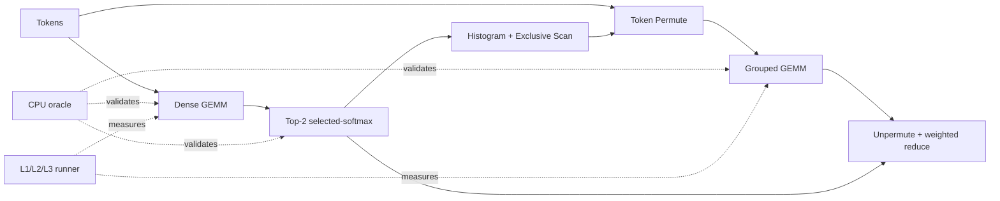

# RaggedRoute 简历话术与面试答辩手册

> 目标岗位：AI Infra / CUDA 实习
> 事实基线：`main@354e1ff0a3aaf602830c8d989eb358cfa857a4c9`
> 使用方式：先掌握 60 秒版本，再按面试官追问进入算子、benchmark 和 Nsight 深挖。本文作为公开的项目答辩补充材料；所有个人职责表述仅在你本人确认属实时使用。

## 1. 信息来源与真实边界

### 1.1 标签

- `源码与证据已证明`：可以直接写进 README、简历或面试回答。
- `个人职责口径`：你确认自己主导了目标、方案选择、实验协议和结果验收；Codex 辅助实现与文档。
- `建议补强后再讲`：仓库已有研究代码或计划，但需要 CUDA 环境复测或需要你进一步掌握源码。
- `禁止宣称`：与当前实现或证据矛盾，面试中不要说。

### 1.2 能讲 / 不能讲事实矩阵

| 类别 | 结论 | 面试安全表述 | 证据 |
|---|---|---|---|
| `源码与证据已证明` | 七个语义算子组成一条 Top-2 MoE 链，另有一个 Histogram+Scan 融合 primitive | “项目是七阶段数据流、八个 benchmark adapter，不是七个独立 Demo。” | [`registry.cpp`](../benchmarks/core/registry.cpp)、[`operators.h`](../include/raggedroute/operators.h) |
| `源码与证据已证明` | 可执行 runtime 仅支持 SM86、strict FP32、zero-stride row-major | “API 可以表示更多 dtype，但当前 kernel 只兑现 FP32/SM86。” | [`dispatch.cpp`](../src/runtime/dispatch.cpp)、[实现状态](../docs/implementation-status.md) |
| `源码与证据已证明` | Histogram 是七个语义算子中唯一通过门禁的默认优化 | “12-case、五进程、同机 strict-FP32 门禁后才进入 `Auto`。” | [Histogram 记录](../docs/histogram/performance-record.md) |
| `源码与证据已证明` | Dense、Top-K、Permute 有显式研究路径，但默认仍是 naive | “研究 candidate 可复现，不等于默认晋级。” | [算子索引](../docs/operator-optimization-index.md) |
| `源码与证据已证明` | Grouped GEMM 是固定 L3 research chain 的最大热点 | “NSYS 中占 kernel time 64.4%，现有 candidate 又受 106 registers/thread 和工作不均限制。” | [L3 报告](../docs/reports/l3_three_way_20260805/RaggedRoute_L3_3way_comparison.md) |
| `源码与证据已证明` | Grouped candidate 未通过 CUTLASS 门禁 | “十 shape ratio-of-sums 只有 0.805x，最差 shape 0.467x，所以没有进入 runtime。” | [Grouped GEMM 记录](../docs/grouped_gemm/performance-record.md) |
| `个人职责口径` | 主导项目方向、技术边界、实验协议和结果验收 | “我负责把问题定义成可验证的工程闭环，并决定 candidate 保留、拒绝或晋级。” | 用户确认；回答时结合配置、报告和代码路径 |
| `个人职责口径` | 使用 Codex 加速代码与文档 | “AI 是实现助手；语义、测量边界、验收门槛和最终结论由我负责审查。” | Git/PR 历史；不要隐瞒大规模 Codex 分支 |
| `建议补强后再讲` | F2 fused Histogram+Scan 已被 `Auto` 选择 | “代码路径存在，但旧运行受干扰且门禁失败，下一步必须独占 GPU 复测或撤回。” | [F2 报告](../docs/reports/rtx3080-histogram-scan-fused-sm86-v2.md) |
| `建议补强后再讲` | realistic/vLLM-semantic L3 | “实验分支已有尝试，但未进入当前 main，所以不写成项目成果。” | PR #31/#32 的 base branch 不是 `main` |
| `禁止宣称` | FP16/BF16 Tensor Core kernel | 当前只实现 strict FP32；不能说实现了低精度 Tensor Core Grouped GEMM | [实现状态](../docs/implementation-status.md) |
| `禁止宣称` | H100/Blackwell 支持 | 只有交叉编译或预案；没有实卡 correctness/performance | [实现状态](../docs/implementation-status.md) |
| `禁止宣称` | 完整 MoE 推理引擎 | 项目不含完整 FFN、训练、多 GPU、All-to-All、continuous batching | [README](../README.md) |
| `禁止宣称` | 普遍超过 cuBLAS/CUTLASS 或生产级性能 | 只能报告具体 shape、dtype、边界和反例 | 各算子 performance record |

## 2. 简历版本

### 2.1 项目名

**RaggedRoute：面向动态非均衡专家负载的单 GPU MoE CUDA 算子链**

### 2.2 一句话描述

主导设计并验收一条 strict-FP32 Top-2 MoE CUDA 算子链，在 RTX 3080 上用 CPU oracle、L1/L2/L3 benchmark、严格配对和 Nsight 证据迭代候选实现，并保留没有通过稳定性与反例门禁的失败优化。

### 2.3 三条简历 bullet

- 主导设计单 GPU Top-2 MoE strict-FP32 CUDA 算子链，串联 router projection、selected-softmax Top-2、Histogram/Scan、Token Permute、Grouped GEMM 与 weighted Unpermute；建立 CPU oracle、边界/随机测试、caller-stream 合同、Compute Sanitizer 与八 adapter benchmark registry。
- 在 RTX 3080（SM86）上组织 Dense GEMM、Top-K、Histogram、Permute 与 Grouped GEMM 的多版本实验，以 cuBLAS/CUB/CUTLASS/vLLM 为参考；Histogram 通过 12-case 五进程门禁进入默认分派，Grouped GEMM 候选因十 shape 对 CUTLASS ratio-of-sums 仅 `0.805x` 被拒绝。
- 构建 L1 Kernel Body、L2 Operator、L3 Chain 的可审计测量管线，固定 seed、warmup、sample、cache、workspace 与 excluded steps，并用 NSYS/NCU 定位固定 L3 research chain 中 Grouped GEMM 占 `64.4%` kernel time、受 106 registers/thread 与任务不均限制。

### 2.4 两条精简版

- 主导构建七阶段 Top-2 MoE CUDA 算子链与八 adapter benchmark/correctness 框架，固定 strict-FP32 语义、caller stream、workspace 和 L1/L2/L3 测量边界。
- 在 RTX 3080 上以 cuBLAS/CUB/CUTLASS/vLLM 为参考进行证据驱动优化；晋级 Histogram shape dispatcher，并根据十 shape 反例与 Nsight 诊断拒绝 Grouped GEMM 默认候选。

### 2.5 不建议放在简历 headline 的数字

- `69.734 us`：它是单一固定 shape 的 selected-candidate research chain，不是 public `Auto` 链。
- `3.524x vs Triton`：跨 compiler/runtime stack，只能说“诊断对照”，不能说 production speedup。
- Permute `1.4110x vs vLLM`：五个 full-from-ids case 的中心结果，但 candidate CV 为 0.160–0.281，pure-permute 还存在严重反例。
- F2 `2.0045x`：受并发 GPU workload 干扰，CV 45%–114%，L3 ratio-of-sums 反而只有 0.9398x。

## 3. 分时长讲解

### 3.1 30 秒版本

RaggedRoute 是一个单 GPU Top-2 MoE CUDA 学习项目。我没有把它做成七个孤立 kernel，而是把 router projection、Top-2、Histogram/Scan、Permute、Grouped GEMM 和 Unpermute 串成一条可测的链。我的重点是性能工程闭环：先固定 strict-FP32 语义和 CPU reference，再分 L1/L2/L3 测量，用 Nsight 找瓶颈，最后通过多 shape、p95 和 CV 门禁决定是否晋级；所以仓库里既保留成功的 Histogram 优化，也保留失败的 Grouped GEMM 候选。

### 3.2 60 秒版本

这个项目面向单卡 Top-2 MoE 的 routing 和一次 expert linear projection，共七个语义阶段。v0.2 API 使用自描述 tensor view、caller-provided stream 和 workspace，hot path 不分配也不强制同步。正确性上，每个 adapter 都有 CPU oracle、边界/随机 case、redzone 和 sanitizer 证据；性能上我把 Kernel Body、完整 Operator 和完整 Chain 分成 L1/L2/L3，避免把 reset、mapping preparation 或 workspace 成本藏在一个好看的数字里。RTX 3080 上，Histogram 的 shape dispatcher 通过 12-case 五进程门禁后进入 `Auto`；相反 Grouped GEMM 虽然在 tiny/single-hot shape 局部更快，但十 shape 对 CUTLASS ratio-of-sums 只有 0.805x，最差 0.467x，所以没有晋级。最新固定 L3 research chain 里 Grouped GEMM 占 64.4% kernel time，下一步应优先解决 expert skew 下的 task scheduling 和 106 registers/thread，而不是继续堆算子。

### 3.3 3 分钟版本

1. **背景与边界（30 秒）**：MoE 每个 token 只送到少数 expert，计算变成动态、ragged、负载不均的分组问题。项目只覆盖单 GPU routing、重排、一次 expert linear 和 weighted reduce，不冒充完整推理框架。
2. **数据流（40 秒）**：Dense GEMM 产生 logits；Top-K 选两个 expert 并做 selected-softmax；Histogram 统计 route 数；Scan 生成 expert offsets；Permute 把 token 按 expert 连续化；Grouped GEMM 执行不同 `M_e` 的 expert linear；Unpermute 按 route position 和权重还原。
3. **API/正确性（35 秒）**：L1 低层 launcher 与 L2 public wrapper 分离。Wrapper 使用 caller stream，强制 reset 纳入 L2，Permute cursor workspace 由调用方提供。CPU double/exact-int reference、边界/随机、redzone、stream contract 与 Compute Sanitizer 保证优化没有改语义。
4. **测量方法（40 秒）**：CUDA Event 给 release latency，NSYS 解释 launch gap/阶段占比，NCU 解释寄存器、occupancy、cache 和 workload imbalance。variant 比较必须匹配硬件、build、seed、dtype、level、cache、repeats、samples 和 excluded steps，否则 fail closed。
5. **结果与反思（35 秒）**：Histogram 通过门禁；Top-K/Permute 有显式 candidate 但不默认；Grouped GEMM candidate 被反例拒绝。项目亮点不是“所有 kernel 都最快”，而是能解释为什么某个机制在某些 shape 有效、为什么整体仍不应该发布。

### 3.4 15 分钟深挖顺序

- 2 分钟：项目边界、Top-2 MoE 数据流、七阶段与八 adapter。
- 2 分钟：v0.2 tensor/stream/workspace/dispatch 合同。
- 3 分钟：L1/L2/L3、公平配对、统计量和证据文件。
- 3 分钟：Histogram 成功晋级的 shape dispatcher。
- 3 分钟：Grouped GEMM 局部成功但整体拒绝的因果链。
- 2 分钟：Top-K 语义、F2 风险、真实 trace/working set 和低精度/H100 后续计划。

## 4. 架构与模块

| 模块 | 职责 | 面试追问点 |
|---|---|---|
| Public runtime | 参数校验、架构/variant dispatch、stream/workspace 合同 | 为什么不在 hot path 查询架构、分配或同步？ |
| CPU correctness | 每算子 oracle、exact integer routing invariants、failure artifact | 为什么 reference 用 double？相对/绝对误差如何解释？ |
| Benchmark adapters | 输入生成、reset、L1/L2 boundary、work estimate、validation | 为什么 stateful operator 的 repeats 需要特殊处理？ |
| Registry/comparison | variant provenance、pairing key、baseline、fail-closed | 如何防止不同 seed/cache/excluded steps 被错误计算 speedup？ |
| Evidence pipeline | raw JSONL、aggregate、comparison、NSYS/NCU sidecar、hash | 为什么 profiler duration 不能作为发布 latency？ |
| Operator sources | naive / candidate / library baseline / CPU reference / Triton | 为什么 library baseline 不进入 public dispatch？ |

## 5. 五条技术深挖

### 5.1 Dense GEMM：从 naive 到 v3

**问题**：naive 是一线程一个输出，缺少 tile 复用；256³ baseline L2 p50 约 27.034 us，而 cuBLASLt reference 为 10.854 us。

**版本链**：shared-memory tiling → 2D mapping/vector staging → register blocking → 64x64 sync/`cp.async` → 64x32 `cp.async` v3。

**证据**：1024³ 时 v3 L2 为 182.630 us，仍比 strict-FP32 cuBLAS 153.754 us 慢约 1.19x；v3 使用 85 registers/thread、无 local spill，global-load sectors 比 v2 低 22.2%，但仍为 cuBLAS 的 1.74x。

**回答重点**：`cp.async` 不是自动加速。它可能改善 global→shared staging，但 tile mapping、reuse、barrier/MIO 成本和 register live range 仍决定最终结果。不能拿 TF32 Tensor Core 与 strict FP32 当公平基线。

### 5.2 Top-K：语义比“找最大两个数”更重要

固定语义是 `top_k=2`、selected-softmax、lower expert-id tie break、NaN 视为 `-Inf`、全 NaN fallback `{0,1}` 和 `{0.5,0.5}`。candidate 用 register-local pair 与 warp/subwarp reductions；v4 进一步采用 row packing 和两次 subgroup reduction。

T2048/E64 单点约有 1.46x local gain，但连续 T/E bucket、p50/p95 和 CV 门禁没有任何 promoted interval。回答时强调：shape dispatcher 不能只为一个点写 if；支持区间必须有连续证据和反例。

### 5.3 Histogram 与 Histogram→Scan

naive Histogram 使用 global atomic。小 R 时主要问题是 launch/underfill，大 R 或热点分布才逐渐出现 atomic contention。晋级 candidate 对小/sparse/large shape 使用不同路径；12-case 五进程门禁全部 p95 优于 strongest baseline，才进入 `Auto`。

F2 把 `R<=4096,E<=64` 的 shared histogram 和 subwarp scan 放进一个 CTA，合法性来自“所有生产与消费都在同一个 CTA”。不能在普通多 CTA kernel 中用 `__syncthreads()` 假装 grid-wide barrier。F2 机制合理，但已有 release 运行受干扰且 L3 回退，因此当前要讲“实验路径和待复测”，不能讲“已稳定加速”。

### 5.4 Token Permute：metadata 与 copy 必须同边界比较

Permute 不只是 row copy，还要从 expert ids 生成 counts/offsets、分配 route position、清零 cursor，并可选物化 `sorted_route`。L1 可以只测 copy kernel，但 L2/L3 必须公平计入每次调用需要的 mapping preparation。

v2 对大且 16-byte 对齐的 Top-2 row 使用 tile4-direct，其余回退 token-owned path，并把 counts/scan/cursor reset 融合为一次 prepare。五个 full-from-ids case 的中心结果好看，但 pure-permute 28-case 全部高 CV、只有 18/28 更快、最差 0.2487x，因此只能作为显式 research candidate。

### 5.5 Grouped GEMM：ragged 调度而不是普通 GEMM

Dense GEMM 的 M/N/K 固定；Grouped GEMM 的每个 expert 有动态 `M_e`，会出现 empty/tiny/hot expert、尾波和不均匀 tile 数。逐 expert host loop 会产生大量 launch；persistent/task-map kernel 又可能付出 descriptor/prefix、register 和负载均衡成本。

现有 candidate 在 tiny/single-hot shape 可以更快，但 clean 十 shape 对 CUTLASS shape-geomean 0.907x、ratio-of-sums 0.805x，T2048 uniform 只有 0.467x。NCU 显示 106 registers/thread 把理论 occupancy 限制到 33.33%，同时 SM active-cycle 与 L2 slice 不均。下一轮应先单独验证 task mapping 或 live range，而不是同时换 tile、stage 和 scheduler。

## 6. L1/L2/L3 与工具分工

| 项目 | 你要说明什么 |
|---|---|
| L1 Kernel Body | 只回答 kernel 机制是否更快；reset/workspace 前置条件必须写清楚 |
| L2 Operator | 包含 public wrapper、必要 reset、mapping preparation；更接近可调用算子 |
| L3 Chain | 包含七阶段每次调用必须做的工作；workspace 预分配，input generation/H2D/oracle 排除 |
| CUDA Event | unprofiled Release 延迟主来源；warmup 后多 samples/process |
| NSYS | 看阶段占比、kernel launch、host gap、同步和 timeline |
| NCU | 看选定 kernel 的 grid、waves/SM、register、occupancy、cache/DRAM 和 workload imbalance |
| p50/p95/CV | p50 看中心，p95 看尾部，CV 判断测量稳定性；不能只挑最好 sample |
| speedup | latency 指标固定为 `baseline_latency / candidate_latency`；大于 1 才是 candidate 更快 |

## 7. 三个 STAR 故事

### 7.1 成功优化：Histogram promotion

- **S**：naive global atomic 在不同 R/skew 下瓶颈不同，单一路径无法覆盖全部 shape。
- **T**：在不改变 exact-int32、zero-workspace 和 caller-stream 合同下设计可回退的 SM86 dispatcher。
- **A**：冻结 naive/CUB strongest baseline；实现 small/sparse/block-private 路径；跑 12-case、五进程 release、correctness、sanitizer、NSYS/NCU；检查每 shape p50/p95 和重复方向。
- **R**：12 case 均无 naive p50 回退，candidate p95 均优于 strongest baseline；`R=1M,E=64,uniform` 对 CUB 提升 1.227x，最终进入 Histogram `Auto`。
- **反思**：成功不是某个 kernel 最快，而是 dispatcher、fallback、反例和证据一起成立。

### 7.2 失败优化：Grouped GEMM rejection

- **S**：naive Grouped GEMM 是初始链最大热点，理论上 persistent scheduling 可以减少 launch/尾波。
- **T**：做 SM86 candidate 并与 strict-FP32 CUTLASS 跨十 shape 比较。
- **A**：迭代 tiled/persistent/register/`cp.async` 版本；用 NCU 观察 106 registers/thread、waves/SM 和工作不均；保留 tiny、empty、uniform、Zipf、large T 反例。
- **R**：部分 shape 最高 2.208x，但正式 ratio-of-sums 0.805x、最差 0.467x，因此拒绝 public runtime promotion。
- **反思**：平均或局部结果不能覆盖部署分布；下一步必须缩小到一个 task-map 或 live-range 假设。

### 7.3 最难取舍：为什么分 L1/L2/L3

- **S**：metadata/reset 是否计入时间会显著改变短 kernel 的结论。
- **T**：既能研究 kernel，又不把必要成本藏起来。
- **A**：保留 low-level launcher 作为 L1；public wrapper 作为 L2；两条明确入口的 chain 作为 L3；comparison 对 excluded steps fail closed。
- **R**：可以解释“pure permute copy 变快但 full-from-ids 不一定变快”，也能防止将 profiler duration 或预处理排除误写成端到端 speedup。

## 8. 露馅风险审计

| 风险点 | 等级 | 面试官可能怎么问 | 可信回答锚点 | 补强动作 |
|---|---|---|---|---|
| 一周内大量 Codex PR | 高 | “这些代码到底是不是你写的？” | 明确 AI 辅助；主导问题定义、合同、实验、验收；对能独立修改的核心路径现场讲代码 | 熟读 dispatch、runner、Histogram、Grouped GEMM 各一条路径；能做小改动 |
| `3.524x vs Triton` | 高 | “编译器、语义、excluded steps 一样吗？” | 承认跨工具链 diagnostic，不是 promotion speedup | 背清 L3 report 的 fixed shape、process、boundary |
| F2 已在 `Auto` 但 gate 失败 | 高 | “为什么失败还上线？” | 这是当前技术债；代码合入不等于证据充分，下一步独占 GPU 复测或 demote | CUDA 环境恢复后优先重跑 |
| Grouped candidate 局部快但整体慢 | 中 | “为什么不用 shape dispatch？” | 当前没有足够连续 shape/trace 证据，且 large T 反例严重 | 增加真实 trace 与三态 evaluator |
| FP16/Tensor Core | 高 | “你的 WMMA/MMA tile 是什么？” | 当前没有低精度 kernel，不假装实现；现阶段重点是 strict-FP32 方法论 | 以后真正实现后再写简历 |
| H100/Blackwell | 高 | “在哪张卡上测过？” | 没有实卡；只有交叉编译/预案 | 租卡后先 correctness、baseline、重新 profile |
| 所有算子都叫优化过 | 中 | “哪个默认真的变了？” | 七语义算子只有 Histogram 通过默认晋级；其他是 explicit/benchmark-only/rejected | 熟记 maturity table |
| 生产可用 | 高 | “多卡、All-to-All、continuous batching 呢？” | 不做这些；项目是单 GPU primitives + evidence pipeline | 不在简历写 production runtime |

## 9. 诚实收口话术

- “这部分我不能把它说成生产线上规模；我能给出当前单 GPU 实验合同、证据和如果接入 runtime 会如何验证。”
- “这个数字来自固定 shape 的 research chain，不是 public Auto 路径；我保留它用于定位瓶颈，不把它当发布 speedup。”
- “这段实现使用 Codex 辅助完成；我负责语义、测量边界和验收。如果继续追代码，我会讲我能独立解释和修改的路径。”
- “H100 目前只有交叉编译，不等于支持。拿到实卡后必须重新做 correctness、baseline 和 profile。”
- “这个 candidate 局部更快，但反例和稳定性不满足门禁，所以我没有让它进入默认 dispatch。”

## 10. 面试前补强清单

### 必须完成

- 能从 `chain_from_tokens` 画出七阶段数据流及张量/metadata。
- 能解释 `KernelSelection`、`RuntimeContext`、caller stream、workspace 和 fallback。
- 能区分 Histogram 的正式 promotion 与 F2 的技术债。
- 能从 `0.805x`、`0.467x` 和 106 registers/thread 讲完 Grouped GEMM 失败因果链。
- 能解释 selected-softmax、tie、NaN 和为什么 CUB/vLLM 只作 benchmark reference。
- 能说清个人主导与 Codex 辅助的边界。

### CUDA 环境恢复后

- 独占 GPU 重跑 F2 L2/L3；通过则补证据，失败则 demote。
- 为 Grouped GEMM 只选一个假设：task map 或 register live range。
- 合入真实 route trace/working-set 后再讨论 promotion evaluator。
- 再决定是否投入 FP16/BF16 Tensor Core 或 H100 实卡阶段。

## 11. 核心证据索引

- [README 与当前边界](../README.md)
- [实现状态](../docs/implementation-status.md)
- [Benchmark 架构](../docs/benchmark-architecture.md)
- [Histogram promotion](../docs/histogram/performance-record.md)
- [Dense GEMM 版本链](../docs/dense_gemm/performance-record.md)
- [Top-K candidate/rejection](../docs/topk_gate/performance-record.md)
- [Token Permute v2](../docs/permute/performance-record.md)
- [Grouped GEMM rejection](../docs/grouped_gemm/performance-record.md)
- [L3 three-way diagnostic](../docs/reports/l3_three_way_20260805/RaggedRoute_L3_3way_comparison.md)
