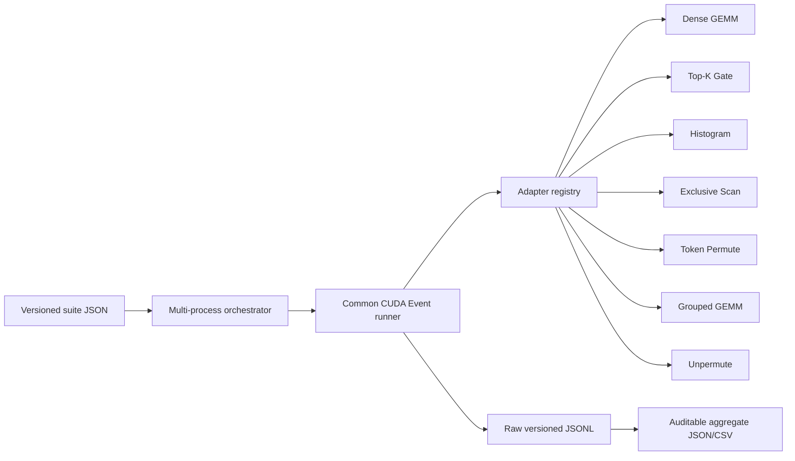
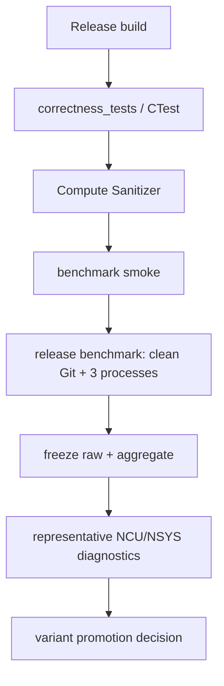

# RaggedRoute Benchmark 架构与发布协议

> 状态：v1 已实现（CUDA naive baseline）；optimized/CUDA library variants 后续按同一协议接入。
> 原则：正确性测试、正式性能评测、profiler 诊断是三条独立流水线，不能互相替代。

## 1. 架构结论

RaggedRoute 使用一个公共 runner 和七个 typed adapter，而不是七套独立计时循环，也不是一个包含所有可选字段的巨型通用参数结构。



公共 runner 只负责：

- 同一 caller stream 上的 warmup、CUDA Event、samples 与批量 launch；
- cache policy 的显式执行；
- raw sample、p50/p90/p95、mean/stddev/CV；
- 设备、构建与 Git 环境；
- versioned JSONL 输出。

adapter 独占：

- 算子专有 shape、dtype、layout、语义和参数校验；
- buffer/workspace 生命周期与输入分布；
- L1 前置状态和 L2 必要 reset；
- CUDA launch、CPU oracle、数值容差和 postcondition；
- logical work、variant 配置和 operator-specific metrics。

接口定义见 `include/raggedroute/benchmark/adapter.h`。生命周期固定为：

```text
make_adapter
  -> setup(options, seed, stream)        # 分配、输入、reference，永不计时
  -> prepare_sample(level, stream)       # L1 排除项，例如 counts/cursor reset
  -> enqueue(level, stream)              # 恰好一次被测调用
  -> validate(stream)                    # 计时区外的一次干净调用后校验
```

新 variant 必须走同一个 adapter contract，不能通过改计时边界获得 speedup。

## 2. 七个 adapter 保留的个性化逻辑

| Adapter | 专有 case/config | L1 前置状态 | L2 必含成本 | 当前 oracle/检查 |
|---|---|---|---|---|
| Dense GEMM | `M/N/K`、row-major、FP32、`alpha=1,beta=0` | 无 | wrapper + kernel | CPU GEMM，绝对+相对误差 |
| Top-K Gate | `T/E`、selected-softmax、lower-id tie、NaN policy | 无 | 完整 fused kernel | ids 精确一致，weights 容差 |
| Histogram | `T/E/top_k`、uniform/Zipf/single-hot/round-robin | `counts_zeroed` | counts reset + histogram | CPU bincount、总数不变量 |
| Exclusive Scan | `E/R`、count distribution | 无 | 完整 scan | offsets 首尾/差分精确一致 |
| Token Permute | `T/E/K`、distribution、是否物化 `sorted_route` | `cursor_zeroed`；L1 强制 `repeats=1` | cursor reset + placement/copy | expert segment、双向 mapping、逐行内容 |
| Grouped GEMM | `T/E/K/N`、expert 负载分布 | packed X、offsets 已准备 | 当前 baseline 无额外动态 prepare | 逐 expert CPU GEMM、空 expert |
| Unpermute | `T/E/N/top_k`、route mapping/weights | mapping 已准备 | gather + weighted reduce | token-owned CPU reference |

当前 naive baseline 使用 FP32，目的是先冻结真实可执行的评测合同；它不是文档中最终 FP16/Tensor Core 版本，也不产生任何“已优化”声明。后续 FP16/CUB/cuBLAS/CUTLASS/optimized CUDA variant 应新增 variant，不覆盖这条基线证据链。

## 3. 测量层级与两条链路

| 层级 | 名称 | 规则 |
|---|---|---|
| L1 | `L1_kernel_body` | 输入/workspace/前置状态已准备；所有排除项写入结果 |
| L2 | `L2_operator_steady` | device-side steady operator；每次必需 reset/device metadata 均计入，workspace 预分配 |
| L3 | `L3_chain_steady` | 多算子 device chain；每轮必要 reset 与中间 metadata 均计入 |
| L4 | `L4_host_call` | host dispatch、输入相关 host prepare、launch 与最终同步；尚未作为 v1 主结果 |

L3 必须使用两个不同 suite ID：

- `chain_from_tokens`：Dense GEMM → Top-K → Histogram → Scan → Permute → Grouped GEMM → Unpermute，完整 7 算子；
- `chain_from_logits`：从预计算 logits 开始，只有后续 6 算子。

两者不能放进同一聚合组，也不能互相计算 speedup。当前 naive L3 为避免隐藏输入相关 host max-M prepare，Grouped GEMM 使用 `R` 作为 worst-case launch bound，并在 `variant_config.grouped_max_m_policy` 中披露。

## 4. 测试、正式评测与 profile 的硬隔离



### Correctness

- `raggedroute_correctness_tests` 直接调用七个 adapter 与两条 chain；`raggedroute_correctness_framework_tests` 独立覆盖 dtype、failure artifact roundtrip、redzone、zero-size、randomized/caller-stream 合同；两者都不创建 CUDA Event、不输出性能结论；当前不提供可执行的 failure replay；
- 覆盖 non-aligned shape、tie、NaN、Inf、Zipf、single-hot、可选 mapping 和两条 L3 chain；
- `tests/test_scripts.py` 检查 suite schema、release gate 与状态型 repeat policy；
- sanitizer 是 correctness gate，不是 benchmark。

### Benchmark smoke

- `configs/benchmark_smoke.json`；
- 只证明所有 target、层级、JSONL 和后置校验可运行；
- sample 很少且 worktree 可 dirty，数字不得用于 README/简历结论。

### Release benchmark

- `configs/benchmark_rtx3080_release.json`；
- Release binary、clean Git、验证开启、warmup≥10、samples≥20、至少 3 个独立进程；
- 各独立进程复用同一个 case seed，确保 shape、路由分布和派生配置完全相同；进程内 case 顺序另行确定性打乱；
- case 顺序按进程确定性打乱，降低热漂移/运行顺序偏差；
- 输出路径必须不存在，脚本拒绝覆盖旧 run；
- raw JSONL 和 manifest 保留，聚合器不会删除原始样本。

`configs/benchmark_promotion_policy.json` 是候选 variant 未来进入默认 dispatch 时使用的版本化标准草案：正确性必须全过，至少三次独立进程，并检查 CV、获益 shape coverage、trace ratio-of-sums、最大单点退化和 workspace 增长。当前没有 promotion evaluator，只有 naive baseline，因此该文件不会自动产生晋升结论。

### Profile

- `scripts/profile_benchmarks.py` 使用 `--profile-once`，不调用正式计时 runner；
- Nsight Compute 的 cache flush、clock control、replay 和序列化会改变 duration，因此 `.ncu-rep` 只解释瓶颈，绝不成为正式 latency；
- profile suite 只选 3–5 个代表 shape。

## 5. 批量计时与统计语义

CUDA Event 的每个 sample 可以包住 `kernel_repeats=N` 个普通 launch。结果中的一个 raw sample 是：

```text
event_elapsed_us / N
```

因此它是 `batch_mean_us`，其 p95 是“多批次均值的 p95”，不是单次调用尾延迟。需要单调用 p95 时必须设置 `kernel_repeats=1` 并增加 samples。Token Permute L1 会修改 cursor，当前 contract 强制 `N=1`；L2 每次调用包含 cursor reset，所以允许批量。

JSON 同时保存全部 raw batch means，并派生 p50/p90/p95、mean、stddev 和 CV。跨进程主表使用 process median 的 median；所有 raw sample 仍保留供审计。

真实 trace 的总体收益应使用：

```text
speedup_trace = sum(weight_i * baseline_latency_i)
                / sum(weight_i * candidate_latency_i)
```

不能把 weighted geometric mean 称为真实部署耗时收益。几何平均只用于 shape-balanced 的归一化比较。

## 6. 结果与环境 schema

公共字段之外，v1 使用三个可扩展对象：

- `case_config`：语义、shape、dtype、分布、tie/NaN、mapping 方向等；
- `variant_config`：tile、thread mapping、scheduler、vector width 等；
- `work.operator_metrics`：rows、atomic 次数、active experts、launch 数等。

环境由二进制和 run manifest 共同记录：build type、build Git SHA/dirty、CUDA compiler/runtime/driver、GPU name/UUID/PCI、compute capability、显存、SM 数，以及 `nvidia-smi` 的 clock/power/temperature 快照。不可用值应标记 unavailable/null，不能填 0 冒充实测。

`oracle` 与 `performance_baseline` 是两个概念：CPU/PyTorch oracle 只判断语义；cuBLAS/CUTLASS/CUB/production implementation 才能作为公平 speedup 分母。v1 目前只有 naive CUDA variant，所以只报告 baseline latency，不报告 speedup。

## 7. 命令

Windows RTX 3080 开发机：

```powershell
cmd /c scripts\configure_windows.bat
cmd /c scripts\build_windows.bat
ctest --preset test-rtx3080-sm86-release

python scripts\run_benchmarks.py `
  --binary out\build\rtx3080-sm86-release\raggedroute_benchmark.exe `
  --config configs\benchmark_smoke.json `
  --output reports\runs\smoke.jsonl

python scripts\aggregate_results.py reports\runs\smoke.jsonl `
  --json reports\runs\smoke.aggregate.json `
  --csv reports\runs\smoke.aggregate.csv
```

正式评测只能在代码提交、重新配置 Release build、worktree clean 且 correctness/sanitizer 通过后运行。

## 8. 依据

- [CUDA Best Practices：Timing](https://docs.nvidia.com/cuda/cuda-c-best-practices-guide/index.html#timing)：异步执行与 CUDA Event 计时；
- [CUTLASS GEMM Measurement Guidelines](https://docs.nvidia.com/cutlass/latest/media/docs/cpp/gemm_performance_measurement_methodology_guidelines.html)：warmup、buffer rotation、clock/power 测量方法；
- [Nsight Compute Profiling Guide](https://docs.nvidia.com/nsight-compute/ProfilingGuide/index.html)：replay、cache control 与 clock control 对测量的影响；
- [Google Benchmark User Guide](https://google.github.io/benchmark/user_guide.html)：manual timing、repetitions、统计和机器上下文；
- [CUB device-scope API](https://nvidia.github.io/cccl/unstable/cub/developer/device_scope.html)：temp storage 查询和 caller stream 模式。
