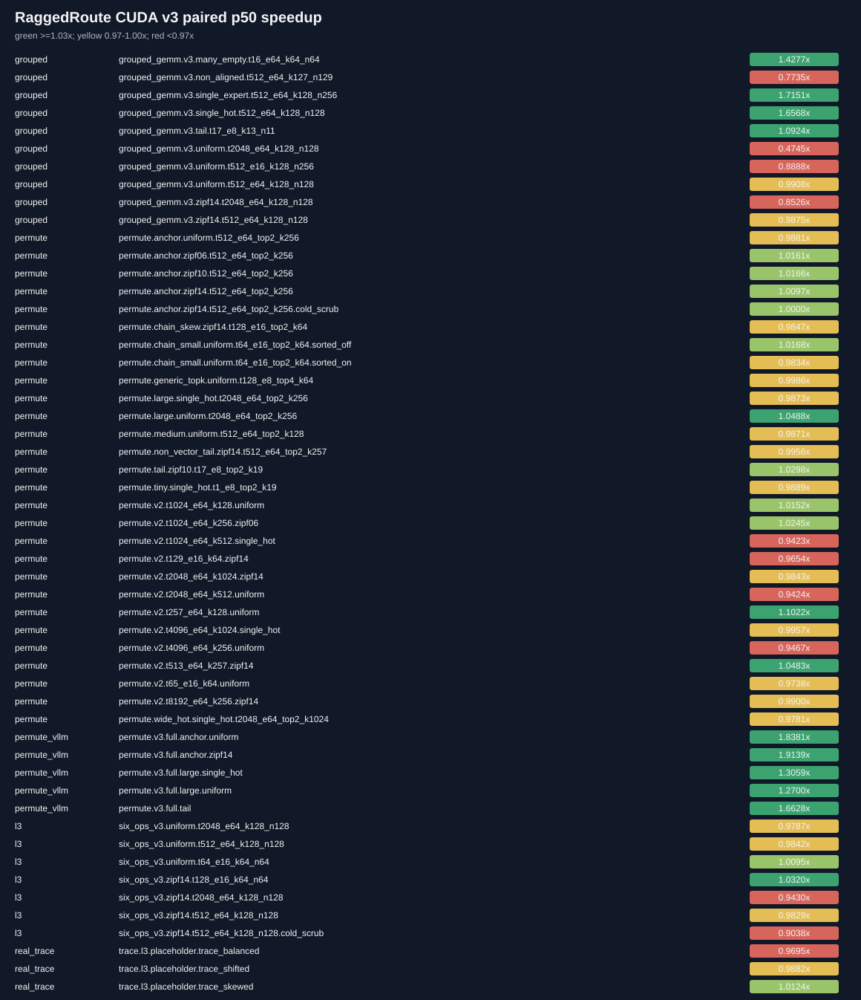

# RaggedRoute CUDA v3 compact evidence

> Promotion decisions use clean, uninstrumented Release timing. NSYS/NCU durations are diagnostic only and raw profiler reports remain outside this compact bundle.

| Scope | Decision | Baseline | Candidate | Paired shapes | Ratio-of-sums | Geomean | Win coverage |
|---|---|---|---|---:|---:|---:|---:|
| grouped | `insufficient_evidence` | `cutlass_grouped` | `cuda_grouped_sm86_fp32_v3` | 10 | 0.9141x | 1.0189x | 0.4000 |
| permute | `insufficient_evidence` | `cuda_token_owned_top2` | `cuda_candidate_v3` | 28 | 0.9938x | 0.9980x | 0.3571 |
| permute_vllm | `insufficient_evidence` | `vllm_moe_permute` | `cuda_candidate_v3_from_ids` | 5 | 1.5452x | 1.5753x | 1.0000 |
| l3 | `insufficient_evidence` | `cuda_postlogit_integrated_latest` | `cuda_postlogit_research_v3` | 7 | 0.9743x | 0.9755x | 0.2857 |
| real_trace | `insufficient_evidence` | `cuda_postlogit_integrated_latest` | `cuda_postlogit_research_v3` | 3 | 0.9900x | 0.9899x | 0.3333 |

A `synthetic_fixture` route trace can validate the input and evaluator pipeline, but cannot satisfy the real-trace policy. Such a result must remain `insufficient_evidence`.
