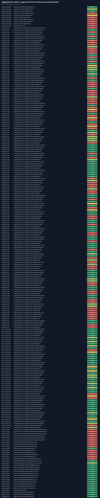

# RaggedRoute CUDA v4 aggressive final evidence compact evidence

> Promotion decisions use clean, uninstrumented Release timing. NSYS/NCU durations are diagnostic only and raw profiler reports remain outside this compact bundle.

| Scope | Decision | Baseline | Candidate | Paired shapes | Ratio-of-sums | Geomean | Win coverage |
|---|---|---|---|---:|---:|---:|---:|
| grouped_queue1024 | `insufficient_evidence` | `cuda_grouped_sm86_fp32_v2` | `cuda_grouped_sm86_fp32_v4a_desc_queue_t1024` | 10 | 0.9225x | 0.8448x | 0.3000 |
| routeprep_t1024 | `insufficient_evidence` | `cuda_candidate_v3_from_ids` | `cuda_routeprep_shared_rank_t1024_v1` | 144 | 1.0439x | 1.0078x | 0.4028 |
| token_owned_top4 | `insufficient_evidence` | `cuda_routeprep_shared_rank_t256_v1` | `cuda_permute_token_owned_topk4_v4` | 48 | 1.0170x | 1.0359x | 0.7292 |
| postroute_gather | `insufficient_evidence` | `cuda_postroute_current_v1` | `cuda_postroute_gather_grouped_v1` | 29 | 0.8191x | 0.9575x | 0.5172 |
| graph_postlogit | `insufficient_evidence` | `cuda_postlogit_integrated_latest` | `cuda_postlogit_graph_fixed_v1` | 1 | 1.6205x | 1.6205x | 1.0000 |
| graph_postroute | `insufficient_evidence` | `cuda_postroute_current_v1` | `cuda_postroute_graph_fixed_v1` | 3 | 1.2336x | 1.2338x | 1.0000 |

A `synthetic_fixture` route trace can validate the input and evaluator pipeline, but cannot satisfy the real-trace policy. Such a result must remain `insufficient_evidence`.
