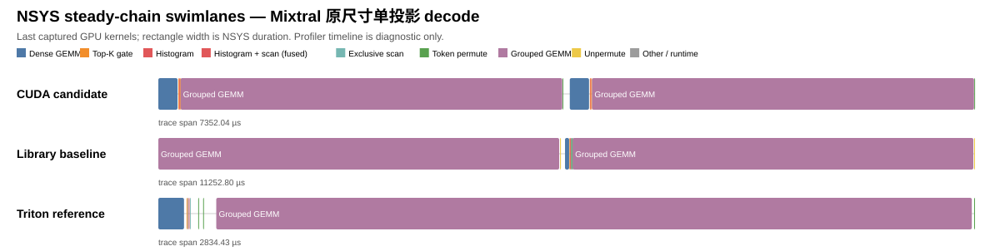
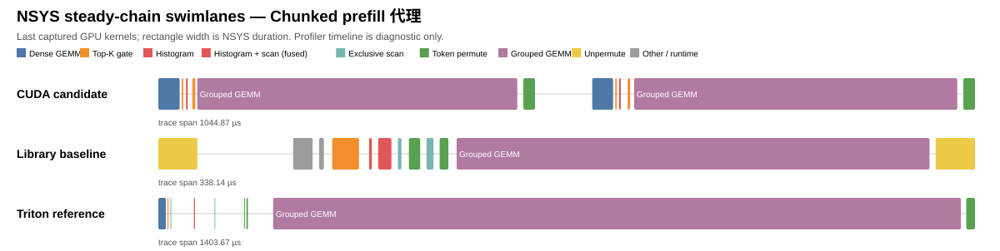
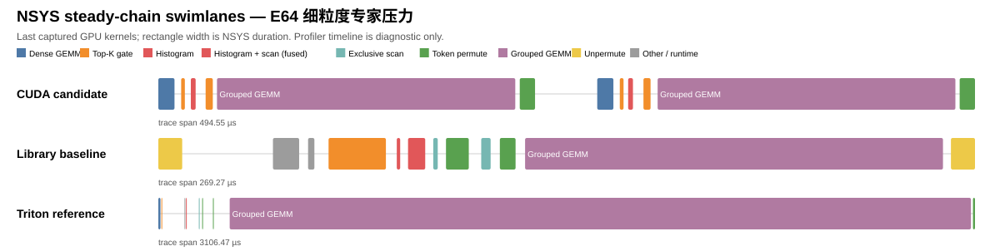

# RaggedRoute 真实 MoE L3 三线路实测与 Nsight 分析

> 生成时间：2026-08-05T15:24:37+00:00。所有发布性能数字来自未 profile 的 3 个独立进程 release JSONL；NSYS/NCU 只用于定位机制，绝不用于发布延迟结论。

## 结论摘要

- **小 shape 的 CUDA 优势不能外推。** Mixtral 原尺寸单投影 decode (`T=8,E=8,K=4096,N=14336`) 中 Triton p50 **2843.136 µs**，快于 CUDA candidate **3656.192 µs** 和 library **5593.429 µs**；此时 L3 时间主要由 Grouped GEMM 决定。
- **中等/预填充代理中 library 更强。** 连续 decode 代理中 library 比 CUDA 快约 **1.12×**；chunked prefill 中 library 为 **250.539 µs**、CUDA 为 **452.267 µs**、Triton 为 **1461.589 µs**。
- **E64 细粒度压力下 CUDA 与 library 接近，Triton 明显退化。** CUDA **214.699 µs**，library **212.992 µs**（差异小于 1%，应结合 library 的 p95/CV 视为接近）；Triton **3286.869 µs**。该实现以 `R` 作为每 expert 的 worst-case Grouped GEMM launch bound，E=64 时产生大量无效 tile 工作。
- 跨四场景相对 Triton 的 p50 几何平均为：CUDA candidate **3.119×**，library baseline **3.351×**。这不是 promotion 结论：三线路的 compiler/runtime 不同，library Top-K/offset 合同也不严格等价。

## 实验合同与边界

| 项目 | 固定值 |
|---|---|
| 源码 / 分支 | `af1b71be1629` / `codex/l3-realistic-moe-eval`，release records 均为 clean build |
| GPU | NVIDIA GeForce RTX 3080，sm_86，68 SM，10 GiB |
| native 工具链 | CUDA 13.3.73，NSYS 2026.1.3，NCU 2026.2.1 |
| Triton 工具链 | `vllm/vllm-openai:latest`，PyTorch 2.11.0+cu130，Triton 3.6.0；WSL 挂载 NSYS/NCU 2026.1.3/2026.2.1 |
| Release 协议 | warm cache；20 warmups；30 samples；3 kernel repeats/sample；3 个独立进程；seed `20260805` |
| L3 边界 | 从 tokens 到 output 的七阶段链；排除输入生成、CPU oracle、H2D、allocation；Triton 另排除 JIT/autotune |
| 路由 | `router_projection_random`；仅 Top-2、`E≤64`，**不是** Zipf/skew trace，也不是 DeepSeek-V3 256-expert/Top-8 复现 |

Library 链使用仓库内 `library_baseline`：Top-K 为 benchmark-only 合同，CUTLASS grouped GEMM 使用固定 host offsets；因此 `strict_comparison_eligible=false`。CUDA/Triton 也因 runtime/compiler stack 不同而保持 `promotion_eligible=false`。

## 未 profile 的 Release 性能

| 场景 | 线路 | p50 (µs) | p95 (µs) | CV | tokens/s | routes/s | Effective GB/s | TFLOP/s | vs Triton |
|---|---|---:|---:|---:|---:|---:|---:|---:|---:|
| Mixtral 原尺寸单投影 decode (`T=8, E=8, K=4096, N=14336, R=16`) | CUDA candidate | 3656.192 | 3663.752 | 0.0011 | 2,188 | 4,376 | 450.61 | 0.514 | 0.778× |
| Mixtral 原尺寸单投影 decode (`T=8, E=8, K=4096, N=14336, R=16`) | Repository library baseline | 5593.429 | 5617.016 | 0.0041 | 1,430 | 2,860 | 294.54 | 0.336 | 0.508× |
| Mixtral 原尺寸单投影 decode (`T=8, E=8, K=4096, N=14336, R=16`) | Triton reference | 2843.136 | 2925.636 | 0.0124 | 2,814 | 5,628 | 496.86 | 0.661 | 1.000× |
| 连续 decode 代理 (`T=128, E=8, K=1024, N=3584, R=256`) | CUDA candidate | 581.120 | 609.468 | 0.0213 | 220,264 | 440,529 | 224.27 | 3.239 | 2.460× |
| 连续 decode 代理 (`T=128, E=8, K=1024, N=3584, R=256`) | Repository library baseline | 518.485 | 536.576 | 0.0178 | 246,873 | 493,746 | 251.36 | 3.631 | 2.757× |
| 连续 decode 代理 (`T=128, E=8, K=1024, N=3584, R=256`) | Triton reference | 1429.504 | 1490.398 | 0.0263 | 89,542 | 179,083 | 91.17 | 1.317 | 1.000× |
| Chunked prefill 代理 (`T=512, E=8, K=512, N=1792, R=1024`) | CUDA candidate | 452.267 | 456.363 | 0.0188 | 1,132,076 | 2,264,151 | 121.85 | 4.170 | 3.232× |
| Chunked prefill 代理 (`T=512, E=8, K=512, N=1792, R=1024`) | Repository library baseline | 250.539 | 274.125 | 0.0390 | 2,043,597 | 4,087,193 | 219.96 | 7.528 | 5.834× |
| Chunked prefill 代理 (`T=512, E=8, K=512, N=1792, R=1024`) | Triton reference | 1461.589 | 1542.724 | 0.0358 | 350,304 | 700,607 | 37.70 | 1.290 | 1.000× |
| E64 细粒度专家压力 (`T=1024, E=64, K=256, N=512, R=2048`) | CUDA candidate | 214.699 | 217.958 | 0.0082 | 4,769,475 | 9,538,950 | 242.14 | 2.664 | 15.309× |
| E64 细粒度专家压力 (`T=1024, E=64, K=256, N=512, R=2048`) | Repository library baseline | 212.992 | 235.349 | 0.0519 | 4,807,692 | 9,615,385 | 244.08 | 2.686 | 15.432× |
| E64 细粒度专家压力 (`T=1024, E=64, K=256, N=512, R=2048`) | Triton reference | 3286.869 | 3374.916 | 0.0162 | 311,543 | 623,085 | 15.82 | 0.174 | 1.000× |

`Effective GB/s` 和 `TFLOP/s` 以记录的 L3 logical bytes/FLOPs 除 p50 推导；它们是端到端工作量归一化指标，非硬件总线或峰值算力利用率。

## NSYS 整链泳道图

每张图由对应 `.nsys-rep` 的 `cuda_gpu_trace.csv` 直接绘制，选择 trace 的末尾稳定 GPU kernels；矩形宽度是实际 NSYS duration。图只服务于阶段/launch 诊断，不能与 release p50 混用。

### Mixtral 原尺寸 decode

### Chunked prefill

### E64 细粒度专家压力

## NCU basic：主导 Grouped GEMM

### Mixtral 原尺寸单投影 decode

| 线路 | NCU kernel | Duration (µs) | SM % | Memory % | DRAM % | L1 % | L2 % | Reg/thread | Shared B/block | Waves/SM | Theoretical / achieved occupancy |
|---|---|---:|---:|---:|---:|---:|---:|---:|---:|---:|---:|
| CUDA candidate | `grouped_gemm_register16x32_async_v3_kernel` | 3412.93 | 50.46 | 65.29 | 65.29 | 50.56 | 20.94 | 106 | 7952 | 1.00 | 33.33% / 32.26% |
| Library baseline | `Kernel` | 4989.82 | 77.33 | 47.59 | 44.65 | 49.62 | 14.17 | 144 | 17680 | 1.00 | 16.67% / 16.67% |
| Triton reference | `_grouped_gemm_kernel` | 6701.92 | 86.15 | 86.15 | 70.28 | 88.31 | 21.53 | 52 | 25600 | 6.59 | 66.67% / 63.46% |

NSYS 主导热点：CUDA candidate: `raggedroute::ops::<unnamed>::grouped_gemm_register16x32_async_v3_kernel…` (94.9% NSYS GPU kernel time)；Library baseline: `void cutlass::Kernel<cutlass::gemm::kernel::GemmGrouped<cutlass::gemm::…` (98.3% NSYS GPU kernel time)；Triton reference: `_grouped_gemm_kernel` (96.3% NSYS GPU kernel time).
### Chunked prefill 代理

| 线路 | NCU kernel | Duration (µs) | SM % | Memory % | DRAM % | L1 % | L2 % | Reg/thread | Shared B/block | Waves/SM | Theoretical / achieved occupancy |
|---|---|---:|---:|---:|---:|---:|---:|---:|---:|---:|---:|
| CUDA candidate | `grouped_gemm_register16x32_async_v3_kernel` | 407.33 | 66.26 | 77.60 | 35.83 | 70.55 | 77.60 | 106 | 7952 | 1.00 | 33.33% / 30.90% |
| Library baseline | `Kernel` | 193.92 | 67.82 | 43.62 | 27.80 | 49.51 | 21.15 | 144 | 17680 | 1.00 | 16.67% / 16.67% |
| Triton reference | `_grouped_gemm_kernel` | 1351.36 | 87.67 | 87.67 | 4.28 | 88.20 | 36.01 | 52 | 25600 | 26.35 | 66.67% / 65.66% |

NSYS 主导热点：CUDA candidate: `raggedroute::ops::<unnamed>::grouped_gemm_register16x32_async_v3_kernel…` (89.3% NSYS GPU kernel time)；Library baseline: `void cutlass::Kernel<cutlass::gemm::kernel::GemmGrouped<cutlass::gemm::…` (77.6% NSYS GPU kernel time)；Triton reference: `_grouped_gemm_kernel` (96.9% NSYS GPU kernel time).
### E64 细粒度专家压力

| 线路 | NCU kernel | Duration (µs) | SM % | Memory % | DRAM % | L1 % | L2 % | Reg/thread | Shared B/block | Waves/SM | Theoretical / achieved occupancy |
|---|---|---:|---:|---:|---:|---:|---:|---:|---:|---:|---:|
| CUDA candidate | `grouped_gemm_register16x32_async_v3_kernel` | 183.33 | 51.89 | 51.89 | 45.72 | 57.11 | 47.62 | 106 | 7952 | 1.00 | 33.33% / 29.76% |
| Library baseline | `Kernel` | 137.38 | 68.90 | 46.46 | 40.01 | 49.90 | 16.37 | 144 | 17680 | 1.00 | 16.67% / 16.66% |
| Triton reference | `_grouped_gemm_kernel` | 3157.44 | 88.17 | 88.17 | 1.77 | 88.30 | 33.22 | 52 | 25600 | 120.47 | 66.67% / 66.07% |

NSYS 主导热点：CUDA candidate: `raggedroute::ops::<unnamed>::grouped_gemm_register16x32_async_v3_kernel…` (86.5% NSYS GPU kernel time)；Library baseline: `void cutlass::Kernel<cutlass::gemm::kernel::GemmGrouped<cutlass::gemm::…` (69.1% NSYS GPU kernel time)；Triton reference: `_grouped_gemm_kernel` (99.0% NSYS GPU kernel time).

`basic` 不包含逐 warp stall、local load/store spill 指令、source correlation 或 PM sampling；这些字段均为 `not_collected`，而不是零。现有 occupancy、SM/DRAM/L1/L2、registers、shared memory 与 waves 已足以判定三组工作负载均由 Grouped GEMM 的 tile/scheduling 效率主导，因此没有虚构 detailed 结果。

## 基于证据的解释

- **Mixtral 原尺寸单投影 decode**：CUDA candidate 的 grouped GEMM 为 50.46% SM / 65.29% DRAM，library/CUTLASS 为 77.33% / 44.65%，Triton 为 86.15% / 70.28%。这些是一次 NCU replay 的机制诊断，不能替代 release p50。
- **Chunked prefill 代理**：CUDA candidate 的 grouped GEMM 为 66.26% SM / 35.83% DRAM，library/CUTLASS 为 67.82% / 27.80%，Triton 为 87.67% / 4.28%。这些是一次 NCU replay 的机制诊断，不能替代 release p50。
- **E64 细粒度专家压力**：CUDA candidate 的 grouped GEMM 为 51.89% SM / 45.72% DRAM，library/CUTLASS 为 68.90% / 40.01%，Triton 为 88.17% / 1.77%。这些是一次 NCU replay 的机制诊断，不能替代 release p50。

1. **真实模型尺寸改变热点的相对权重。** Dense GEMM、Top-K、histogram/scan、permute、unpermute 的 launch 与融合优势在短小工作负载里可见；当 `K/N` 或每 expert 的矩阵工作增大时，Grouped GEMM 占据 NSYS 大部分 GPU time，最终由其 kernel 的 scheduling/tile 效率决定。
2. **强库并不会天然输给手写 CUDA。** CUTLASS 和 Triton 都采用各自的 schedule、寄存器/共享内存权衡与 grid 几何。当前 candidate 走 strict FP32 SIMT 路径，不能把 Tensor Core/TF32 优化直接当作等价替换；比较必须先冻结数值合同。
3. **Triton 的 E64 退化是实现策略，不是“Trition 一定慢”。** 该 reference 的 `worst_case_R` launch 上界让许多 expert 的空/尾 tile 仍被调度。下一轮的单变量改动应先引入基于实际 `offsets` 的有效 M/tile 上界，随后重新做 full correctness、三进程 unprofiled release 与同一 profile contract。

## 工程限制与后续验证门槛

- Mixtral 场景仅模拟一个 expert projection；完整 MoE FFN 的三投影、通信、KV/attention 和服务调度不在该 L3 边界内。
- Release 未锁 GPU clocks；逐进程 CV 已完整报告。NCU 使用 `--clock-control none` 和 `--cache-control none`，其 duration 只作诊断。
- 任何后续优化必须保持：相同 seed/shape/math/cache/时间边界，所有 oracle PASS，3 个独立 unprofiled 进程 p50/p95 通过门槛；否则只记录为诊断候选。

## 原始工件与可复核性

- [Release JSONL](artifacts/release_20260805_2240.jsonl) · [Release manifest](artifacts/release_20260805_2240.jsonl.manifest.json) · [Comparison JSON](artifacts/comparison_20260805_2240.json)
- [Release suite config](artifacts/l3_realistic_moe_release.json) · [Collection manifest / commands](analysis/collection_manifest.json) · [NCU parsed metrics](analysis/ncu_basic.json) · [NSYS parsed hotspots](analysis/nsys_hotspots.json)
- 所有 3 场景 × 3 线路的原始 `.nsys-rep`、`.sqlite`、NSYS CSV、`.ncu-rep` 与 NCU manifests 位于 [profile artifacts](artifacts/profile/)，各文件的 SHA-256 见 [artifact manifest](artifact_manifest.json)。
