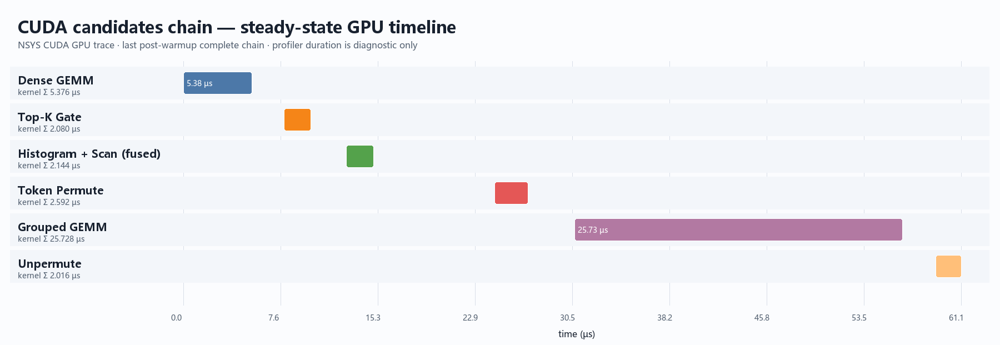
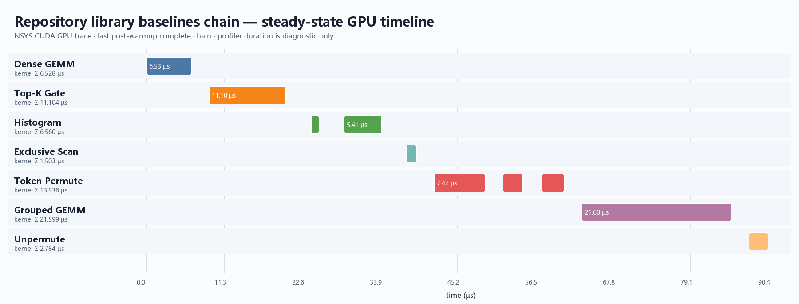
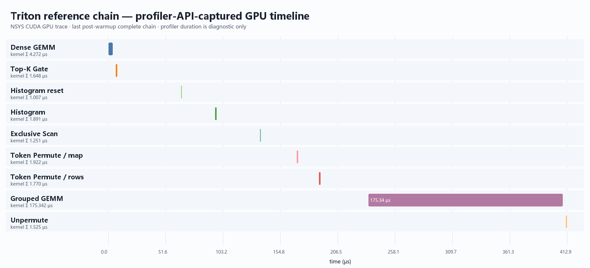

# RaggedRoute 七算子 L3 三线路真实性能与 Nsight 分析

> 生成时间：2026-08-05T21:07:54+08:00。正式性能数字全部来自未 profile 的 release 运行；NSYS/NCU 只用于机制诊断。

## 结论摘要

- 在本次固定工作负载 `T=512, E=64, top_k=2, R=1024, K=N=128, fp32 strict` 下，CUDA candidate 链的聚合 p50 为 **69.734 µs**，Triton reference 为 **245.760 µs**，CUDA 对 Triton 为 **3.524×**。
- Repository library baseline 链的聚合 p50 为 **94.413 µs**，对 Triton 为 **2.603×**。CUDA 相对 library 的观测比值为 **1.354×**，但它是诊断差距，**不是严格可发布 speedup**：Top-K 是 benchmark-only 合同，CUTLASS grouped GEMM 使用确定性 oracle 生成的固定 host offsets。
- 三条线路均通过七阶段 oracle/postcondition。CUDA 的主要热点是 Grouped GEMM（NSYS kernel-time 占比 64.4%）；Triton 的 Grouped GEMM 占 92.0%，是端到端差距的首要来源。
- NCU 表明 CUDA grouped kernel 受到 106 registers/thread、低 occupancy 和 SM/L2 工作不均限制；library CUTLASS kernel 同时受 64-block grid 小于 68 SM、144 registers/thread 和 shared-memory 限制；Triton kernel 则在 4096 blocks、15.06 waves/SM 下达到约 85.74% Compute/L1 利用率，瓶颈是 strict-IEEE worst-case tile 工作量而不是 occupancy 不足。

## 实验合同

| 项目 | 固定值 |
|---|---|
| 源码基线 / 实验提交 | `8d4c281eb28bb63e93f9b499343486938f8c3515` / `a6d37017427755b9493876f8e05df96562b2a3dd` |
| 分支 | `codex/l3-three-way-eval` |
| GPU | NVIDIA GeForce RTX 3080，CC 8.6，68 SM，10.0 GiB |
| Driver / CUDA | driver API 13010；native runtime 13010；NVCC 13.3.73 |
| Nsight | NSYS 2026.1.3；NCU 2026.2.1；NCU set=`basic`，clock-control=`none` |
| Triton 容器 | `vllm/vllm-openai:latest`；PyTorch 2.11.0+cu130；Triton 3.6.0 |
| Shape / 语义 | `chain_from_tokens`，`T=512,E=64,top_k=2,R=1024,K=128,N=128,fp32,strict_fp32` |
| Release 采样 | warm cache；20 warmups；30 samples；5 repeats/sample；3 independent processes/line |
| 随机性 | seed `20260729`；`router_projection_random`；同一输入合同 |
| 时间边界 | L3 steady chain；排除 input generation、CPU oracle、H2D、allocation；Triton 额外排除 JIT/autotune |
| 正确性 gate | CTest 8/8 PASS；release 9/9 records `validation.ok=true` |

正式运行按独立进程串行执行。Manifest 的 GPU 快照为：

- start：`NVIDIA GeForce RTX 3080, GPU-7c5e95c0-e5a4-15d8-24a0-c8c8b58d6f39, 00000000:81:00.0, 591.86, 10240, P8, 210, 405, 5.79, 320.00, 30`
- end：`NVIDIA GeForce RTX 3080, GPU-7c5e95c0-e5a4-15d8-24a0-c8c8b58d6f39, 00000000:81:00.0, 591.86, 10240, P0, 1965, 9501, 117.29, 320.00, 36`

未固定 GPU clocks；进程级竞争负载清单未单独归档，状态为 `unsupported_or_unknown`。因此报告同时保留逐进程 CV，且不把 profiler duration 用作 release 结论。

## 三条线路的七算子映射

| 阶段 | CUDA candidate | Repository library baseline | Triton reference |
|---|---|---|---|
| Dense GEMM | `cuda_register_tiled_v3_64x32_async` | `cublaslt` | `_dense_gemm_kernel` |
| Top-K Gate | `cuda_local_pair_two_reduce_top2_v4` | `cub_block_radix_top2`（benchmark-only） | `_top2_selected_softmax_kernel` |
| Histogram | `cuda_fused_histogram_scan`（融合） | `CUB DeviceHistogram` | `_histogram_kernel` |
| Exclusive Scan | 同上融合 kernel | `CUB BlockScan` | `_exclusive_scan_kernel` |
| Token Permute | `cuda_candidate_from_ids_equivalent` | `vllm_moe_permute` 路径 | `_route_map_kernel` + `_permute_rows_kernel` |
| Grouped GEMM | `cuda_grouped_sm86_fp32_v1` | `cutlass_grouped` | `_grouped_gemm_kernel` |
| Unpermute | `cuda_warp_token_vec4` | `vllm_finalize_routing` | `_unpermute_kernel` |

## 未 profile 的 Release 结果

| 线路 | 聚合 p50 (µs) | 聚合 p95 (µs) | 跨进程 CV | Effective GB/s | TFLOP/s | 相对 Triton |
|---|---:|---:|---:|---:|---:|---:|
| CUDA candidates | 69.734 | 76.820 | 0.0605 | 109.62 | 0.604 | 3.524× |
| Library baselines（诊断） | 94.413 | 117.412 | 0.1018 | 80.97 | 0.446 | 2.603× |
| Triton reference | 245.760 | 256.020 | 0.0236 | 31.10 | 0.171 | 1.000× |

`comparison.json` 明确给出 `promotion_eligible=false`：CUDA/Triton 使用不同 compiler/runtime stack；library 链另有语义边界。因此这是一份工程诊断报告，不是默认 dispatch 的自动 promotion 记录。

### 每个独立进程

| 线路 | Process | p50 (µs) | p95 (µs) | CV | Correctness |
|---|---:|---:|---:|---:|---|
| CUDA candidates | 1 | 68.710 | 76.042 | 0.0477 | PASS（abs 1.454e-05） |
| CUDA candidates | 2 | 69.734 | 73.523 | 0.0537 | PASS（abs 1.454e-05） |
| CUDA candidates | 3 | 70.963 | 78.787 | 0.0706 | PASS（abs 1.454e-05） |
| Library baselines（诊断） | 1 | 100.352 | 120.648 | 0.1001 | PASS（abs 2.590e-05） |
| Library baselines（诊断） | 2 | 94.413 | 116.460 | 0.1032 | PASS（abs 2.590e-05） |
| Library baselines（诊断） | 3 | 93.696 | 112.507 | 0.0975 | PASS（abs 2.590e-05） |
| Triton reference | 1 | 245.043 | 248.371 | 0.0098 | PASS（abs 2.611e-05） |
| Triton reference | 2 | 246.374 | 256.205 | 0.0209 | PASS（abs 2.611e-05） |
| Triton reference | 3 | 245.760 | 256.614 | 0.0327 | PASS（abs 2.611e-05） |

## NSYS：整链泳道与七阶段贡献

泳道图由 NSYS `cuda_gpu_trace.csv` 的真实 start/duration 数据直接绘制，选择预热后的最后一条完整链；它不是手工估算，也不是 GUI 截图。矩形宽度与 GPU kernel duration 成比例，空白代表相邻 GPU work 之间的间隔。

### CUDA candidates

| 阶段 | 主 kernel / 子步骤 | GPU kernel time (µs) | kernel-time 占比 |
|---|---|---:|---:|
| Dense GEMM | `dense_gemm_register_tiled_v3_64x32_async_kernel` | 5.376 | 13.5% |
| Top-K Gate | `topk_gate_local_pair_two_reduce_kernel` | 2.080 | 5.2% |
| Histogram + Scan (fused) | `histogram_exclusive_scan_fused_subwarp_kernel` | 2.144 | 5.4% |
| Token Permute | `token_permute_token_owned_top2_kernel` | 2.592 | 6.5% |
| Grouped GEMM | `grouped_gemm_register16x32_async_v3_kernel` | 25.728 | 64.4% |
| Unpermute | `unpermute_warp_token_vec4_kernel` | 2.016 | 5.0% |

GPU kernel Σ=39.936 µs，首个到末个 kernel 的 span=61.087 µs。Histogram 与 Exclusive Scan 被融合为一次 kernel launch，因此 7 个语义算子对应 6 个主 kernel。

### Repository library baselines

| 阶段 | 主 kernel / 子步骤 | GPU kernel time (µs) | kernel-time 占比 |
|---|---|---:|---:|
| Dense GEMM | `ampere_sgemm_32x32_sliced1x4_nn` | 6.528 | 10.3% |
| Top-K Gate | `cub_block_radix_top2_kernel` | 11.104 | 17.5% |
| Histogram | `DeviceHistogramInitKernel` `DeviceHistogramSweepKernel` | 6.560 | 10.3% |
| Exclusive Scan | `block_scan_kernel` | 1.503 | 2.4% |
| Token Permute | `DeviceRadixSortSingleTileKernel` `compute_expert_offsets` `expand_rows` | 13.536 | 21.3% |
| Grouped GEMM | `CUTLASS grouped GEMM` | 21.599 | 34.0% |
| Unpermute | `finalize_routing` | 2.784 | 4.4% |

GPU kernel Σ=63.614 µs，span=90.430 µs。Token Permute 路径包含 radix sort、expert-offset 和 row expansion；这解释了 library 链的额外 launch 与间隙。

### Triton reference

| 阶段 | 主 kernel / 子步骤 | GPU kernel time (µs) | kernel-time 占比 |
|---|---|---:|---:|
| Dense GEMM | `_dense_gemm_kernel` | 4.272 | 2.2% |
| Top-K Gate | `_top2_selected_softmax_kernel` | 1.648 | 0.9% |
| Histogram reset | `fill/reset` | 1.007 | 0.5% |
| Histogram | `_histogram_kernel` | 1.891 | 1.0% |
| Exclusive Scan | `_exclusive_scan_kernel` | 1.251 | 0.7% |
| Token Permute / map | `_route_map_kernel` | 1.922 | 1.0% |
| Token Permute / rows | `_permute_rows_kernel` | 1.770 | 0.9% |
| Grouped GEMM | `_grouped_gemm_kernel` | 175.342 | 92.0% |
| Unpermute | `_unpermute_kernel` | 1.525 | 0.8% |

GPU kernel Σ=190.628 µs，span=412.927 µs。该 trace 通过 CUDA Profiler API 只捕获预热后的一条链，排除了 JIT/autotune；NSYS 注入仍会放大 host launch 间隔，所以 span 不等于 release p50。

## NCU：每条链主导 Grouped GEMM

| 线路 | NCU kernel duration (µs) | Compute % | Memory % | DRAM % | L1 % | L2 % | Grid / Block | Reg/thread | Waves/SM | Theoretical / achieved occupancy |
|---|---:|---:|---:|---:|---:|---:|---|---:|---:|---:|
| CUDA candidates | 33.15 | 21.71 | 24.08 | 24.08 | 37.31 | 16.48 | 272 / 128 | 106 | 1.00 | 33.33% / 26.62% |
| Library CUTLASS | 22.59 | 55.72 | 40.99 | 34.34 | 46.55 | 12.06 | 64 / 256 | 144 | 0.94 | 16.67% / 16.66% |
| Triton | 184.93 | 85.74 | 85.74 | 4.62 | 87.21 | 31.02 | 4096 / 256 | 52 | 15.06 | 66.67% / 64.55% |

NCU duration 受 replay、cache-control 和序列化影响，只作为上下文。`basic` 未采集逐 stall、local load/store spill 和 PM sampling，因此这三类均为 `not_collected`，不能据此宣称某个具体 stall 或 register spill 已被证明。

### 证据链诊断

1. **CUDA candidate：寄存器限制 + 单 wave/工作不均。** 106 registers/thread 将理论 occupancy 限制在 33.33%，achieved 仅 26.62%；同时 Compute 21.71%、DRAM 24.08% 都低，而 grid=272 正好约 1 wave/SM。NCU 还报告 SM active-cycle min 比平均低 46.28%、L2 slice max 高于平均 32.69%。两类独立信号共同支持 latency/imbalance，而不是峰值带宽饱和。
2. **Library CUTLASS：underfill 是首要边界。** grid=64 小于 68 SM、waves/SM=0.94，至少 4 个 SM 无 block；144 registers/thread 和约 16.66 KiB dynamic shared memory 又把每 SM 限制到 1 block，achieved occupancy=16.66%。Compute 55.72% 尚未达到饱和，和 underfill 证据一致。
3. **Triton：计算/L1 饱和且做了过量 worst-case tile 工作。** grid=4096、15.06 waves/SM、achieved occupancy=64.55%，排除小 grid/低 occupancy 为主因；Compute/Memory=85.74%、L1=87.21%，而 DRAM=4.62%。这与 grouped kernel 对每 expert 按 `worst_case_R` tile 覆盖的实现相符，优化方向应是减少无效 tile/采用有效 row-count 调度，而不是单纯提高 occupancy。

## 七算子的组件级解释

| 算子 | 本次 L3 证据 | 工程判断 |
|---|---|---|
| Dense GEMM | NSYS：CUDA 约 13.5% kernel time；library 约 10%；Triton 约 2.2% | 当前 shape 下不是主瓶颈；保持 strict-FP32 合同后再讨论 Tensor Core/TF32。 |
| Top-K Gate | CUDA 单 kernel；library CUB Top-2 占明显比例；Triton 约 0.9% | Library Top-K 合同仅 benchmark-only，不能将链级差值归因成严格算子胜负。 |
| Histogram | CUDA 与 Scan 融合；library CUB init+sweep 两次；Triton 单独 reset+histogram | 融合减少一次 launch 和中间边界，优势主要体现在短链调度。 |
| Exclusive Scan | CUDA 融合；library/Triton 各自独立 launch | E=64 时算术工作很小，launch/gap 往往比 kernel body 更重要。 |
| Token Permute | CUDA 单 kernel；library 三个步骤；Triton map+rows 两个 kernel | Library 的 radix/offset/expand 增加 launch，且 mapping preparation 已包含在 L3 时间边界内。 |
| Grouped GEMM | 三路均为最大热点；Triton 92.0% kernel time | 优化优先级最高；上述 NCU 结论直接适用。 |
| Unpermute | 三路均为短 kernel | 不是当前主导项；应避免为了微小 kernel 改动扩大全链 workspace 或同步成本。 |

逐算子 release 背景可见归档的[七算子单体报告](artifacts/prior_single_operator_report/RaggedRoute_7ops_library_comparison_20260805_193637.md)。该报告来自此前独立单算子 campaign，不与本次 L3 数字混算。

## 优化优先级与验证门槛

1. Triton Grouped GEMM：以实际 expert row counts 限制 grid/tile 工作，保留 strict IEEE FP32；先验证全部 expert skew/tail，再用同一 L3 suite 做 3-process release A/B。目标是降低 grouped kernel GPU-time，同时不得增加 mapping materialization 到时间边界外。
2. CUDA Grouped GEMM：单变量测试更小 live-range/tile 或更均衡的 work scheduling；必须同时观察 registers/thread、local load/store（需 detailed）和 release p50/p95，不能只追 occupancy。
3. Library 路径：若要形成严格对照，先消除 Top-K 合同差异，并让 CUTLASS problem metadata 来自同一 device-side routing 结果；完成前继续标记 `diagnostic_not_strictly_comparable`。

任何候选只有在 correctness 全绿、同一 seed/shape/math/cache/time boundary、3 个独立进程、未 profile release p50 与 p95 均满足阈值后才可 promotion。

## 局限与状态

- 当前 release suite 只有一个固定 L3 shape，不能代表全部 release shape/distribution；跨 shape geomean 为 `not_collected`。
- Warp stall、spill 指令、source correlation、PM sampling 为 `not_collected`；basic 已足以区分当前三种主导机制，故未升级 detailed/full。
- NSYS/NCU 没有逐一 replay 七个非热点 kernel；它们的组件级数据来自同一完整链的 NSYS GPU timeline。
- Library 链 `strict_comparison_eligible=false`；CUDA/Triton comparison 也因 runtime/compiler stack 差异 `promotion_eligible=false`。
- RTX 3080 为 sm_86；本报告不建议 Hopper/Blackwell 专属 TMA、WGMMA、TMEM 或 tcgen05 机制。

## 原始工件

- [Release JSONL](artifacts/release_20260805_204227.jsonl) · [Release manifest](artifacts/release_20260805_204227.jsonl.manifest.json) · [Comparison JSON](artifacts/comparison_20260805_204227.json)
- [CTest 8/8 verification log](artifacts/verification_ctest.txt)
- [Artifact SHA-256 manifest](artifact_manifest.json) · [Machine-readable report data](report_data.json)
- CUDA candidate：[NSYS report](artifacts/profile/cuda_candidate_nsys/reports/system.nsys-rep) · [NCU report](artifacts/profile/cuda_candidate_ncu/reports/ncu_basic.ncu-rep)
- Library：[NSYS report](artifacts/profile/library_nsys/reports/system.nsys-rep) · [NCU report](artifacts/profile/library_ncu/reports/ncu_basic.ncu-rep)
- Triton：[NSYS report](artifacts/profile/triton_nsys_capture/system.nsys-rep) · [NCU report](artifacts/profile/triton_ncu/ncu_basic.ncu-rep)

原始 CSV、NCU 文本、profiler manifests 和命令行均保存在 `artifacts/profile/`。所有归档文件的大小与 SHA-256 在 `artifact_manifest.json` 中。
